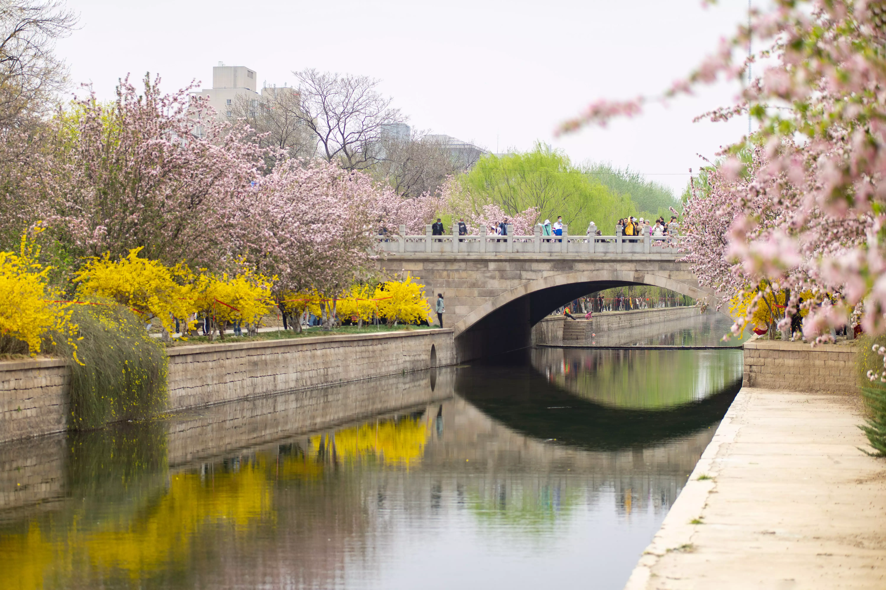
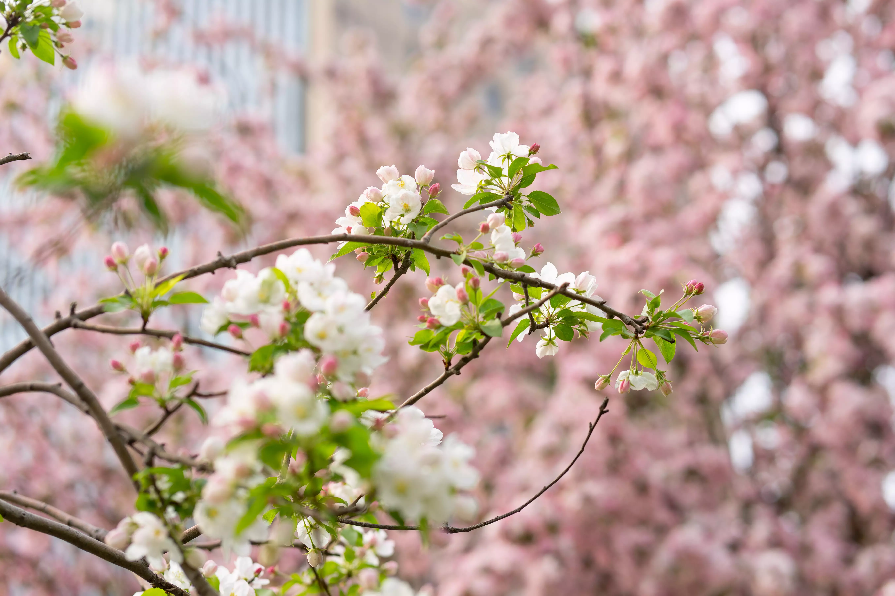
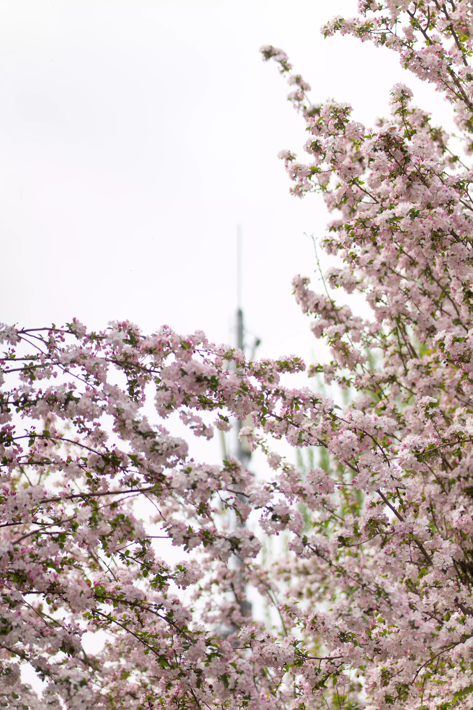
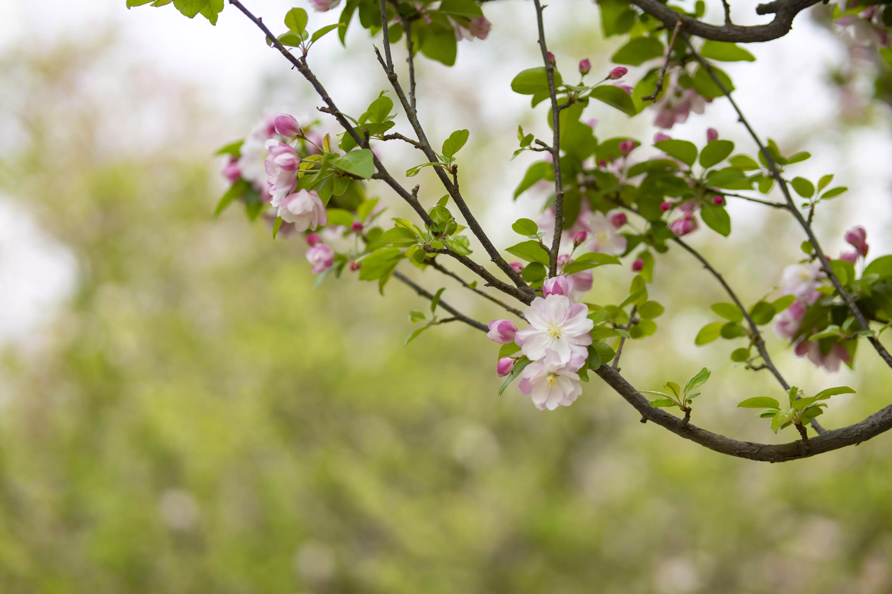
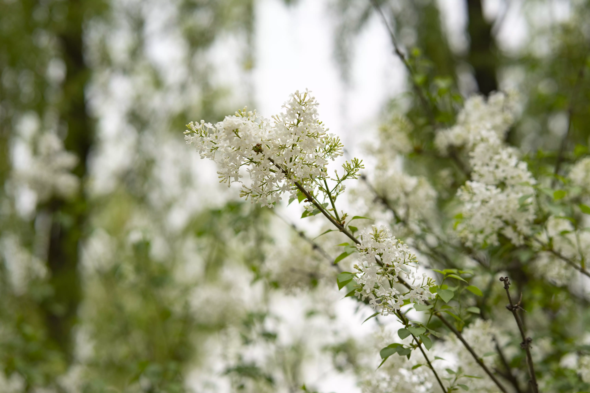
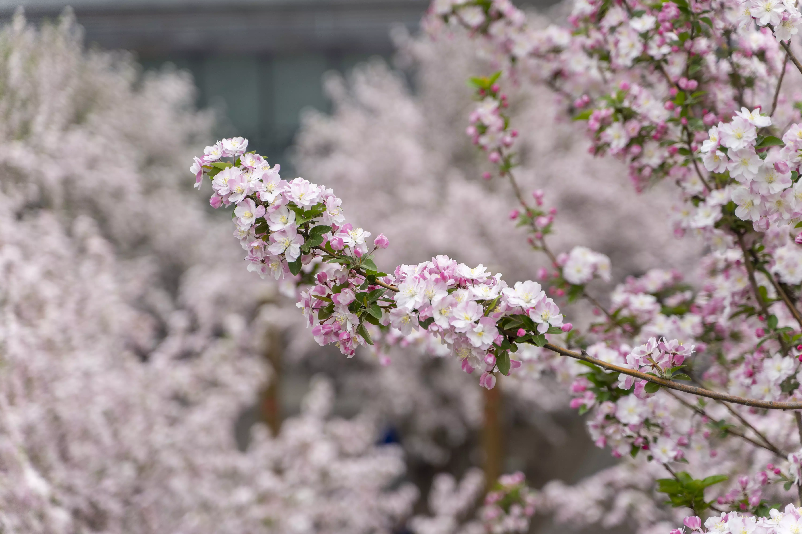
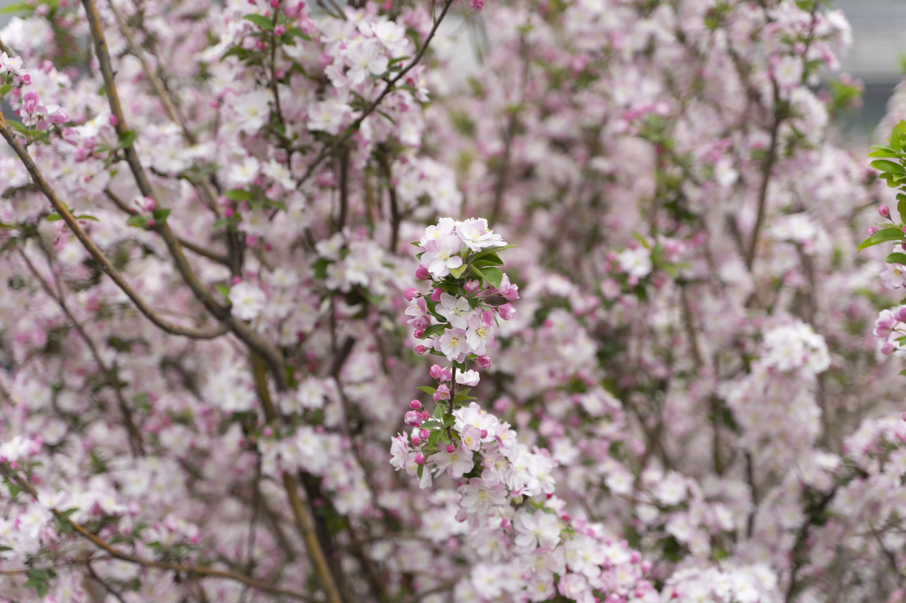
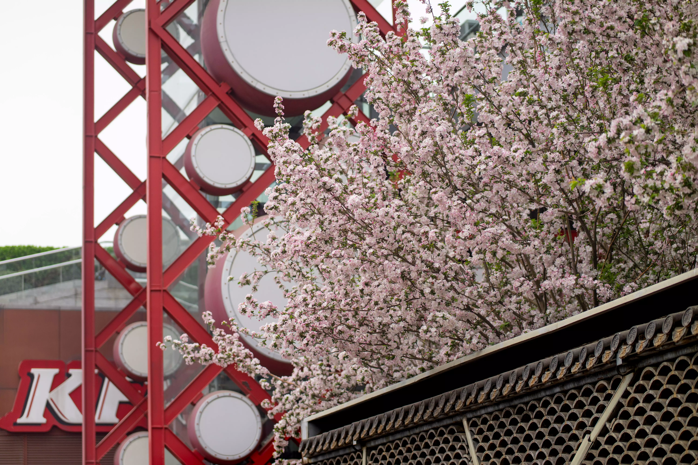
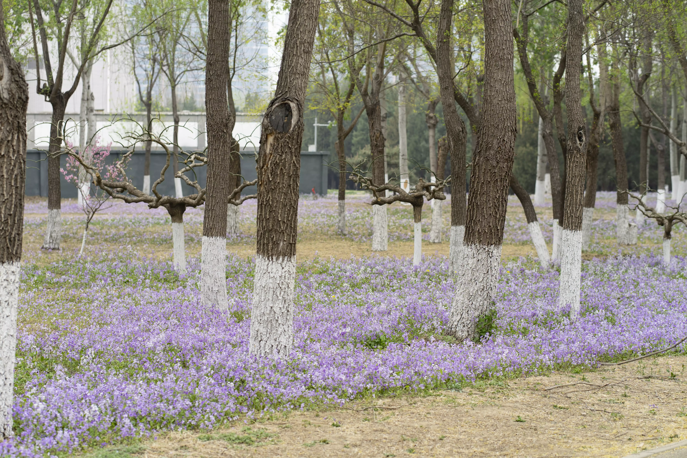

## Introduction

Spring in Beijing is beautiful but brief. My wait traverses through a long and cold winter, until the arrival of spring. Spring in Beijing seems to come somewhat abruptly; the wind that was harsh yesterday becomes much gentler today.

Shooting Locations: Haitang Flower Creek, Olympic Park (outside Xinao Shopping Center), Bajia Countryside Park

Equipment: Sony A7m2

## Photos

 

 

 

 

 