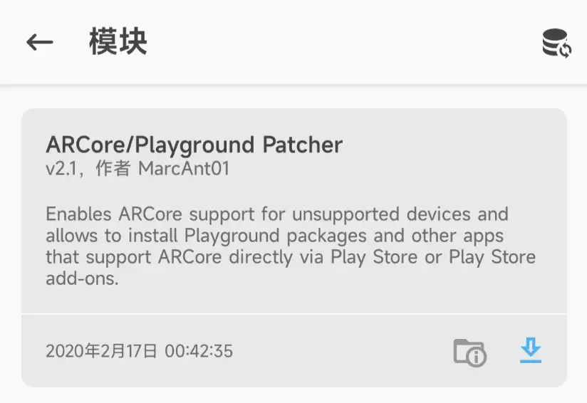
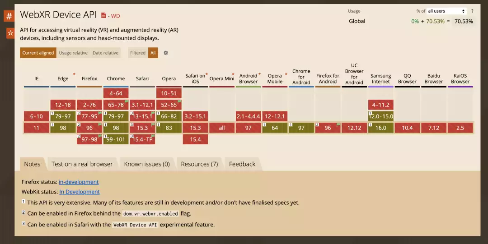
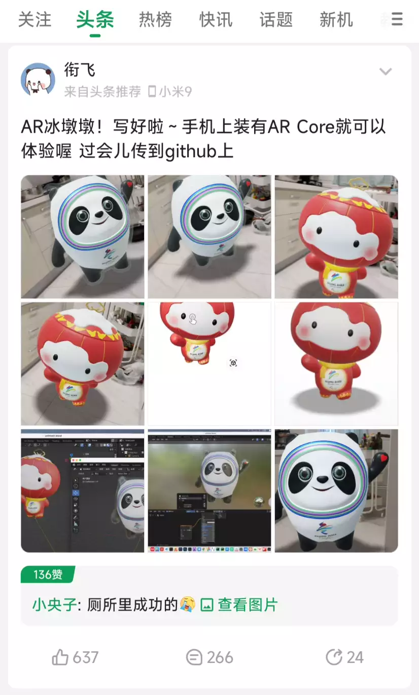
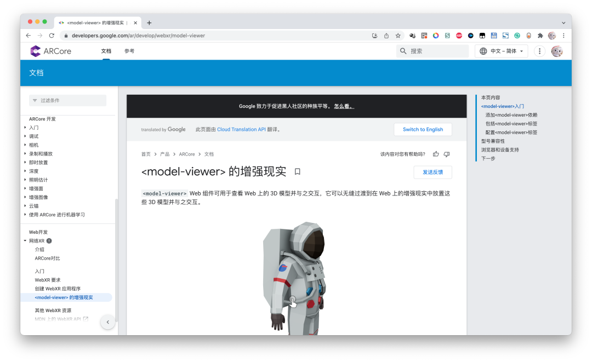

<section style="margin: 10px 0%; box-sizing: border-box; line-height: 1.75em; visibility: visible;"><section style="display: inline-block; width: 100%; vertical-align: top; background-color: rgb(240, 249, 255); border-width: 0px; border-style: none; border-color: rgb(62, 62, 62); overflow: hidden; padding: 29px; box-sizing: border-box; visibility: visible;"><section style="box-sizing: border-box; visibility: visible;" powered-by="xiumi.us">
 
</section><section style="text-align: center; justify-content: center; box-sizing: border-box; visibility: visible;" powered-by="xiumi.us"><section style="text-align: justify; color: rgb(62, 62, 62); box-sizing: border-box; visibility: visible;">
<strong style="box-sizing: border-box; visibility: visible;">Recently, Bing Dwen Dwen has become a sensation!</strong>

With the opening of the Beijing Winter Olympics,

The mascot "Bing Dwen Dwen" has instantly become a top-tier phenomenon.

People can't help but exclaim,

<strong style="box-sizing: border-box; visibility: visible;">"Who wouldn't want a cute Bing Dwen Dwen!"</strong>

Merchandise featuring Bing Dwen Dwen at the official Olympic flagship store keeps selling out, 

Both online and offline,

Truly exemplifying the sentiment that "A Dwen is hard to buy."
</section></section><section style="transform: perspective(0px); transform-style: flat; box-sizing: border-box; visibility: visible;" powered-by="xiumi.us"><section style="text-align: left; margin: 0px 0% -31px; justify-content: flex-start; transform: translate3d(21px, 0px, 0px) rotateY(180deg); box-sizing: border-box; visibility: visible;"><section style="max-width: 100%; vertical-align: middle; display: inline-block; line-height: 0; width: 130px; height: auto; box-sizing: border-box; visibility: visible;"><svg xmlns="http://www.w3.org/2000/svg" viewBox="0 0 494.521 262.87" width="100%" style="box-sizing: border-box; visibility: visible;"><g style="box-sizing: border-box; visibility: visible;"><g style="box-sizing: border-box; visibility: visible;"><polygon points="422.982 212.89 352.913 174.181 336.254 174.181 284.804 139.392 268.145 147.721 260.305 139.392 36.379 262.87 494.521 262.87 422.982 212.89" style="box-sizing: border-box; visibility: visible;" fill="rgb(192, 219, 252)"></polygon><g style="opacity: 0.52; box-sizing: border-box; visibility: visible;"><path d="M377.2,206.847s3.43,15.68-20.579,0-60.269-36.259-60.269-36.259l43.609,43.228s-39.69-8.929-49-8.929-18.62,15.68-63.209,16.66c-37.587.826-108.243,34.526-148.589,40.774l150.512-1.932-169.5,2.175a88.087,88.087,0,0,0-19.239-2.208l-.343.189L260.305,139.392l7.84,8.329,16.659-8.329,51.45,34.789h16.659l53.543,29.58C392.891,204.742,377.2,206.847,377.2,206.847Z" style="box-sizing: border-box; visibility: visible;" fill="rgb(255, 255, 255)"></path></g><polygon points="436.495 221.22 494.521 262.87 494.521 262.87 436.495 221.22" style="box-sizing: border-box; visibility: visible;" fill="rgb(255, 255, 255)"></polygon><polygon points="53.869 262.645 36.379 262.87 36.379 262.87 53.869 262.645" style="box-sizing: border-box; visibility: visible;" fill="rgb(255, 255, 255)"></polygon><g style="opacity: 0.52; box-sizing: border-box; visibility: visible;"><path d="M286.841,161.768l-21.391-2.09s-5.689,19.456-27.248,13.305c-11.8,5.656-75.051,43.252-114.619,41.8l136.722-75.391,7.84,8.329,16.659-8.329,37.36,25.262Z" style="box-sizing: border-box; visibility: visible;" fill="rgb(255, 255, 255)"></path></g><polygon points="44.176 212.89 80.548 174.181 89.196 174.181 115.902 139.392 124.55 147.721 128.62 139.392 244.857 262.87 7.041 262.87 44.176 212.89" style="box-sizing: border-box; visibility: visible;" fill="rgb(192, 219, 252)"></polygon><g style="opacity: 0.52; box-sizing: border-box; visibility: visible;"><path d="M67.943,206.847s-1.781,15.68,10.682,0,31.285-36.259,31.285-36.259L87.273,213.816s20.6-8.929,25.435-8.929,9.665,15.68,32.811,16.66c19.511.826,56.188,34.526,77.131,40.774l-78.129-1.932,87.983,2.175a25.142,25.142,0,0,1,9.987-2.208l.178.189L128.62,139.392l-4.07,8.329-8.648-8.329L89.2,174.181H80.548l-27.794,29.58C59.8,204.742,67.943,206.847,67.943,206.847Z" style="box-sizing: border-box; visibility: visible;" fill="rgb(255, 255, 255)"></path></g><polygon points="37.161 221.22 7.041 262.87 7.041 262.87 37.161 221.22" style="box-sizing: border-box; visibility: visible;" fill="rgb(255, 255, 255)"></polygon><polygon points="235.778 262.645 244.857 262.87 244.857 262.87 235.778 262.645" style="box-sizing: border-box; visibility: visible;" fill="rgb(255, 255, 255)"></polygon><g style="opacity: 0.52; box-sizing: border-box; visibility: visible;"><path d="M114.845,161.768l11.1-2.09s2.953,19.456,14.144,13.305c6.127,5.656,38.958,43.252,59.5,41.8L128.62,139.392l-4.07,8.329-8.648-8.329L96.509,164.654Z" style="box-sizing: border-box; visibility: visible;" fill="rgb(255, 255, 255)"></path></g><g style="opacity: 0.18; box-sizing: border-box; visibility: visible;"><path d="M53.869,107.739h0a53.871,53.871,0,0,1,53.87-53.87h0A53.87,53.87,0,0,1,53.869,0h0A53.869,53.869,0,0,1,0,53.869H0A53.87,53.87,0,0,1,53.869,107.739Z" style="box-sizing: border-box; visibility: visible;" fill="rgb(61, 147, 227)"></path></g><g style="opacity: 0.18; box-sizing: border-box; visibility: visible;"><path d="M379.741,132.613h0a32.534,32.534,0,0,1,32.534-32.534h0a32.534,32.534,0,0,1-32.534-32.534h0a32.534,32.534,0,0,1-32.533,32.534h0A32.534,32.534,0,0,1,379.741,132.613Z" style="box-sizing: border-box; visibility: visible;" fill="rgb(61, 147, 227)"></path></g></g></g></svg></section></section></section></section></section>

## Technical Background

Augmented Reality (AR), also referred to as "Simulated Reality" or "Extended Reality" in relation to Virtual Reality (VR), involves calculating the position and angle of a camera feed and integrating image analysis technology. This allows the virtual world on the screen to interact with the real-world scene. This technology was proposed in 1990. With the increasing computational power of portable electronic devices, the applications of AR are becoming more extensive.

## Demo Effect

## How to Use

### Android: Requires a phone that supports ARCore and has ARCore installed

#### Check ARCore Support

For information on ARCore support, you can refer to Google's official documentation on ARCore (https://developers.google.com/ar/devices). If your device is not supported but has the Magisk framework installed, you can download ARCore/Playground Patcher from Magisk to forcibly support it.

For Chinese phones like MIUI, you need to activate Google services in the settings and update ARCore in the Xiaomi App Store. For phones that come with Google services by default, ARCore should already be installed.

#### Use Google App or Latest Version of Chrome to Open Web Page

Website (Recommended to use VPN):  
https://xianfei.github.io/ar2022/

Click to show website QR code

Copy this address into the Google app or Chrome to access. (iOS users can directly visit this link)  
The effect is better when opened in the Google app. The demonstration in the video is done through the default browser (which does not support WebXR) and calls the Google APP for 3D AR interaction. Please download the Google app from the Play Store, otherwise, you will see the following prompt:

Alternatively, you can use Chrome or other browsers that support WebXR technology. However, the effect is not as good as the Google app. WebXR is a very cutting-edge web frontend technology that few browsers support.

### iOS: Simply visit the website in Safari

https://xianfei.github.io/ar2022/

Click to show website QR code

### Click the Cube Icon to Enter AR Mode

Click on the icon at the bottom right of the image to enter AR mode.

If all goes well, you should be able to see Bing Dwen Dwen and Snow Rong Rong.

## Coolapk Headlines

I posted it on Coolapk last night before going to sleep. When I woke up, I found that it had made the headlines, and many netizens said they succeeded. Some also offered solutions. Those who didn’t succeed can look for useful information in the comments section of Coolapk.

Here are some success screenshots shared by Coolapk users in the comments:

## Technical Solutions

Modeling: Blender   Display: model-viewer

For AR display technology, you can refer to Google ARCore WebXR documentation (https://developers.google.com/ar/develop/webxr/model-viewer). It is easy to understand, and those with a slight understanding of frontend development will get it instantly.

Here, all we need to do is export the glb file (if you also want to preview it on iOS, you need to export a usdz file). After completing the 3D modeling in Blender, just export the glb and usdz files (if you don't know how to model, you can search on Bilibili where many creators have shared model files). Note that materials involving reflection and refraction like glass may not necessarily be realized in AR. It is recommended to use a semi-transparent solid color material to draw Bing Dwen Dwen's shell.

Project source code:

https://github.com/xianfei/xianfei.github.io/tree/master/static/ar2022