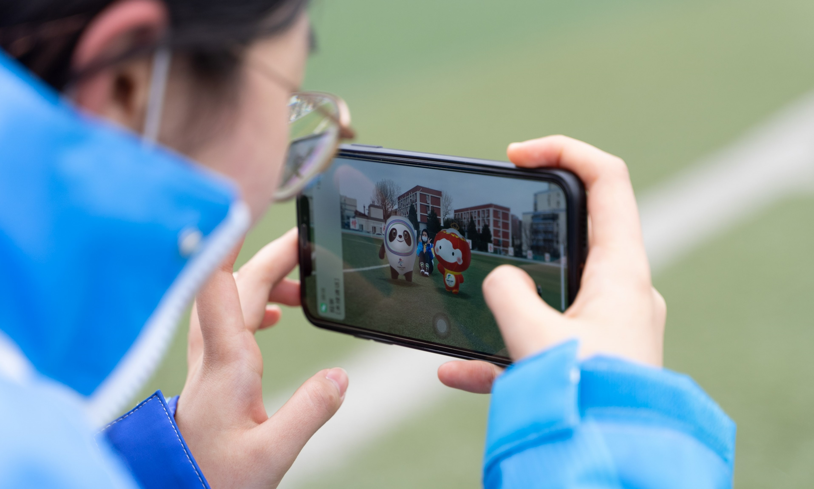
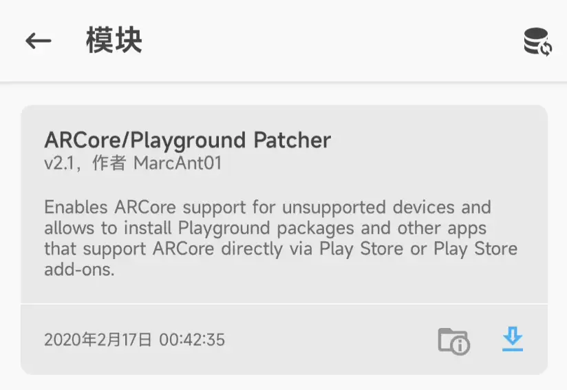
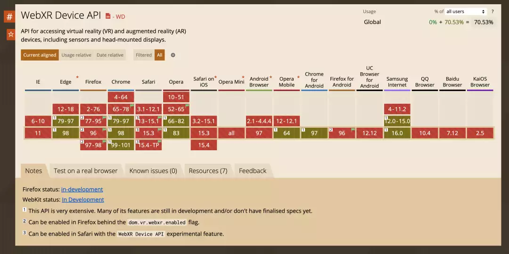
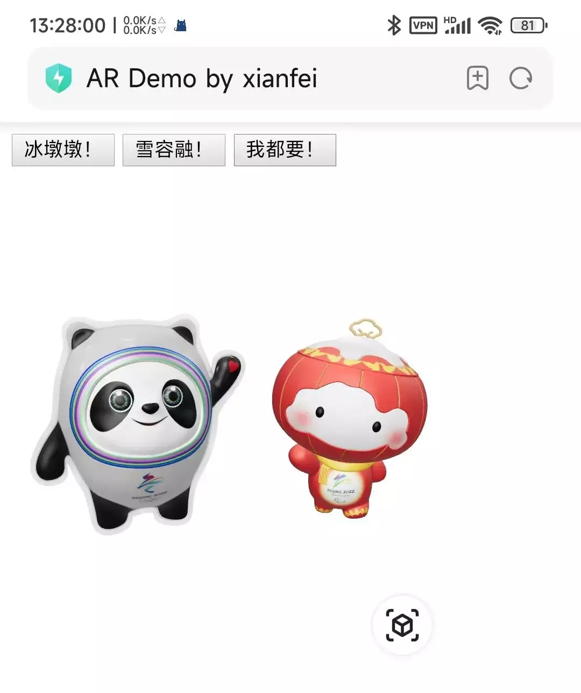
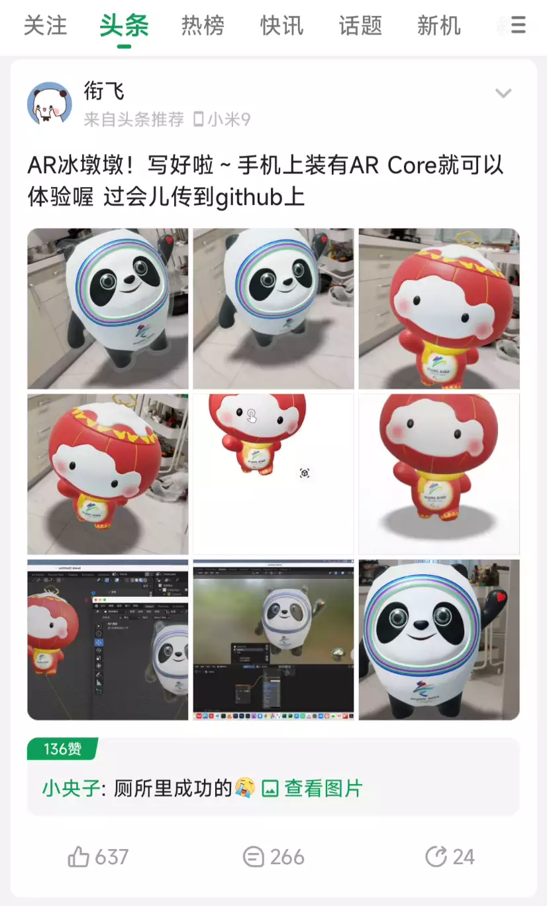
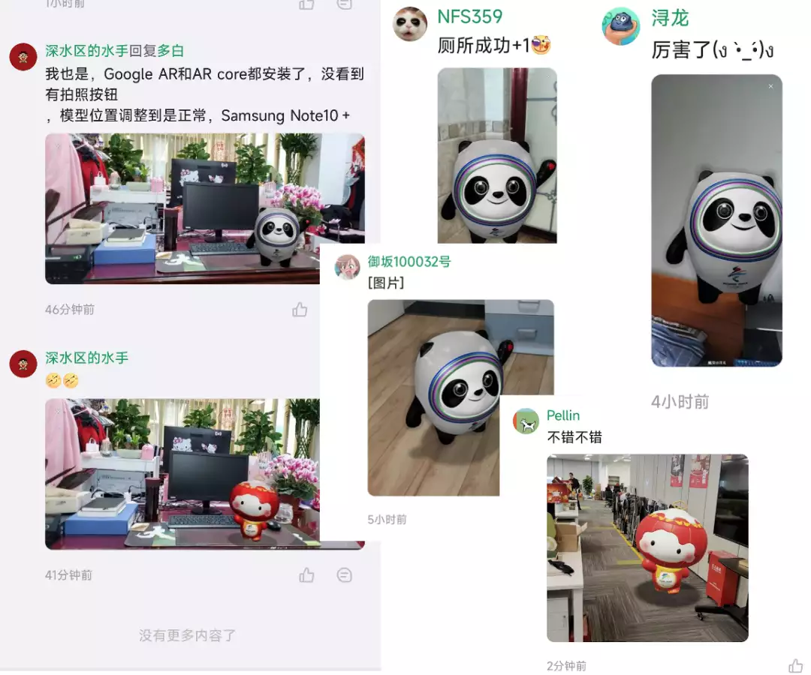
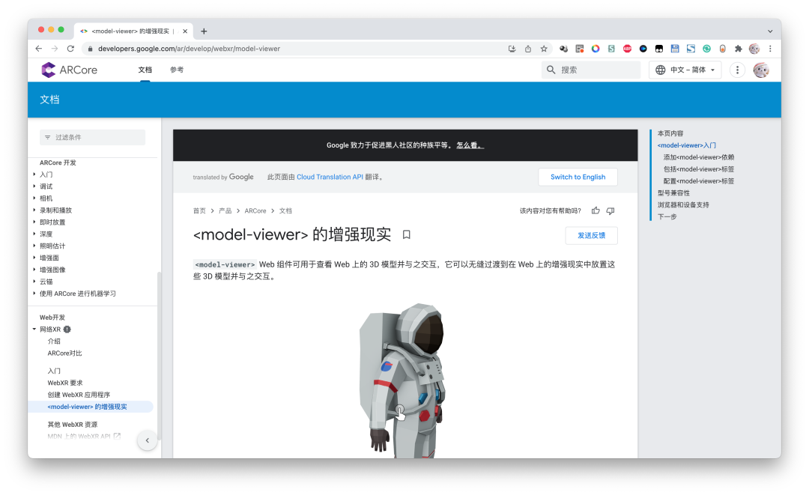
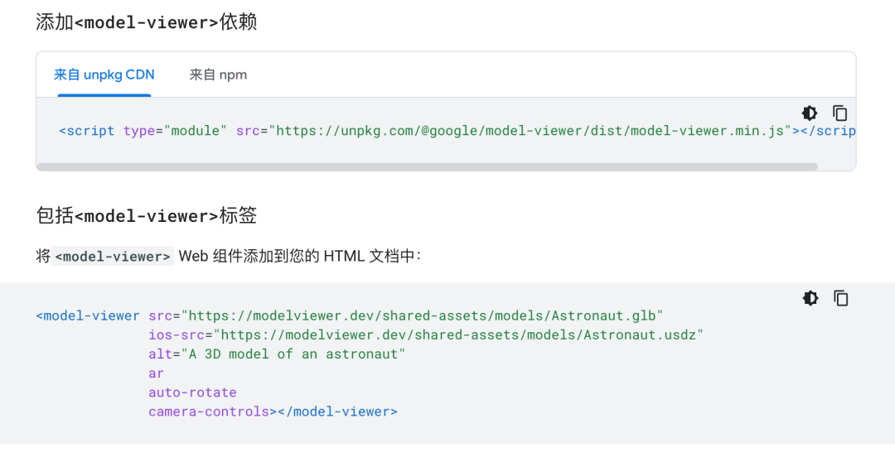
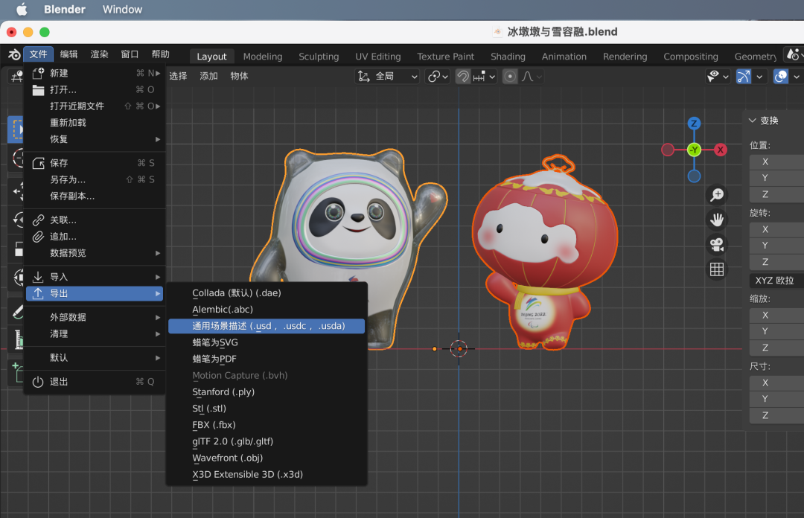

<section style="margin: 10px 0%; box-sizing: border-box; line-height: 1.75em; visibility: visible;"><section style="display: inline-block; width: 100%; vertical-align: top; background-color: rgb(240, 249, 255); border-width: 0px; border-style: none; border-color: rgb(62, 62, 62); overflow: hidden; padding: 29px; box-sizing: border-box; visibility: visible;"><section style="box-sizing: border-box; visibility: visible;" powered-by="xiumi.us">
 
</section><section style="text-align: center; justify-content: center; box-sizing: border-box; visibility: visible;" powered-by="xiumi.us"><section style="text-align: justify; color: rgb(62, 62, 62); box-sizing: border-box; visibility: visible;">
<strong style="box-sizing: border-box; visibility: visible;">最近，冰墩墩火了！</strong>

随着北京冬奥会开幕

吉祥物“冰墩墩”一跃成为现象级顶流

大家不禁纷纷直呼

<strong style="box-sizing: border-box; visibility: visible;">“谁不想要一只可爱的冰墩墩！”</strong>

奥林匹克官方旗舰店冰墩墩周边一再售罄 

无论线上还是线下

都实力演绎“一墩难求”
</section></section><section style="transform: perspective(0px); transform-style: flat; box-sizing: border-box; visibility: visible;" powered-by="xiumi.us"><section style="text-align: left; margin: 0px 0% -31px; justify-content: flex-start; transform: translate3d(21px, 0px, 0px) rotateY(180deg); box-sizing: border-box; visibility: visible;"><section style="max-width: 100%; vertical-align: middle; display: inline-block; line-height: 0; width: 130px; height: auto; box-sizing: border-box; visibility: visible;"><svg xmlns="http://www.w3.org/2000/svg" viewBox="0 0 494.521 262.87" width="100%" style="box-sizing: border-box; visibility: visible;"><g style="box-sizing: border-box; visibility: visible;"><g style="box-sizing: border-box; visibility: visible;"><polygon points="422.982 212.89 352.913 174.181 336.254 174.181 284.804 139.392 268.145 147.721 260.305 139.392 36.379 262.87 494.521 262.87 422.982 212.89" style="box-sizing: border-box; visibility: visible;" fill="rgb(192, 219, 252)"></polygon><g style="opacity: 0.52; box-sizing: border-box; visibility: visible;"><path d="M377.2,206.847s3.43,15.68-20.579,0-60.269-36.259-60.269-36.259l43.609,43.228s-39.69-8.929-49-8.929-18.62,15.68-63.209,16.66c-37.587.826-108.243,34.526-148.589,40.774l150.512-1.932-169.5,2.175a88.087,88.087,0,0,0-19.239-2.208l-.343.189L260.305,139.392l7.84,8.329,16.659-8.329,51.45,34.789h16.659l53.543,29.58C392.891,204.742,377.2,206.847,377.2,206.847Z" style="box-sizing: border-box; visibility: visible;" fill="rgb(255, 255, 255)"></path></g><polygon points="436.495 221.22 494.521 262.87 494.521 262.87 436.495 221.22" style="box-sizing: border-box; visibility: visible;" fill="rgb(255, 255, 255)"></polygon><polygon points="53.869 262.645 36.379 262.87 36.379 262.87 53.869 262.645" style="box-sizing: border-box; visibility: visible;" fill="rgb(255, 255, 255)"></polygon><g style="opacity: 0.52; box-sizing: border-box; visibility: visible;"><path d="M286.841,161.768l-21.391-2.09s-5.689,19.456-27.248,13.305c-11.8,5.656-75.051,43.252-114.619,41.8l136.722-75.391,7.84,8.329,16.659-8.329,37.36,25.262Z" style="box-sizing: border-box; visibility: visible;" fill="rgb(255, 255, 255)"></path></g><polygon points="44.176 212.89 80.548 174.181 89.196 174.181 115.902 139.392 124.55 147.721 128.62 139.392 244.857 262.87 7.041 262.87 44.176 212.89" style="box-sizing: border-box; visibility: visible;" fill="rgb(192, 219, 252)"></polygon><g style="opacity: 0.52; box-sizing: border-box; visibility: visible;"><path d="M67.943,206.847s-1.781,15.68,10.682,0,31.285-36.259,31.285-36.259L87.273,213.816s20.6-8.929,25.435-8.929,9.665,15.68,32.811,16.66c19.511.826,56.188,34.526,77.131,40.774l-78.129-1.932,87.983,2.175a25.142,25.142,0,0,1,9.987-2.208l.178.189L128.62,139.392l-4.07,8.329-8.648-8.329L89.2,174.181H80.548l-27.794,29.58C59.8,204.742,67.943,206.847,67.943,206.847Z" style="box-sizing: border-box; visibility: visible;" fill="rgb(255, 255, 255)"></path></g><polygon points="37.161 221.22 7.041 262.87 7.041 262.87 37.161 221.22" style="box-sizing: border-box; visibility: visible;" fill="rgb(255, 255, 255)"></polygon><polygon points="235.778 262.645 244.857 262.87 244.857 262.87 235.778 262.645" style="box-sizing: border-box; visibility: visible;" fill="rgb(255, 255, 255)"></polygon><g style="opacity: 0.52; box-sizing: border-box; visibility: visible;"><path d="M114.845,161.768l11.1-2.09s2.953,19.456,14.144,13.305c6.127,5.656,38.958,43.252,59.5,41.8L128.62,139.392l-4.07,8.329-8.648-8.329L96.509,164.654Z" style="box-sizing: border-box; visibility: visible;" fill="rgb(255, 255, 255)"></path></g><g style="opacity: 0.18; box-sizing: border-box; visibility: visible;"><path d="M53.869,107.739h0a53.871,53.871,0,0,1,53.87-53.87h0A53.87,53.87,0,0,1,53.869,0h0A53.869,53.869,0,0,1,0,53.869H0A53.87,53.87,0,0,1,53.869,107.739Z" style="box-sizing: border-box; visibility: visible;" fill="rgb(61, 147, 227)"></path></g><g style="opacity: 0.18; box-sizing: border-box; visibility: visible;"><path d="M379.741,132.613h0a32.534,32.534,0,0,1,32.534-32.534h0a32.534,32.534,0,0,1-32.534-32.534h0a32.534,32.534,0,0,1-32.533,32.534h0A32.534,32.534,0,0,1,379.741,132.613Z" style="box-sizing: border-box; visibility: visible;" fill="rgb(61, 147, 227)"></path></g></g></g></svg></section></section></section></section></section>

## 技术背景

增强现实（Augmented Reality，简称AR），也有对应VR虚拟实境一词的翻译称为实拟虚境或扩张现实，是指透过摄影机影像的位置及角度精算并加上图像分析技术，让屏幕上的虚拟世界能够与现实世界场景进行结合与交互的技术。这种技术于1990年提出。随着随身电子产品运算能力的提升，增强现实的用途也越来越广。

## 效果演示

## 使用方法

### Android：需要一部支持ARCore并安装ARCore的手机

#### 检查ARCore

对于ARCore的支持情况，可查看Google官方对于AR Core的文档（https://developers.google.com/ar/devices），如果自己的设备不支持且装有Magisk框架，可在Magisk中下载ARCore/Playground Patcher来强行支持

对于MIUI等国产手机，需要在设置中启动Google基础服务，并去小米应用商店更新ARCore。对于默认装有Google服务的手机应该是自带的。

#### 需要Google应用或最新版的Chrome打开网页

网址：（建议翻墙进行）
https://xianfei.github.io/ar2022/

点击显示网页二维码

将该地址复制到Google应用或Chrome中即可。（iOS用户可以直接访问该链接）
推荐在Google应用中打开效果更好，视频中所展示的是通过系统自带浏览器（不支持WebXR）调用Google APP展示3D AR交互。请Play商店中下载Google应用，否则将会提示如下：

或者使用Chrome等支持WebXR技术的浏览器进行打开，不过效果不如Google应用。WebXR是一项非常前沿的Web前端技术，浏览器们几乎很少支持

### iOS: 直接在Safari中访问网站即可

https://xianfei.github.io/ar2022/

点击显示网页二维码

### 点击立方体图标按钮进入AR模式

点击图中右下角的那个图标，即可进入AR模式。

如果顺利的话，应该可以看见冰墩墩和雪容融了

##  酷安头条 

昨天凌晨睡觉前把它发到了酷安上，睡醒后发现上了头条，也有很多网友表示成功了，也有些网友提出了一些解决方案，没成功的读者可以在酷安评论区里看看有无有用的内容。

此处为一些酷安网友在评论区晒的成功截图：

##  技术方案 

建模：Blender   展示：model-viewer

AR展示技术可以参考Google ARCore WebXR 文档（ https://developers.google.com/ar/develop/webxr/model-viewer  ）简单易懂，对前端开发稍有了解的同学肯定是一看就会。

此处我们只需导出glb文件即可（如果想要在iOS中也能进行预览则需要导出usdz文件）在Blender完成3D建模后只需要导出glb和usdz文件即可（如果不会建模可以去b站搜一下许多up主分享了模型文件）值得注意的是，玻璃材质等涉及反射折射的材料在AR上不一定能实现，建议使用半透明的实色材质来绘制冰墩墩的外壳

项目源代码：

https://github.com/xianfei/xianfei.github.io/tree/master/static/ar2022