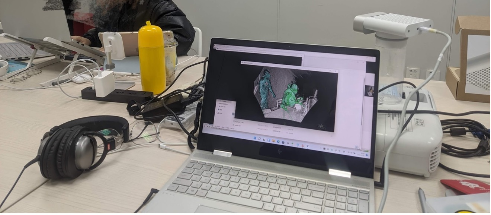
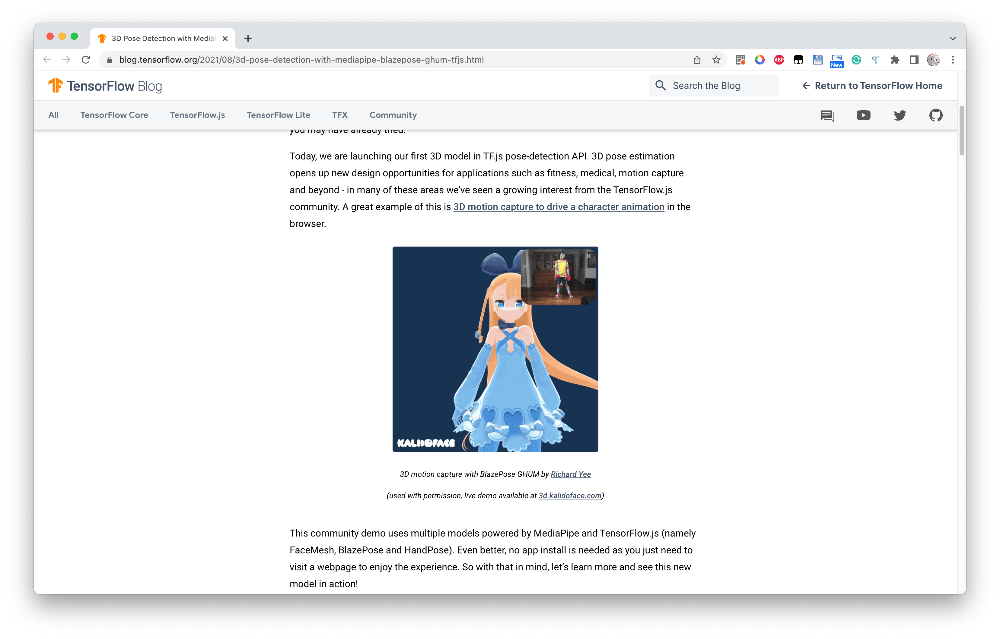
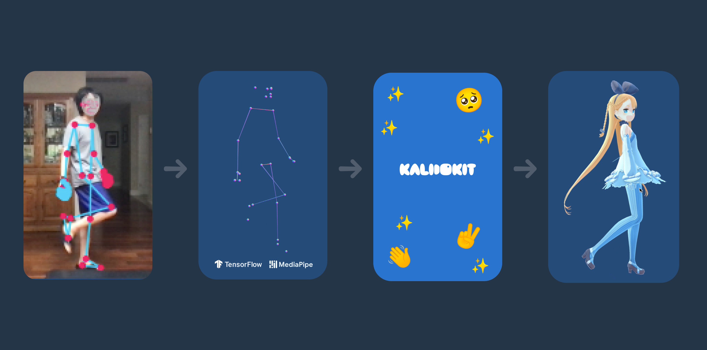
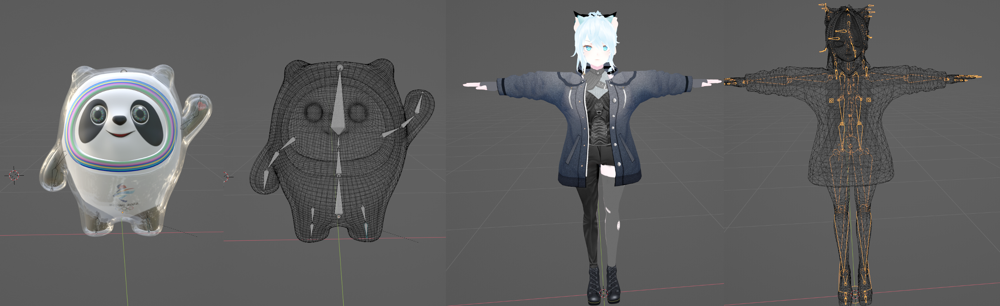
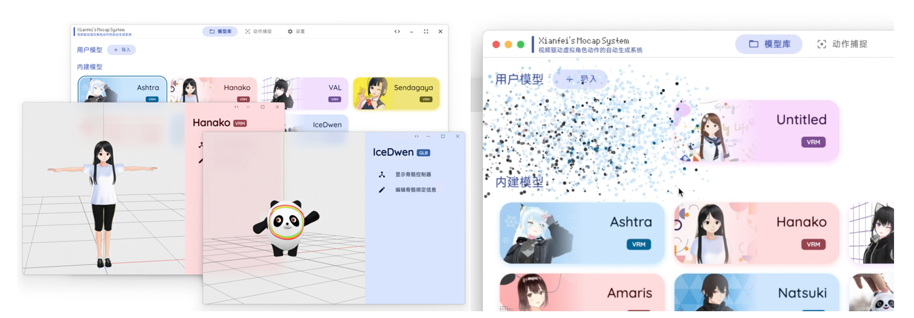
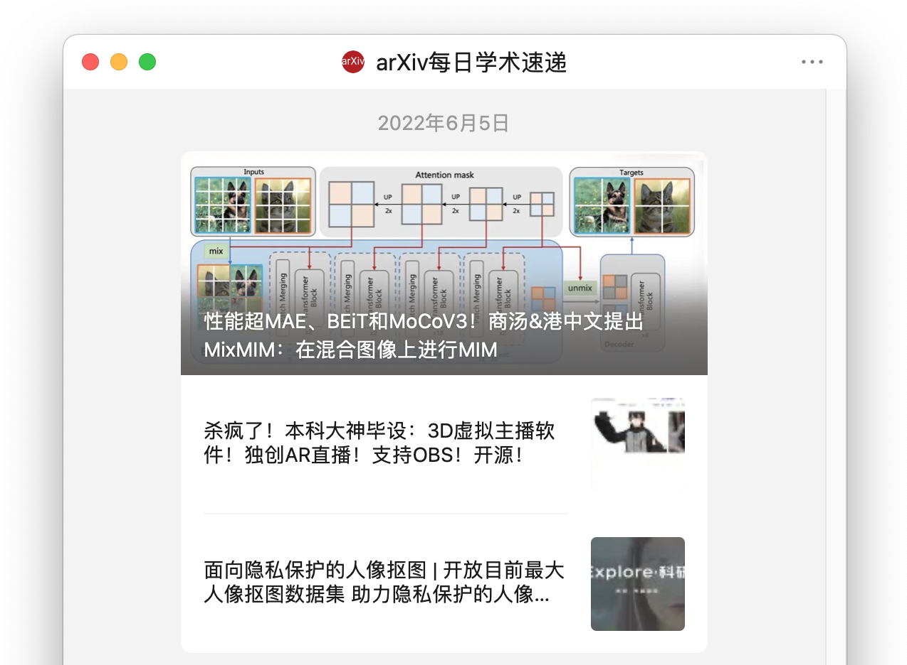

The complete version of the thesis can be viewed on the WeChat public account "Xianfei".

The English version of this project has been accepted into IEEE ISMAR 2022-Adjunct.

As of the time of writing, this project has received 1.5k Stars on GitHub, and the introductory video has received 27k likes and 11k coins on Bilibili.

[GitHub Repo](https://github.com/xianfei/SysMocap/)

## Introduction

Four years of university life have flown by, during which I've learned a lot. The graduation project is the last opportunity to independently implement a project I'm interested in during my undergraduate studies. After discussing with my supervisor, I decided to build a video-driven virtual avatar system, or virtual anchor system. This allows users to choose their virtual avatars and control them.

Of course, developing this system was a considerable challenge for me. It involved computer vision, computer graphics, desktop GUI development, network communication, and other areas. Before this, I had little experience with advanced technologies in posture assessment and motion capture. My supervisor provided me with a Kinect (a hardware device specifically used for motion capture) and introduced me to some open-source projects in this field. The goal was to drive the skeletal movements of a virtual avatar using open-source algorithms.

I also learned about 3D graphic engines like Unreal Engine and Unity.

## Technical Approach

During development, I researched and compared multiple existing algorithms. Many algorithms required specialized computer setups to run, which was a limitation. I wanted my system to be accessible for everyone, bringing the joy of technology to all.

While browsing through open-source projects, I stumbled upon an article on Google's TensorFlow Blog: [3D Pose Detection with MediaPipe BlazePose GHUM and TensorFlow.js](https://blog.tensorflow.org/2021/08/3d-pose-detection-with-mediapipe-blazepose-ghum-tfjs.html). It discussed a web-based 3D human joint detection method. This aligned perfectly with my vision for a highly portable and universal system. Using the Electron framework, I was able to develop a first-class cross-platform desktop GUI application.

Even better, this project, known as [kalidokit](https://github.com/yeemachine/kalidokit), provided source code, including its pipeline as illustrated below:

I then proceeded to study Mediapipe and kalidokit.

## Innovation

While Mediapipe and kalidokit took me a huge step forward, they only supported VRM type virtual avatars. More common formats like fbx, glb/gltf were not supported.

After implementing the tasks outlined in the project description, I wanted to add some practical and cutting-edge features. With virtual anchors gaining popularity, the virtual avatars generated by this software needed to be applied in real-time streaming. I designed an HTTP and WebSocket-based system for virtual avatar and action forwarding, and I set up a dedicated interface for OBS streaming software to stream to mainstream platforms.

As we move closer to a metaverse era, AR/VR/MR (Augmented Reality, Virtual Reality, and Mixed Reality) will become mainstream. I designed a WebXR-based virtual avatar streaming solution. Users only need to access the system on WebXR-compatible devices to view virtual avatars and their actions in their surroundings in real-time. Imagine a science fiction scenario: you open an AR-enabled phone or put on VR/MR glasses, and the virtual avatar appears right in front of you.

Main tasks include:

1. Support for driving different types of virtual avatars.
2. Develop a visually pleasing and easy-to-use GUI.
3. OBS streaming support.
4. AR/VR display support.

## Challenges

### Driving Different Types of Virtual Avatars

Different virtual avatars often have different skeletal structures and naming conventions. One of the major challenges was learning about the skeletal systems of 3D models.

This may be the first virtual anchor software that supports a variety of different virtual avatar formats and skeletal structures.

### AR Display

In my previous article about "AR Ice Cube," I wanted to implement AR technology in this project.

This may be the first virtual anchor software that can be used for AR/VR streaming.

## Conclusion

Through this project, I gained valuable knowledge in computer graphics—such as Euler angles, rotation matrices, quaternions, and spherical interpolation.

A friend mentioned that she saw an article about my project on a WeChat public account she follows. Their review of my project was "mind-blowing" 😂

The idea was to do something fun and unique. I wanted my project to be something that not everyone in my class or even my field could easily replicate.

