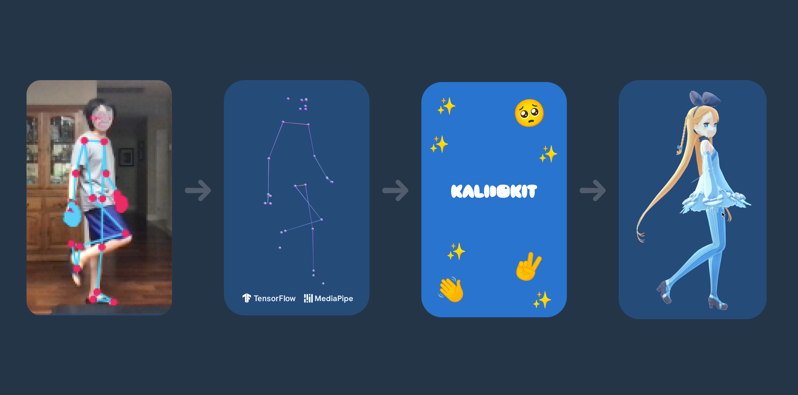
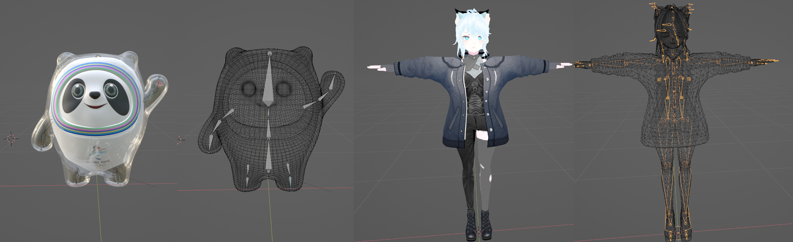
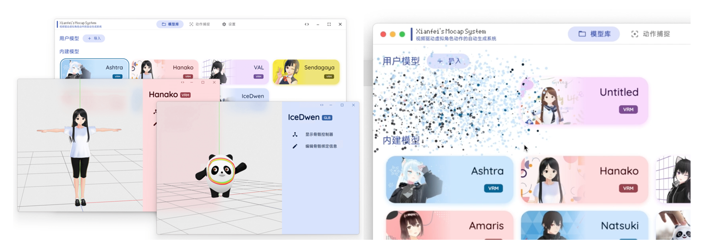

完整版毕业论文可在微信公众号Xianfei进行查看。

目前该项目的英文版论文已被收录至IEEE ISMAR 2022-Adjunct中。

该项目截至发稿前在Github已获得1.5k Stars，介绍视频在B站获得了2.7万赞及1.1万硬币。

https://github.com/xianfei/SysMocap/

## 前言

大学四年转瞬即逝，四年的时光让我学会了许多知识，而毕业设计作为本科期间最后一次自己独立实现自己想做的项目，希望能做一个前沿、有用、有趣的软件，在与指导老师一番沟通后，决定做一个用视频驱动虚拟形象的系统，也就是一个虚拟主播系统，可以选择自己的虚拟形象，并且让虚拟形象跟着自己动。

当然，这个系统的开发对于我来说是个不小的挑战，它涉及了计算机视觉、计算机图形学、桌面图形界面程序开发、网络通信等知识。而且对于姿态评估及动作捕捉方面的前沿技术之前的学习生活中并没有了解，于是指导老师拿给我了Kinect（一个专门用于动作捕捉的硬件）并且让我了解了一些这方面的开源项目，并且跟我说明了我需要做什么——使用开源的算法获得到的动作数据来驱动虚拟形象的骨骼运动。并且，我也了解到了虚幻引擎、Unity等三维图形引擎的知识。

## 技术方案

在开发过程中，研究并对比了多种现有的算法，但是许多算法的运行环境很苛刻，需要专业的计算机配置才能运行。而我希望我做的系统是大家都能用上的，让大家能够体会到科技的乐趣。

在浏览这方面的开源项目时，突然发现了Google TensorFlow Blog上的一篇文章[3D Pose Detection with MediaPipe BlazePose GHUM and TensorFlow.js](https://blog.tensorflow.org/2021/08/3d-pose-detection-with-mediapipe-blazepose-ghum-tfjs.html)，其中谈到了一种基于Web技术的3D人体关节点检测方法。诶！Web技术！这不正好提供了非常强大的可移植性和通用行吗！配合之前使用过的Electron框架，能开发出体验一流的跨平台桌面端GUI应用程序。

当然，更好的是，这个叫做[kalidokit](https://github.com/yeemachine/kalidokit)项目还给出了源代码，它给出的Pipeline如下图所示：

于是我就去研究了一下Mediapipe和kalidokit

## 创新点

Mediapipe和kalidokit的帮助下已经可以完成毕业设计课题中的一大步了，但是kalidokit自带的demo只能驱动VRM类型的虚拟形象，而面对更常见的fbx、glb/gltf则无从下手。

同时在实现任务书中的功能之后，我希望能够再加入一些实用的功能和前沿的功能。因为最近虚拟主播很火爆，所以该软件生成的虚拟形象需要实时应用于直播。于是设计了基于HTTP和WebSocket的虚拟形象及动作转发系统，并且为OBS直播软件专门设置了接口，使其可以直接被用于推流到主流平台中。

但是目前常规的直播都是二维图像直播，在这个元宇宙即将来临的时代，AR/VR/MR（增强现实、虚拟现实与混合现实）必会成为主流趋势，所以我在想能不能定义一种全新的直播方式，可以让用户更为直观的看到对方的虚拟形象呢？于是就设计了基于WebXR技术的虚拟形象直播方案，用户只需要在支持WebXR的设备上访问该系统，即可实时的通过网络在周围环境中查看虚拟形象及其动作。就像科幻电影里面的那样，打开支持AR的手机或带上支持VR/MR的眼镜，虚拟形象就站在你的面前。

主要来说要做的事情如下：

1. 使其可以驱动不同类型的虚拟形象

2. 为其编写一套简单易用好看的GUI

3. 支持OBS进行直播

4. 支持AR/VR展示

## 难点

### 使其可以驱动不同类型的虚拟形象

面对这个工作，首先我了解3D模型的骨骼，3D模型之所以能动，是因为他有骨骼，也就是说3D模型有骨骼是能够让他动起来的必要条件。不同的虚拟形象模型，往往有着不同的骨骼结构及命名规则。图中为冰墩墩的骨骼（自己绑定的）和VRM虚拟形象的骨骼（自带的）。

我们可以发现其骨骼数量是不一样的，其实命名方式也是不一样的，甚至骨骼的坐标系、运动方式都是不一样的，比如下图中三种不同的虚拟形象，做同样的动作时，对坐标的操作是不一样的。

这或许是迄今为止首个可以支持多种不同虚拟形象格式、不同类型不同骨骼结构的虚拟主播软件。

### AR展示

在写上期的《AR冰墩墩》文章的时候，就是想着在毕设中可以实现AR冰墩墩跟着我做一样的动作。上期用到的[&lt;model-viewer&gt;](https://modelviewer.dev/)就是基于Three.js开发的，使用WebXR浏览AR内容。但是由于前者是高度封装的，我们想让虚拟形象实时的做指定的动作，需要对虚拟形象骨骼的控制能力。于是就用参考[这篇文章](https://threejs.org/docs/#manual/en/introduction/How-to-create-VR-content)编写了WebXR接口。

这或许是迄今为止首个可以用来AR/VR直播的虚拟主播软件。

### GUI

一个好看的程序就让用户有更多想用的欲望。所以在界面设计上下了许多的功夫，比如采用了自动取色算法进行色彩搭配，比如在添加虚拟形象时的非线性动画，比如在删除虚拟形象时的粒子爆炸效果……

这或许是迄今为止最好看的跨平台虚拟主播软件。

## 结束语

在完成毕设的过程中，学到了许多计算机图形学的知识——比如欧拉角、旋转矩阵、四元数、球面插值等。

之前我的一个朋友跟我说，她在一个她关注的公众号上看见了对我的毕设的介绍，我一看还真是。

[这篇文章中](https://mp.weixin.qq.com/s/54vewhYrAfEyqLAAYUVkBw)对我的毕设的评价是“杀疯了”😂

其实只是想做点儿有趣的事情罢了，当时就在想，我的毕设应该是那种，可能我们班我们专业的换别人就不一定能做出来的东西。
