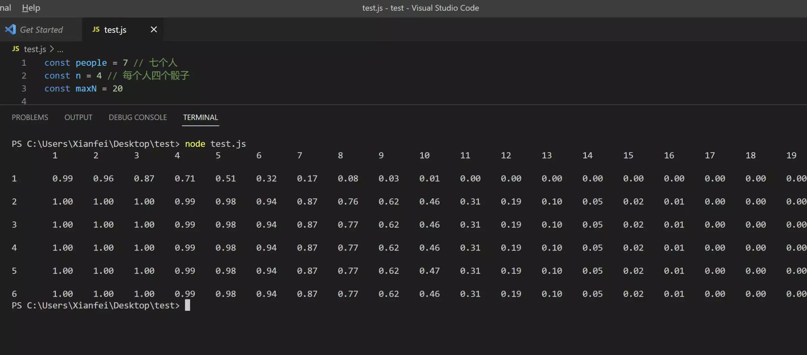

## Introduction

During the National Holiday, a junior friend invited me to a party, which was essentially just drinking, playing games, singing, and eating. The final activity was drinking, and we played a dice game to guess the points. You can look up the specific rules online; [this is the general idea](https://zhinan.sogou.com/guide/d1610025575.htm).

For this game, we only had 30 dice, and 7 of us participated in the activity, which meant that each person could only use 4 dice.

## Preliminary Probability Calculations

In the gaming segment, we thought about calculating probabilities. However, it wasn't the right time and place to think about this kind of problem, so we simply concluded that it's "not easy to calculate." But to answer the question, "When is the best time to call 'open' to maximize the winning rate?" we still have to use probability. Indeed, the next day I started pondering this question. Since my math skills are not that great, I used computer code to simulate the whole process, and the results are as follows:

That is to say, in this scenario, for a call of "five 1s," the winning rate for "opening" is about 49%; for "ten of x" (1<x<7, x∈N), the winning rate for "opening" is about 54%.

## Further Analysis

Before calling out the dice numbers in the game, you can take a look at what you have. Generally, we will decide what to call based on the dice we already have. Therefore, our code can also consider this, that is, calculate the probability based on known partial information. With the current number of people and dice, assuming I know I have 2 ones and 2 fours, then my winning rate for calling "twelve 4s" is as high as 58%, far higher than the rate when I don't know any information.

## Tool Development

To help readers apply this theory in practice, I've developed a small tool based on the above introduction. It can calculate probabilities and help readers better understand the content of this article.
<iframe src="dice.html" style="width:100%;height:550px;border:none;border-radius:20px;box-shadow: var(--shadow-l1);"></iframe>

Source code: [https://github.com/xianfei/xianfei.github.io/blob/master/content/post/dice/dice.html](https://github.com/xianfei/xianfei.github.io/blob/master/content/post/dice/dice.html)

## Conclusion

In truth, playing dice while drinking is just for fun. If you find someone you're interested in, it's fine to have a few more drinks yourself.

Cover photo: https://unsplash.com/photos/pQyTChJwEDI