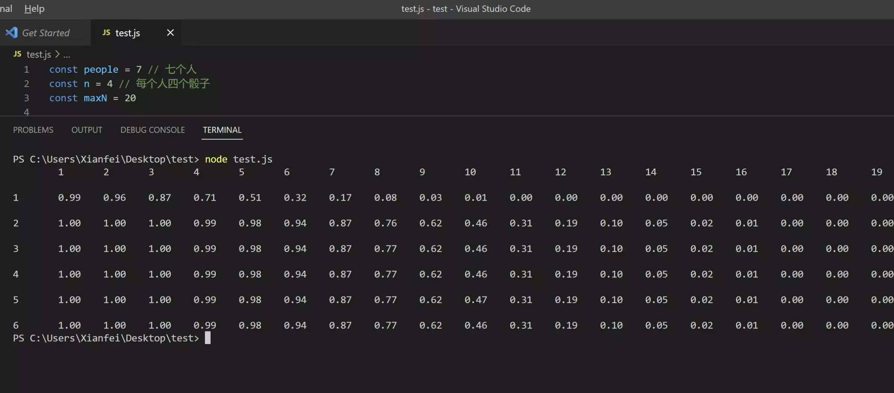

## 前言

国庆的时候，我的一个学弟朋友邀请我参加一次轰趴活动，其实无非就是去喝酒、玩游戏、唱歌、吃饭。最后一项活动就是喝酒了，顺便摇骰子猜点数。具体的规则可以上网上查一下，[大概就是这样](https://zhinan.sogou.com/guide/d1610025575.htm)。

此次游戏因为我们的骰子数量只有30个，我们有7个人参与此次活动，只够每个人4个骰子。

## 概率初步计算

在游戏环节中，我们想过进行概率计算，由于当时在活动现场不适合思考这种问题，于是就简单的得出了“不是很好算”这个结论。不过要回答“什么时候喊开，胜率最大”这个问题，我们还是要用概率去计算。这不，第二天我就在想这个问题，由于本人的数学水平不是很好，所以使用了计算机代码对整个过程进行模拟，结果如下：

也就是说在这种情况下，对于“5个1”的叫法，“开”他的胜率约为49%；对于“10个x”（1<x<7,x∈N），“开”他的胜率约为54%。

## 进一步分析

对于这个游戏，我们再叫骰子之前，可以看一下自己有什么骰子。一般情况下，我们也会根据自己已经有的骰子，来决定我们要叫什么的。