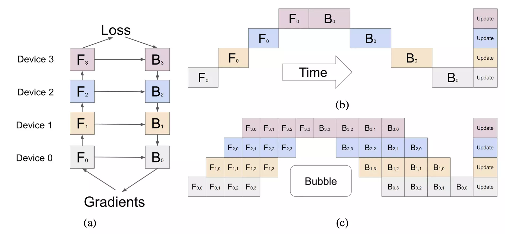
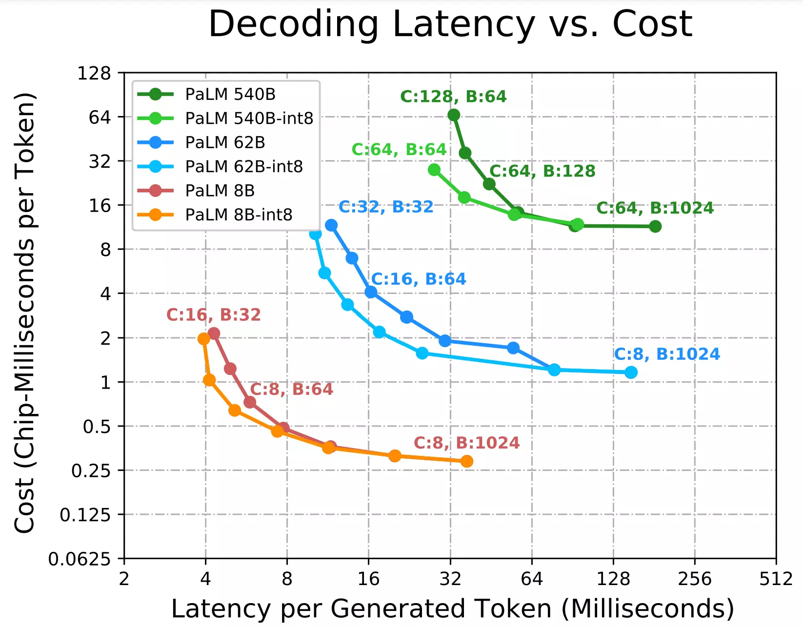
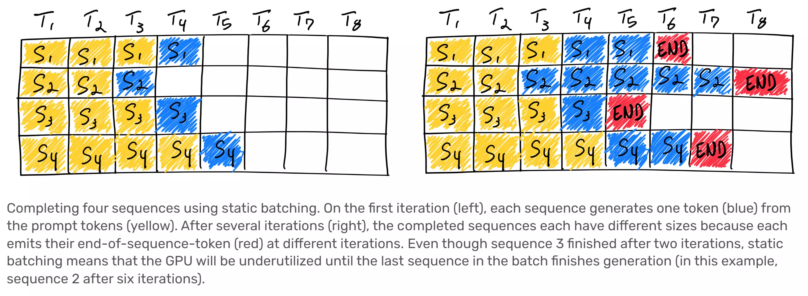
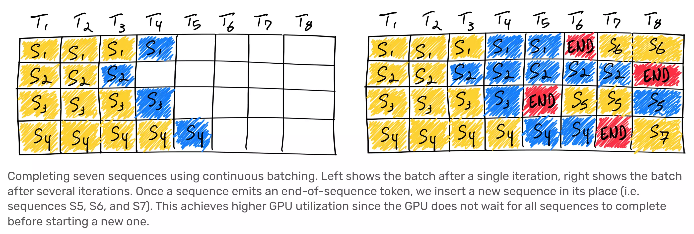

Original：https://www.semianalysis.com/p/gpt-4-architecture-infrastructure

Title：GPT-4 Architecture, Infrastructure, Training Dataset, Costs,Vision, MoE

SubTitle：Demystifying GPT-4: The engineering tradeoffs that led OpenAI to their architecture.

## 前言 & 综述

OpenAI 保持 GPT-4 架构的神秘感及闭源并不是因为怕人们担心对人类存在一些生存风险，而是因为他们构建的东西是可复制的。 事实上，我们预计 Google、Meta、Anthropic、Inflection、Character、腾讯、字节跳动、百度等在短期内都将拥有与 GPT-4 一样强大的模型。

不要误会我们的意思，OpenAI 拥有令人惊叹的工程，他们构建的东西令人难以置信，但他们得出的解决方案并不神奇。 这是一个优雅的解决方案，具有许多复杂的权衡。 做大只是战斗的一部分。 OpenAI 最持久的护城河是他们在全球范围内被广泛使用（拥有大量的数据）、领先的工程人才，并且可以通过未来的模型继续领先于其他人。

我们从许多来源收集了大量有关 GPT-4 的信息，今天我们想分享一下。 这包括模型架构、训练基础设施、推理基础设施、参数计数、训练数据集组成、token数、层数、并行策略、多模态视觉适配、不同工程权衡背后的思维过程、独特的实施技术以及它们如何缓解矩形模型在推理上的巨大瓶颈。

研究 GPT-4 最有趣的方面是，理解他们为什么做出某些架构上的决定。

此外，我们将大致猜测 A100 上 GPT-4 的训练和推理成本，以及如何在下一代模型架构中与 H100 计算卡的情况下进行进一步的扩展。

首先，从 GPT-3 到 GPT-4，OpenAI 希望扩展 100 倍，但成本是很大的问题。 Dense Transformers 模型很难进一步扩大参数量1。 Dense Transformers 是 OpenAI GPT-3、Google PaLM、Meta LLAMA、TII Falcon、MosaicML MPT 等使用的模型架构。 我们可以轻松说出 50 家使用相同架构来训练LLMs（大语言模型）的公司。 这是一个很好的方法，但它在**扩展方面存在缺陷**。

从训练成本的角度来看，可以参阅我们在 GPT-4 之前关于即将推出的密集（同前文中的Dense）模型**The AI Brick Wall**的训练成本讨论1。 在那里，我们揭示了 OpenAI 在 GPT-4 架构方面所做的 high-level 工作以及各种现有模型的训练成本。

但是在过去的 6 个月里，我们意识到**训练成本并不是一个决定性因素**（irrelevant）。

当然，从表面上看，花费数千万甚至数亿美元的计算时间来训练模型似乎很疯狂，但这对于这些公司来说是微不足道的。 它实际上是一个资本支出（Capex line）项目，规模扩大可以持续带来更好的结果。 唯一的限制因素是将计算扩展到一个时间尺度，以便人类可以得到反馈并修改架构。

未来几年，谷歌、Meta、OpenAI/微软等多家公司将在价值超过千亿美元的超级计算机上训练模型。 Meta 每年在“元宇宙（Metaverse）”上烧了超过 160 亿美元，Google 每年在各种永远不会实现成果的项目上浪费 100 亿美元。 亚马逊在 Alexa 上损失了超过 50 亿美元。 加密货币在毫无价值的情况下浪费了超过 1000 亿美元

这些公司和其他组织可以而且将会花费超过一千亿美元来创建可以训练单个大规模模型的超级计算机。 然后可以通过多种方式将这些大型模型产品化。这项工作将在多个国家和公司重复进行。 这是新的军备竞赛。 以前的浪费与现在的区别在于，人工智能可以在取代部分人类的工作上短期内带来有形的价值。

扩展人工智能（真正的人工智能砖墙）的更重要问题是**推理**。 目标是将训练计算与推理计算分离。 这就是为什么训练 Chinchilla 对于任何将要部署的模型来说都是最佳的。 这就是为什么要进行稀疏模型架构； 并不是每个参数在推理过程中都会被使用到。

真正的棘手的问题这些模型的用户**使用的成本太高**。推理成本是训练成本的数倍。这就是OpenAI在模型架构和基础设施方面的创新目标。

大型模型的推理是一个多变量问题，在这个问题中，密集模型的模型大小会成为致命的问题。我们已经在这里2详细讨论了关于边缘计算的问题，但对于数据中心来说，问题是非常相似的。简要概述就是，设备永远无法拥有足够的内存带宽来让大型语言模型达到一定程度的吞吐量。即使它们拥有足够的带宽，边缘计算上硬件计算资源的利用率也会非常低。

在数据中心和云端，利用率是至关重要的。Nvidia因软件优越性而受到赞誉的一半原因是，在GPU的几代生命周期中，Nvidia不断更新底层软件，通过更智能地在芯片内、芯片之间以及内存之间移动数据，从而提高FLOPS利用率。

在大多数当前的应用场景中，LLM推理的作用是作为实时助手，这意味着它必须实现足够高的吞吐量，以便用户实际使用。人类平均每分钟阅读速度约为250个单词，但有些人的阅读速度高达每分钟1000个单词。这意味着你需要每秒输出至少8.33个 token （tokens），但每秒输出33.33个 token 才能覆盖所有极端情况。

由于内存带宽要求，即使在最新的Nvidia H100 GPU服务器上，一个拥有万亿参数的密集型模型也无法实现这种吞吐量。每生成一个 token ，都需要将每个参数从内存加载到芯片上。然后将生成的 token 输入到提示中，并生成下一个 token 。此外，还需要额外的带宽来为注意力机制中的KV缓存进行流式传输。

> 图注：该图表假设由于无法融合每个操作、注意力机制所需的内存带宽和硬件开销等低效问题，等同于参数读取。实际上，即使使用像英伟达的FasterTransformer库这样的“优化”库，总开销甚至更大。

上图展示了为了以足够高的吞吐量为单个用户提供LLM推断服务所需的内存带宽。它表明，即使是8个 H100 也无法在每秒33.33个 token 的速度下为1万亿参数的密集模型提供服务。此外，在每秒20个 token 的速度下，8xH100的FLOPS利用率仍然低于5%，导致推断成本极高。实际上，对于目前的8路张量并行H100系统，推断约束在约3000亿前馈参数左右。

然而，OpenAI使用A100实现了人类阅读速度，并使用了超过1万亿参数的模型，而且他们以每1000个 token 仅0.06美元的低价广泛提供。这是因为它是稀疏的，即并非每个参数都被使用。

关于GPT-4模型架构、训练基础设施、推断基础设施、参数数量、训练数据集组成、 token 数量、层数、并行策略、多模态视觉编码器、不同工程权衡背后的思考过程、独特实施技术以及如何减轻与巨型模型推断相关的一些最大瓶颈的问题，我们不再拖泥带水，直接进入主题。

## 模型架构 Model Architecture

GPT-4的大小是GPT-3的10倍以上。我们认为它在120个层次上拥有约1.8万亿个参数，而GPT-3的参数约为1750亿个。

OpenAI通过使用专家混合（MoE, mixture of experts）模型来保持成本合理。如果您不熟悉MoE，请阅读我们6个月前关于广义GPT-4架构和训练成本的文章。

此外，OpenAI在其模型中使用了16个专家模型，每个专家模型的MLP参数约为1110亿个。其中有2个专家模型被路由到每个前向传递中。

虽然文献中谈到了很多高级路由算法，用于选择将每个 token 路由到哪个专家，但OpenAI的路由算法据称对于当前的GPT-4模型来说相当简单。此外，注意力（此处指Transformer的Attention）约有550亿个共享的参数。

每个前向传递推断（生成1个 token ）仅使用约2800亿个参数和约560 TFLOP。这与纯密集模型每个前向传递所需的约1.8万亿个参数和约3700 TFLOP形成鲜明对比。

## 数据集构成 Dataset Composition

OpenAI 在大约 13 万亿个 tokens 的数据集上训练了 GPT-4。其中 CommonCrawl RefinedWeb 包含大约 5 万亿个高质量 tokens。作为参考，Deepmind 的 Chinchilla 和 Google 的 PaLM 模型分别在大约 1.4 万亿 tokens 和大约 0.78 万亿 tokens 上进行了训练。甚至据称 PaLM 2 也在大约 5 万亿 tokens 上进行了训练。

> CommonCrawl 是一个非营利组织，它定期从互联网上抓取和存储网页数据。它提供一个包含数十亿个网页的大型公共数据集，这些网页来自于全球各地的多种语言。这个数据集对于研究人员、开发者和企业来说非常有价值，因为它可以用于训练机器学习模型，例如自然语言处理（NLP）任务，以及进行其他大数据分析。在本文中，CommonCrawl 用于提供大量高质量 tokens，以便在训练 GPT-4 时使用。

这个数据集并非 13 万亿个独特的 tokens。相反，由于缺乏高质量 tokens，数据集包含了多个时期。文本数据有 2 个时期，代码数据有 4 个时期。有趣的是，这远远低于 Chinchilla 的最优值，表明需要在双倍的 token 数量上训练模型。这表明网络上缺乏易于获取的 tokens。实际上存在着 1000 倍以上的高质量文本 tokens，甚至还有更多的音频和视觉 tokens，但获取它们并不像网络抓取那样简单。

还有来自 ScaleAI 和内部的数百万行指令微调数据。不幸的是，我们没有找到关于他们 RLHF 数据的更多信息。预训练阶段有 8k 的上下文长度（seqlen）。GPT-4 的 32k seqlen 版本是基于预训练后的 8k 进行微调的。

在集群上，批量大小在数天内逐渐增加，但最后，OpenAI 使用了一个批量大小为 6000 万！当然，由于并非每个专家都能看到所有 tokens，这只是每位专家的 750 万 tokens 的“仅仅”一个批次大小。

## 并行策略 Parallelism Strategies

能够利用所有A100 GPU的并行策略至关重要。他们利用了8路张量并行，因为这是NVLink的极限。除此之外，我们听说他们正在使用15路流水线并行。从理论上讲，考虑到数据通信与计算时间，这是过多的流水线，但如果他们受到内存容量的限制，那么这是有道理的。

在纯粹的流水线+张量并行的情况下，每个GPU在FP16下仅参数就需要约30GB。一旦加上KV缓存和开销，如果OpenAI的大部分GPU都是40GB A100，那么从理论上讲这是有道理的。他们可能使用了ZeRo阶段1。他们可能使用了块级FSDP（全分布式状态并行）或混合共享数据并行。

> ZeRo（Zero Redundancy Optimizer，零冗余优化器）是一种用于降低深度学习训练中内存需求的技术。ZeRo Stage 1 是这个优化策略的第一阶段。在这个阶段，优化器状态和梯度被分布式存储在多个 GPU 或设备上，从而减少了每个设备的内存占用。这使得在有限的硬件资源下训练更大的模型成为可能。

> FSDP（Fully Sharded Data Parallel，全分布式状态并行）和混合共享数据平行（Hybrid Shared Data Parallel）都是用于加速深度学习训练的并行计算策略，但它们的实现和关注点有所不同。
>
>FSDP 是一种将模型参数、优化器状态和梯度在多个设备（如 GPU）之间分片的技术。通过将这些状态分布在不同的设备上，FSDP 可以降低每个设备的内存需求，从而使得在有限的硬件资源下训练更大的模型成为可能。FSDP 还可以与其他并行策略（如模型并行和流水线并行）结合使用，以进一步提高训练速度和扩展性。
>
>混合共享数据平行（Hybrid Shared Data Parallel）是一种结合了数据并行和模型并行的策略。在数据并行中，每个设备都有一个完整的模型副本，并在不同的数据子集上进行训练。在模型并行中，模型被划分为多个部分，每个部分分布在不同的设备上。混合共享数据平行旨在充分利用这两种策略的优点，通过将模型参数和计算在多个设备上共享，来提高训练速度和扩展性。
>
>总之，FSDP 和混合共享数据平行都是为了加速深度学习训练而设计的并行计算策略，但它们关注的优化方向和实现方式有所不同。FSDP 主要关注降低内存需求，而混合共享数据平行则关注在多个设备上共享模型参数和计算。

至于为什么他们没有使用完整模型的FSDP，可能是因为较高的通信开销。虽然OpenAI在大多数节点之间具有高速网络连接，但可能并非所有节点之间都具有这种连接。我们认为至少有一些集群的连接带宽远低于其他集群。

我们不明白他们如何避免在如此高的流水线并行中的每个批次都有巨大的泡沫。他们可能只是承担了成本。

## 训练成本  Training Cost

OpenAI的GPT-4训练浮点运算次数约为2.15e25，在大约25,000个A100上进行90到100天，其MFU（机器利用率）约为32%至36%。这种极低的利用率部分原因是由于大量的故障，需要从检查点重新启动。上述提到的泡沫成本非常高。

另一个原因是在如此多的GPU之间进行all-reduce操作非常耗费资源。这尤其是在我们怀疑集群实际上是由一堆较小的集群组成，它们之间的网络连接较弱的情况下。例如，在集群的各个部分之间有800G/1.6T的非阻塞连接，但这些部分之间只有200G/400G的连接。

> 文中提到的all-reduce指的是一种并行计算中常用的通信操作，它在分布式系统中的多个节点之间进行全局归约操作。在深度学习训练过程中，all-reduce操作通常用于在多个GPU或计算节点之间同步参数更新，以便在训练大型模型时确保各个节点的模型参数保持一致。这种操作涉及在所有参与节点之间传输和聚合数据，因此在涉及大量GPU的情况下可能变得非常耗费资源和时间。

如果他们在云中的成本约为每小时1美元的A100，那么仅此次运行的训练成本就约为6300万美元。这还不包括所有的实验、失败的训练运行以及其他成本，如数据收集、RLHF、员工等。由于这些因素，真正的成本要高得多。此外，这意味着您需要有人购买芯片/网络/数据中心，承担资本支出，并将其租给您。

如今，预训练可以在约8,192个H100上进行约55天，每小时2美元的H100成本为2150万美元。我们相信到今年底将有9家公司拥有更多的H1003。并非所有这些公司都会将所有设备用于单次训练运行，但那些这样做的公司将拥有更大的模型。Meta到今年底将拥有超过100,000个H100，但相当数量的H100将分布在他们的数据中心进行推理。他们最大的单个集群仍将远超25k个H100。

到今年底，许多公司将拥有足够的计算资源来训练一个GPT-4大小的模型。

## 权衡 之 混合专家模型  Mixture of Expert Tradeoffs

MoE是在推理过程中减少参数数量的一个很好的方法，同时仍然可以增加参数数量，这是在每个训练token中编码更多信息所必需的。这是非常必要的，因为获取足够多的高质量token非常困难。如果OpenAI真的要尝试达到Chinchilla最优，他们本来需要在2倍的token上进行训练。

话虽如此，OpenAI做出了多种权衡。例如，MoE在推理过程中非常难以处理，因为在每个token生成过程中，并非模型的每个部分都会被利用。这意味着当其他部分被使用时，某些部分可能处于休眠状态。在为用户提供服务时，这会严重影响利用率。

研究人员已经证明，使用64到128个专家比使用16个专家能获得更低的损失，但这仅仅是研究。选择较少专家的原因有很多。OpenAI选择16个专家的一个原因是，更多的专家很难在许多任务中泛化。更多的专家也可能更难以实现收敛。在如此大规模的训练过程中，OpenAI选择在专家数量上更为保守。

此外，使用较少的专家还有助于降低他们的推理基础设施的需求。在转向专家混合推理架构时，存在各种困难的权衡。在讨论OpenAI面临的问题以及他们做出的选择之前，让我们先从LLMs的推理基本权衡开始。

## 权衡 之 推理  Inference Tradeoffs

在开始之前，我们想顺便指出，我们与之交谈过的每一家LLM公司都认为Nvidia的FasterTransformer推理库相当糟糕，而TensorRT更是糟糕透顶。无法对Nvidia的模板进行修改意味着人们需要从头开始创建自己的解决方案。对于正在阅读本文的Nvidia的人员来说，你们需要尽快解决这个问题，以便在LLM推理方面取得优势，否则实际上将成为一个开放的工具，这样可以更容易地添加第三方硬件支持。一波巨型模型即将来临。如果在推理方面没有软件优势，而且还需要手写内核，那么AMD的MI3004和其他硬件的市场将会更大。

在批量大小（同时服务的用户数量）维度和所使用芯片数量方面，大型语言模型推理存在3个主要权衡。

1. **延迟** - 模型必须在合理的延迟内做出响应。人们在聊天应用中等待输出开始流式传输之前，不希望等待太长时间。预填充（输入 tokens ）和解码（输出 tokens ）需要不同的时间来处理。

2. **吞吐量** - 模型必须每秒输出一定数量的 tokens 。大约每秒30个 tokens 是人类所需的。对于各种其他用例，较低和较高的吞吐量也可以接受。

3. **利用率** - 运行模型的硬件必须实现高利用率，否则成本会太高。虽然可以通过使用更高的延迟和更低的吞吐量将更多的用户请求组合在一起，从而实现更高的利用率，但这会增加难度

LLM推理主要是关于平衡两个主要方面：内存带宽和计算能力。用最简化的术语来说，每个参数都需要被读取，并且与之相关的有2个FLOPs。因此，大多数芯片的比例（H100 SXM只有3TB/s的内存带宽，但有2000 TFLOP/s的FP8计算能力）对于批量大小为1的推理来说是完全不平衡的。如果只有一个用户在使用，批量大小为1，那么将每个参数流式传输到每个 token 生成所需的内存带宽将主导推理时间。计算时间几乎为零。

要将大型语言模型有效地扩展到许多用户，批量大小必须大于1。多个用户分摊参数读取成本。例如，在批量大小为256或512的情况下，每读入一个字节的内存，就有512 FLOP/s或1024 FLOP/s。这个比例更接近H100的内存带宽与FLOPS之间的关系。这有助于实现更高的利用率，但同时也带来了更高的延迟。

许多人认为内存容量是LLM推理的主要瓶颈，因为模型的大小可以适应多个芯片，但这是错误的。虽然大型模型需要多个芯片进行推理，较高的内存容量导致它们适应更少的芯片，但实际上，最好使用比所需容量更多的芯片，以便降低延迟，提高吞吐量，并使用更大的批量大小以实现更高的利用率。

谷歌在他们的PaLM推理论文中展示了这些权衡。然而，值得注意的是，这是针对像PaLM这样的密集模型，而不是像GPT-4这样的稀疏模型。

如果一个应用程序要求尽可能低的延迟，我们需要应用更多的芯片并以尽可能多的方式对模型进行划分。较低的延迟通常可以通过较小的批量大小来实现，但较小的批量大小也会导致较差的MFU(利用率)，从而导致每个 token 的总成本（以芯片秒或美元计）更高

如果一个应用程序需要离线推理并且延迟不是一个问题，主要目标是最大化每个芯片的吞吐量（即，最小化每个 token 的总成本）。提高批量大小是最有效的方法，因为较大的批量通常会导致更好的MFU(利用率)，但是随着批量大小的增加，某些对于小批量大小不高效的划分策略变得高效。

> MFU指的是Memory Functional Unit（内存功能单元），它是计算设备（如GPU或ASIC芯片）中负责处理数据存储和访问的部分。MFU的利用率是指这些内存功能单元在处理任务时的效率。提高MFU利用率意味着计算设备能更有效地处理数据，从而提高性能。

更多的芯片和更高的批量大小是最便宜的，因为它们提高了利用率，但这也引入了第三个变量，网络时间。将模型分割到不同芯片上的某些方法在延迟方面更有效，但会在利用率方面产生权衡。

权重加载部分的内存时间和非注意力计算时间与模型大小成正比，与芯片数量成反比。然而，对于给定的划分布局，芯片间通信所需的时间减少得较慢（或者根本不减少），因此随着芯片数量的增加，它变得越来越重要。

虽然我们今天只会简要讨论这个问题，但应该指出的是，随着批量大小和序列长度的增加，KV缓存的内存需求呈爆炸式增长。

如果一个应用程序需要生成具有长注意力上下文的文本，它会显著增加推理时间。对于一个具有多头注意力的500B+模型，注意力KV缓存变得很大：对于批量大小为512且上下文长度为2048的情况，KV缓存总计为3TB，这是模型参数大小的3倍。芯片的计算核心在此期间基本上是空闲的，因为它需要从片外内存加载这个KV缓存。

较长的序列长度对内存带宽和内存容量的影响尤为恶劣。OpenAI的16k序列长度的GPT 3.5 Turbo和32k序列长度的GPT 4由于内存限制无法使用较大的批量大小，因此价格更高。较低的批量大小导致较低的硬件利用率。此外，随着序列长度的增加，KV缓存膨胀。KV缓存无法在用户之间共享，因此需要单独读取内存，进一步限制内存带宽。稍后会有更多关于MQA（Multi-Query Attention）的内容。

## GPT-4 Inference Tradeoffs And Infrastructure

以上所说到的困难在 GPT-4 推理中都会遇到，但是专家混合（MoE）模型架构的引入会带来新的困难。每个 token 生成的前向传播可以路由到不同的专家集合。这在吞吐量、延迟和更高批量大小的利用率之间达到的权衡中产生了问题。

OpenAI 的 GPT-4 有 16 个专家，每个前向传播有 2 个。这意味着，如果批量大小为 8，每个专家的参数读取可能仅为批量大小 1。更糟糕的是，这可能意味着 1 个专家的批量大小可能为 8，而其他专家的批量大小可能为 4、1 或 0。每一次 token 生成，路由算法都会将前向传播发送到不同的方向，导致 token 到 token 延迟以及专家批量大小的显著变化。

推理基础设施是 OpenAI 选择更少专家数量的主要原因。如果他们选择更多的专家，内存带宽将进一步限制推理。OpenAI 在他们的推理集群上经常达到 4k+ 的批量大小，这意味着即使在专家之间进行最佳负载平衡，专家们的批量大小也只有约 500。实现这一点需要非常大量的使用。

我们了解到，OpenAI 在 128 个 GPU 的集群上运行推理。他们在多个数据中心和地理位置拥有多个这样的集群。推理是在 8 路张量并行和 16 路流水线并行下完成的。每个包含 8 个 GPU 的节点只有约 130B 参数，即每个 GPU 在 FP16 下不到 30GB，在 FP8/int8 下不到 15GB。这使得推理可以在 40GB A100 上运行，只要 KV 缓存大小在所有批次中不会过大。

包含各种专家的单独层不会在不同节点之间拆分，因为这会使网络流量过于不规律，而在每个 token 生成之间重新计算 KV 缓存的成本会非常高。任何未来 MoE 模型扩展和条件路由的最大困难是如何处理绕过 KV 缓存的路由。

层的数量是 120，所以在 15 个不同的节点之间进行划分是简单的，但是因为第一个节点需要进行数据加载和嵌入，所以在推理集群的头节点上放置较少的层是有意义的。此外，还有一些关于投机解码的传言，我们稍后会讨论，但我们不确定是否相信它们。这也解释了为什么头节点需要包含更少的层。

## GPT-4 推理费用 GPT-4 Inference Cost

GPT-4的成本是175B参数Davinchi模型的3倍，尽管其前馈参数仅为1.6倍。这主要是由于GPT-4所需的大型集群更多，以及实现的利用率较低。

我们认为，对于128个A100s进行GPT-4 8k seqlen推理，每1k tokens的成本为0.0049美分；而对于128个H100s进行GPT-4 8k seqlen推理，每1k tokens的成本为0.0021美分。需要注意的是，我们假设较高的利用率，并保持批量大小较高。

这可能是一个错误的假设，因为很明显OpenAI有时利用率非常低。我们认为OpenAI在低谷时段关闭集群，并将这些节点重新用于从检查点恢复训练较小的测试模型，尝试各种新技术。这有助于降低推理成本。如果OpenAI不这样做，他们的利用率会更低，我们的成本估计会翻一番以上。

## Multi-Query Attention

MQA（Multi-Query Attention，多查询注意力）是其他所有人都在做的事情，但我们想指出OpenAI也在做。长话短说，只需要1个头，KV缓存的内存容量可以显著减少。即便如此，32k seqlen的GPT-4肯定无法在40GB的A100s上运行，而8k的最大批量大小受到限制。如果没有它，8k的最大批量大小将受到很大限制，以至于变得不经济。

## 连续批量处理 Continuous batching

OpenAI 实现了可变批量大小和连续批量处理。 这是为了允许一定程度的极大地优化了延迟并优化推理成本。 如果您不熟悉这个概念，AnyScale 上面的这篇文章5值得一读。

## 推测性解码 Speculative Decoding

我们从一些可靠的人那里听说，OpenAI在GPT-4推理中使用了推测性解码。我们不确定是否相信这一点。在进行简单检索任务和更复杂任务时，token to token 延迟在不同时间段下会产生变化和差异6似乎表明这是可能的，但有太多的变量无法知道。以防万一，我们将在这里通过使用“加速LLM推理与分阶段推测性解码”的一些文本并进行一些修改/添加一些内容来解释它。

通常将使用LLM分为两个阶段。首先是预填充，将提示通过模型生成KV缓存和第一个输出概率分布（可能的 token 输出）。这通常很快，因为整个提示可以并行处理。

第二阶段是解码。从输出的概率分布中选择一个 token 并将其反馈到模型中，该模型为后续 token 生成概率分布。这一过程重复进行，直到生成所需数量的 token 。由于解码必须按顺序通过计算单元流式传输权重以生成单个 token ，因此这第二阶段的算术强度（arithmetic intensity，计算FLOP /内存带宽字节）在小批量运行时极低。因此，解码通常是自回归生成中最昂贵的部分。

这就是为什么在OpenAI的API调用中，输入 token 比输出 token 便宜得多。推测性解码的基本思想是使用一个更小、更快的草稿模型提前解码几个 token ，然后将它们作为单个批次输入到oracle模型中。如果草稿模型对其预测是正确的——更大的模型同意——可以用单个批次解码几个 token ，从而节省大量的内存带宽，因此每个 token 的时间也节省了。

然而，如果较大的模型拒绝了草稿模型预测的 token ，那么将丢弃批次的其余部分，并且算法自然地恢复到标准的逐 token 解码。推测性解码还可以伴随着拒绝抽样方案，从原始分布中抽样。请注意，这仅在带宽是瓶颈的小批量设置中有用。

推测性解码用计算换带宽。推测性解码是一个有吸引力的性能工程目标的两个关键原因是：首先，它根本不会降低模型质量。其次，它提供的收益通常与其他方法正交，因为其性能来自将顺序执行转换为并行执行。

当前的推测方法为批次预测单个序列。然而，这种方法不能很好地扩展到大批量大小或低草稿模型对齐。直观地说，两个模型对于长连续 token 序列达成一致的概率呈指数级下降，这意味着随着算术强度的增加，推测性解码的收益迅速减小。

我们认为，如果OpenAI使用推测性解码，他们可能只使用它来处理大约4个 token 的序列。另外，关于降低GPT-4质量的整个阴谋可能仅仅是因为他们让oracle模型接受来自推测性解码模型的较低概率序列。另一个插曲是，有些人们猜测bard使用推测性解码，因为Google在将整个序列发送给用户之前等待序列生成，但我们不认为这种猜测是正确的。

总之，推测性解码是一种在不降低模型质量的情况下提高性能的方法，它通过降低内存带宽需求来实现。然而，这种方法在某些情况下可能会受到限制，例如大批量大小或低草稿模型对齐。OpenAI可能在GPT-4中使用了推测性解码，但我们不能确定它们是否确实采用了这种方法。此外，关于GPT-4质量降低的阴谋论可能与推测性解码模型接受较低概率序列有关。尽管有关bard使用推测性解码的猜测存在，但我们不相信这种猜测是正确的。

## 视觉多模态 Vision Multi-Modal

GPT-4 的视觉多模态功能是相对不太令人印象深刻的部分，至少与领先的研究相比。当然，目前还没有人将这些研究商业化为多模态LLM。

视觉编码器与文本编码器是分开的，但存在交叉注意力。我们了解到，其架构类似于Flamingo。这在GPT-4的1.8T参数之上增加了更多参数。在仅文本预训练之后，它会使用另外大约2万亿个 token 进行微调。

在视觉模型方面，OpenAI希望从头开始训练，但成熟度不够，因此他们希望通过从文本开始来降低风险。

他们将训练的下一个模型，GPT-5，据称将从头开始进行视觉训练，并能够自己生成图像。此外，它还将能够处理音频。

这种视觉功能的主要目的之一是用于能够阅读网页并转录图像和视频内容的自主代理。他们训练的一些数据是联合数据（渲染的LaTeX/文本）、网页截图、YouTube 视频中的部分帧及运行 Whisper 以获取语音转文本。

关于LLM过度优化的一个有趣之处是，视觉模型的IO成本与文本模型不同。在文本模型中，正如我们在《亚马逊云危机》7一文中所描述的，它非常便宜。在视觉上，数据加载的IO约为150倍。每个图像 token 600字节，而文本则为4字节。目前正在进行大量的图像压缩工作。

这对于那些针对2-3年后的LLMs优化硬件的硬件供应商非常相关。他们可能会发现自己生活在一个每个模型都具有强大视觉和音频功能的世界里。他们可能会发现自己的架构适应性较差。总的来说，架构肯定会超越我们今天所看到的基于当前简化文本的密集型和/或MoE模型。 

## 引用 Reference

- [1] [The AI Brick Wall – A Practical Limit For Scaling Dense Transformer Models, and How GPT 4 Will Break Past It](https://www.semianalysis.com/p/the-ai-brick-wall-a-practical-limit)
- [2] [On Device AI – Double-Edged Sword](https://www.semianalysis.com/p/on-device-ai-double-edged-sword)
- [3] [AI Capacity Constraints - CoWoS and HBM Supply Chain](https://www.semianalysis.com/p/ai-capacity-constraints-cowos-and)
- [4] [AMD MI300 – Taming The Hype – AI Performance, Volume Ramp, Customers, Cost, IO, Networking, Software](https://www.semianalysis.com/p/amd-mi300-taming-the-hype-ai-performance)
- [5] [How continuous batching enables 23x throughput in LLM inference while reducing p50 latency](https://www.anyscale.com/blog/continuous-batching-llm-inference)
- [6] [Clearly OpenAI does variable batch size based on usage volume……](https://twitter.com/dylan522p/status/1639791815778873346?s=20)
- [7] [Amazon’s Cloud Crisis: How AWS Will Lose The Future Of Computing](https://www.semianalysis.com/p/amazons-cloud-crisis-how-aws-will)