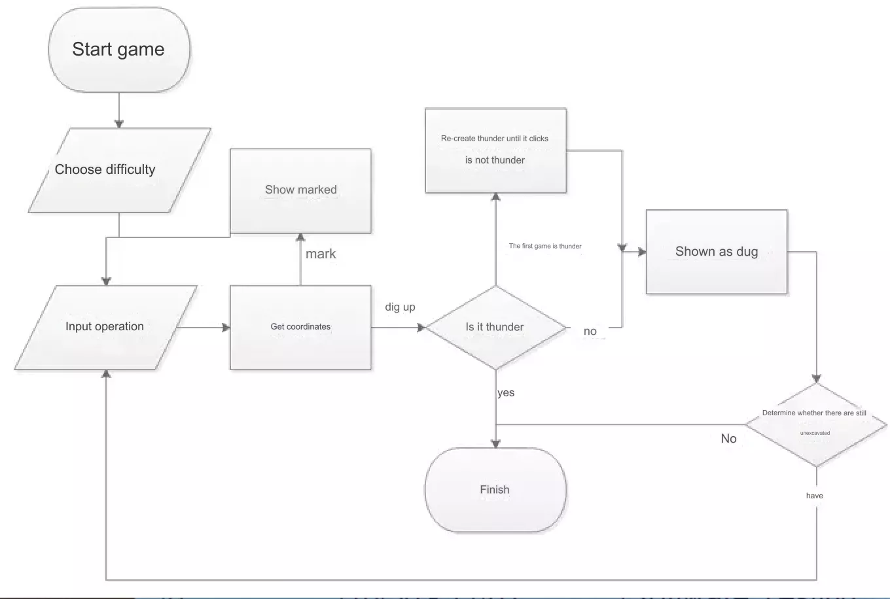

+++
author = "Xianfei"
title = "Minesweeper Command Line Version with C"
date = "2019-01-11"
description = "Freshman C Language/Linux Development Practical Course Homework"
categories = [
    "CLI","Coding","Coursework"
]
image = "cta.png"
slug = "minesweeper-cli"
+++

# Introduction

A multi-platform console minesweeper software based on the C language, capable of implementing all the functionalities of the Windows system's built-in Minesweeper game. It includes features such as custom game parameters, no mines on the first click, digging, marking, automatic handling of mine-free areas, and quickly opening surrounding areas under certain conditions. The console version is implemented using operation commands combined with row and column coordinates.

# Flowchart

<div class="gallery"></div>

# Source Code

```c
#include <stdio.h>
#include <string.h>
#include <stdlib.h>
#include <time.h>

// Characters for undug and marked
#define undigged "▣"
#define marked "∅"

// Number of rows, columns, and mines
unsigned int row = 16;
unsigned int col = 30;
unsigned int minenum = 9;

// Function to randomly generate mines
int makemine(int mine[32][32]) {
    int a[minenum]; // To store mine positions
    int i, j;
    for (i = 1; i < row + 1; i++) {
        for (j = 1; j < col + 1; j++) {
            mine[i][j] = 0; // Clear for re-mining in case the first click hits a mine
        }
    }
    srand((int) time(0));
    a[0] = rand() % (row * col);
    for (i = 1; i < minenum; i++) {
        a[i] = rand() % (row * col);
        for (j = 0; j < i; j++) {
            if (a[i] == a[j]) i--;
        }
    }
    for (i = 0; i < minenum; i++) {
        // Recording the generated mine positions into the array
        int x = a[i] / col + 1;
        int y = a[i] % col + 1;
        mine[x][y] = 1;
    }
    return 0;
}

// Function to print the minefield
int output(char show[31][31][4]) {
    int i, j;
    for (i = 1; i < row + 1; i++) {
        printf("%3d ", i);
        for (j = 1; j < col + 1; j++) {
            printf("%s ", show[i][j]);
        }
        putchar('\n');
    }
    return 0;
}

// Calculate the number of mines around (x, y)
int scanmine(int mine[32][32], int x, int y) {
    int n = 0, i, j;
    for (i = 1; i > -2; i--) {
        for (j = 1; j > -2; j--) {
            if (mine[x + i][y + j] == 1) n++;
        }
    }
    return n;
}

// Function to automatically open areas without mines
void chuli0(char show[31][31][4], int mine[32][32]) {
    int x, y, i, j;
    for (x = 1; x < row + 1; x++) {
        for (y = 1; y < col + 1; y++) {
            if (show[x][y][0] == ' ') {
                for (i = 1; i > -2; i--) {
                    for (j = 1; j > -2; j--) {
                        if (scanmine(mine, x + i, y + j)) show[x + i][y + j][0] = '0' + scanmine(mine, x + i, y + j);
                        else show[x + i][y + j][0] = ' ';
                        show[x + i][y + j][1] = 0;
                    }
                }
            }
        }
    }
}

// Calculate the number of remaining undug areas
int least(char show[31][31][4]) {
    int i, j, n = 0;
    for (i = 1; i < row + 1; i++) {
        for (j = 1; j < col + 1; j++) {
            if (!(strcmp(show[i

][j], undigged))) n++;
            if (!(strcmp(show[i][j], marked))) n++;
        }
    }
    return n;
}

// Execute the game
int game(char show[31][31][4], int mine[32][32], int flag[31][31]) {
    while(getchar() != '\n'); // Clear keyboard buffer
    int i = 0, j = 0, k = 0, x, y;
    static int flagnum = 0;
    printf("Undug: %d ", least(show));
    printf("Remaining mines: %d ", minenum - flagnum);
    printf("Marked: %d\n", flagnum);
    printf("    ");
    for (i = 0; i < col; i++) printf("%c ", i + 'a');
    putchar('\n');
    output(show);
    puts("\nEnter operation and row-column coordinates: (Operations: d - dig, f - flag/unflag, o - try to open surroundings)");
    int opt = getchar();
    y = getchar() - 'a' + 1;
    scanf("%d", &x);
    if (x < 1 || x > row || y < 1 || y > row) {
        puts("error");
        puts("\n\n\n");
        return 1; // Error checking
    }
    switch (opt) {
        case 'd':
            if (flag[x][y]) {
                puts("\n\n");
                printf("This location is marked. Please unmark it before retrying!!!");
                puts("\n");
                break;
            }
            else {
                if (mine[x][y] && (least(show) != col * row)) {
                    printf("You exploded!!!");
                    return 0;
                }
                if (mine[x][y] && (least(show) == col * row)) {
                    do { makemine(mine); } // Preventing a mine on the first click
                    while (mine[x][y]);
                }
                if (!mine[x][y]) {
                    if (scanmine(mine, x, y)) show[x][y][0] = '0' + scanmine(mine, x, y);
                    else show[x][y][0] = ' ';
                    show[x][y][1] = 0;
                    if (!(scanmine(mine, x, y))) {
                        for (k = 0; k < (col > row ? col : row); k++) chuli0(show, mine);
                    }
                    puts("\n\n\n");
                    break;
                }
            }
        case 'f':
            flag[x][y] = !flag[x][y];
            if (flag[x][y]) {
                strcpy(show[x][y], marked);
                flagnum++;
            } else {
                strcpy(show[x][y], undigged);
                flagnum--;
            }
            puts("\n\n\n");
            break;
        case 'o':
            k = 0;
            for (i = 1; i > -2; i--) {
                for (j = 1; j > -2; j--) {
                    if (!(strcmp(show[x + i][y + j], marked))) k++;
                }
            }
            if (k != scanmine(mine, x, y)) {
                puts("\n\n");
                puts("Cannot quickly open. Not all surroundings are marked");
                puts("\n");
                break;
            }
            for (i = 1; i > -2; i--) {
                for (j = 1; j > -2; j--) {
                    if (!(strcmp(show[x + i][y + j], undigged))) {
                        if (scanmine(mine, x + i, y + j)) show[x + i][y + j][0] = '0' + scanmine(mine, x + i, y + j);
                        else show[x + i][y + j][0] = ' ';
                        show[x + i][y + j][1] = 0;
                        if (!(scanmine(mine, x + i, y + j))) {
                            for (k = 0; k < (col > row ? col : row); k++) chuli0(show, mine);
                        }
                    }
                }
            }
            puts("\n\n\n");
            break;
        default:
            puts("error");
            puts("\n\n\n");
    }
    if (least(show) == minenum) {
        printf("You win!!!");
        return 0;
    }
    return 1;
}

// Choose difficulty
int choose() {
    puts("Choose difficulty:");
    puts("1. Easy 9x9 10 mines");
    puts("2. Medium 16x16 40 mines");
    puts("3. Advanced 16x30 99 mines");
    puts("4. Customized");
     printf("Please enter the option number:");
     switch (getchar()) {
         case '1':
             minenum = 10;
             row = 9;
             col = 9;
             break;
         case '2':
             minenum = 40;
             row = 16;
             col = 16;
             break;
         case '3':
             minenum = 99;
             row = 16;
             col = 30;
             break;
         case '4':
             puts("Please enter the number of lines:");
             scanf("%d", &row);
             puts("Please enter the number of columns:");
             scanf("%d", &col);
             puts("Please enter the number of mines:");
             scanf("%d", &minenum);
             if (row > 24 || col > 30 || minenum > 0.9 * col * row) {
                 puts("The number of rows cannot be greater than 24, and the number of columns cannot be greater than 30");
                 puts("The number of mines cannot be greater than 90% of the number of squares");
                 while(getchar() != '\n');//Clear the keyboard buffer
                 return 1;
             }
             break;
         default:
             puts("error");
             while(getchar() != '\n');//Clear the keyboard buffer
             return 1;
     }
     return 0;
}

int main() {
     while(choose());//Select the game difficulty. If the correct choice is made, the return value should be 0
     int mine[32][32] = {0}, flag[31][31] = {0},i,j;
     makemine(mine);//Make mine
     putchar('\n');
     char show[30 + 1][30 + 1][4] = {0}; //Used to store the string displayed by the thunder disk. Special symbols occupy 3 bytes on macos/linux.
     for (i = 1; i < row + 1; i++) {
         for (j = 1; j < col + 1; j++) {
             strcpy(show[i][j], undigged);//Initialize thunder disk
         }
     }
     while (game(show,mine,flag));//Execute the game. The return value should be 0 when the game ends.
     return 0;
}
```