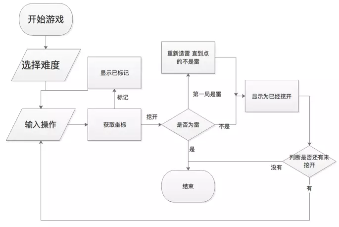

+++
author = "Xianfei"
title = "扫雷 Command Line Version with C"
date = "2019-01-11"
description = "大一C语言/Linux开发实践课程作业"
categories = [
    "CLI","Coding","课程作业"
]
image = "cta.png"
slug = "minesweeper-cli"
+++

# 前言

一个基于C语言的多平台控制台扫雷软件，可以实现Windows系统自带小游戏扫雷的所有功能。实现了自定义游戏参数、第一次不会踩到雷、挖雷、标记、自动处理无雷区域、一定条件下快速挖开周围区域的功能。控制台版本使用操作命令+行列坐标方式实现。

# 流程图

<div class="gallery"></div>

# 源代码

```c
#include <stdio.h>
#include <string.h>
#include <stdlib.h>
#include <time.h>

//设定为挖开和已标记填充的字符
#define undigged "▣"
#define marked "∅"


//行列数及雷数
unsigned int row = 16;
unsigned int col = 30;
unsigned int minenum = 9;

//随机造雷函数
int makemine(int mine[32][32]) {
    int a[minenum]; //用于保存雷的位置
    int i, j;
    for (i = 1; i < row + 1; i++) {
        for (j = 1; j < col + 1; j++) {
            mine[i][j] = 0;//遍历清空  用于第一次踩到雷重新造雷用
        }
    }
    srand((int) time(0));
    a[0] = rand() % (row * col);
    for (i = 1; i < minenum; i++) {
        a[i] = rand() % (row * col);
        for (j = 0; j < i; j++) {
            if (a[i] == a[j]) i--;
        }
    }
    for (i = 0; i < minenum; i++) {
        //将前面产生的雷的位置写入到数组中
        int x = a[i] / col + 1;
        int y = a[i] % col + 1;
        mine[x][y] = 1;
    }
    return 0;
}

//输出雷盘
int output(char show[31][31][4]) {
    int i, j;
    for (i = 1; i < row + 1; i++) {
        printf("%3d ", i);
        for (j = 1; j < col + 1; j++) {
            printf("%s ", show[i][j]);
        }
        putchar('\n');
    }
    return 0;
}

//计算x,y周围的雷数
int scanmine(int mine[32][32], int x, int y) {
    int n = 0, i, j;
    for (i = 1; i > -2; i--) {
        for (j = 1; j > -2; j--) {
            if (mine[x + i][y + j] == 1)n++;
        }
    }
    return n;
}

//用于自动打开没有雷的区域
void chuli0(char show[31][31][4], int mine[32][32]) {
    int x, y, i, j;
    for (x = 1; x < row + 1; x++) {
        for (y = 1; y < col + 1; y++) {
            if (show[x][y][0] == ' ') {
                for (i = 1; i > -2; i--) {
                    for (j = 1; j > -2; j--) {
                        if (scanmine(mine, x + i, y + j)) show[x + i][y + j][0] = '0' + scanmine(mine, x + i, y + j);
                        else show[x + i][y + j][0] = ' ';
                        show[x + i][y + j][1] = 0;
                    }
                }
            }
        }
    }
}

//计算剩余未挖开地方的数
int least(char show[31][31][4]) {
    int i, j, n = 0;
    for (i = 1; i < row + 1; i++) {
        for (j = 1; j < col + 1; j++) {
            if (!(strcmp(show[i][j], undigged)))n++;
            if (!(strcmp(show[i][j], marked)))n++;
        }
    }
    return n;
}

//执行游戏
int game(char show[31][31][4], int mine[32][32],int flag[31][31]){
    while(getchar() != '\n');//清除键盘缓冲区
    int i = 0, j = 0, k = 0, x, y;
    static int flagnum = 0;
    printf("未挖开：%d ", least(show));
    printf("剩余雷：%d ", minenum - flagnum);
    printf("已标记：%d\n", flagnum);
    printf("    ");
    for (i = 0; i < col; i++)printf("%c ", i + 'a');
    putchar('\n');
    output(show);
    puts("\n请输入操作和列号行号:(操作：d挖开,f标记/取消标记,o尝试打开四周)");
    int opt = getchar();
    y = getchar() - 'a' + 1;
    scanf("%d", &x);
    //printf("%d--%d",x,y);
    if(x<1||x>row||y<1||y>row){
        puts("error");
        puts("\n\n\n");
        return 1;//查错语句
    }
    switch (opt) {
        case 'd':
            if (flag[x][y]) {
                puts("\n\n");
                printf("该处已被标记，请取消后重试！！！");
                puts("\n");
                break;
            }
            else {
                if (mine[x][y] && (least(show) != col * row)) {
                    printf("你炸了！！！");
                    return 0;
                }
                if (mine[x][y] && (least(show) == col * row)) {
                    do { makemine(mine); }//防止第一次踩到雷
                    while (mine[x][y]);
                }
                if (!mine[x][y]) {
                    if (scanmine(mine, x, y)) show[x][y][0] = '0' + scanmine(mine, x, y);
                    else show[x][y][0] = ' ';
                    show[x][y][1] = 0;
                    if (!(scanmine(mine, x, y))) {
                        for (k = 0; k < (col > row ? col : row); k++)chuli0(show, mine);
                    }
                    puts("\n\n\n");
                    break;
                }
            }
        case 'f':
            flag[x][y] = !flag[x][y];
            if (flag[x][y]) {
                strcpy(show[x][y], marked);
                flagnum++;
            } else {
                strcpy(show[x][y], undigged);
                flagnum--;
            }
            puts("\n\n\n");
            break;
        case 'o':
            k = 0;
            for (i = 1; i > -2; i--) {
                for (j = 1; j > -2; j--) {
                    if (!(strcmp(show[x + i][y + j], marked)))k++;
                }
            }
            if (k != scanmine(mine, x, y)) {
                puts("\n\n");
                puts("无法快速打开，周围未全部标记");
                puts("\n");
                break;
            }
            for (i = 1; i > -2; i--) {
                for (j = 1; j > -2; j--) {
                    if (!(strcmp(show[x + i][y + j], undigged))) {
                        if (scanmine(mine, x + i, y + j))
                            show[x + i][y + j][0] = '0' + scanmine(mine, x + i, y + j);
                        else show[x + i][y + j][0] = ' ';
                        show[x + i][y + j][1] = 0;
                        if (!(scanmine(mine, x + i, y + j))) {
                            for (k = 0; k < (col > row ? col : row); k++)chuli0(show, mine);
                        }
                    }
                }
            }
            puts("\n\n\n");
            break;
        default:
            puts("error");
            puts("\n\n\n");
    }
    if (least(show) == minenum) {
        printf("你赢了！！！");
        return 0;
    }
    return 1;
}

//选择难度
int choose(){
    puts("请选择难度：");
    puts("1.初级 9x9 10个雷");
    puts("2.中级 16x16 40个雷");
    puts("3.高级 16x30 99个雷");
    puts("4.自定义");
    printf("请输入序号：");
    switch (getchar()) {
        case '1':
            minenum = 10;
            row = 9;
            col = 9;
            break;
        case '2':
            minenum = 40;
            row = 16;
            col = 16;
            break;
        case '3':
            minenum = 99;
            row = 16;
            col = 30;
            break;
        case '4':
            puts("请输入行数：");
            scanf("%d", &row);
            puts("请输入列数：");
            scanf("%d", &col);
            puts("请输入雷数：");
            scanf("%d", &minenum);
            if (row > 24 || col > 30 || minenum > 0.9 * col * row) {
                puts("行数不能大于24，列数不能大于30");
                puts("雷数不能大于方格数的90%");
                while(getchar() != '\n');//清除键盘缓冲区
                return 1;
            }
            break;
        default:
            puts("error");
            while(getchar() != '\n');//清除键盘缓冲区
            return 1;
    }
    return 0;
}

int main() {
    while(choose());//选择游戏难度，如果正确选择返回值应为0
    int mine[32][32] = {0}, flag[31][31] = {0},i,j;
    makemine(mine);//造雷
    putchar('\n');
    char show[30 + 1][30 + 1][4] = {0};//用于储存雷盘显示的字符串  在macos/linux上特殊符号占用3byte
    for (i = 1; i < row + 1; i++) {
        for (j = 1; j < col + 1; j++) {
            strcpy(show[i][j], undigged);//初始化雷盘
        }
    }
    while (game(show,mine,flag));//执行游戏  游戏结束时返回值应为0
    return 0;
}
```