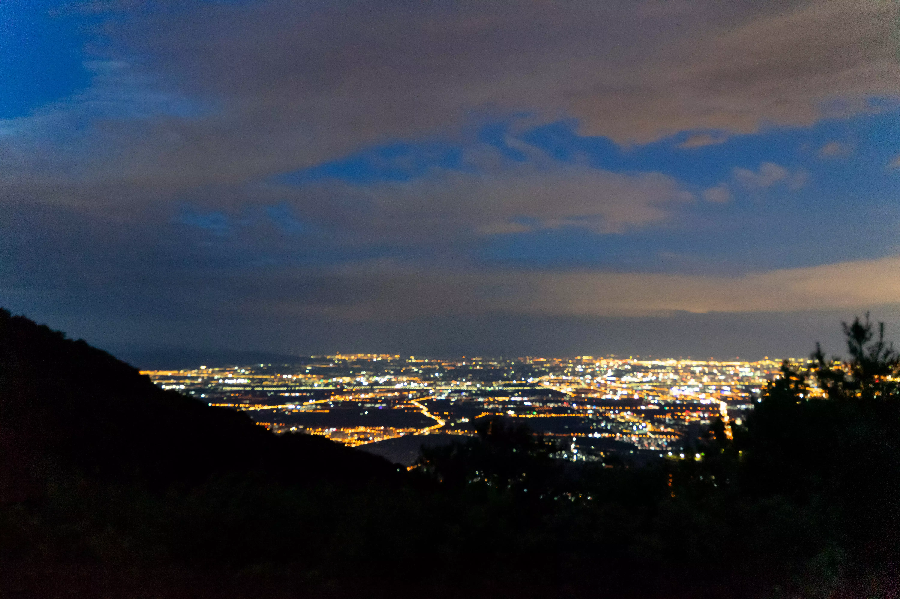
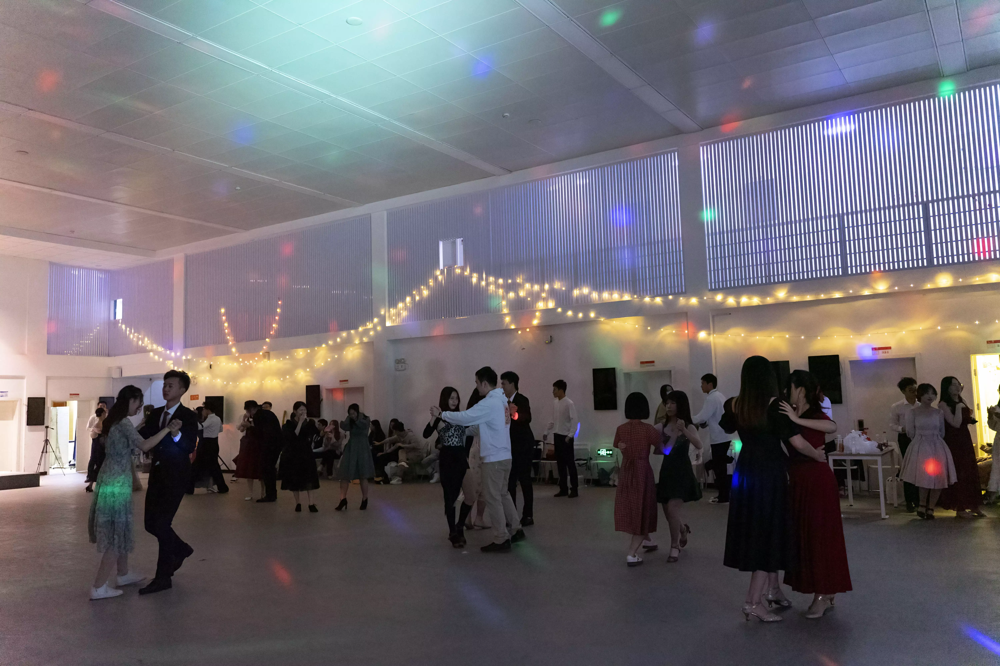

+++
author = "Xianfei"
title = "2021年度总结&杂谈"
date = "2022-01-27"
description = "再见2021，你好2022"
categories = [
    "Life",
    "年度总结"
]
image = "clay-banks-HyczMwZbdLg-unsplash.jpg"
slug = "my2021"
+++

　　2021 年或许是平平淡淡的一年，又或许是充满挑战的一年。最近几天打算写一写自己的心得吧，或许也算是对去年的总结，又或是对未来的展望。文笔欠佳，见谅。

　　首先来写写 2021 年吧，一转眼就大四了，大四的生活主要是在准备考研，考不考得上也不好说，就在今儿看空卡老师的公众号时看到了一调消息，觉得还挺好笑的。

说道这里还有一个很好笑的：势态研凉 

好了，言归正传，让我来分享2021都经历了什么有趣的事情吧！

## 2021.7 秦皇岛之旅——自驾游

&nbsp;
      

      

      

      

　　2021的那个暑假，偶然提到了Aranya——秦皇岛的一个很文艺的社区，正好大家也想去海边了，以及想到了自驾游，于是我们就想到了这么一个安排！车还是那辆老车——老捷达，但是这个车别看虽然老，真的是好开，当时是晚上去的走的夜路，开了四个多小时吧开到了北戴河~

　　这次出去玩我们订的是民宿，可以自己做饭，自己吃火锅。秦皇岛的物价很便宜，我们在那边有一家很喜欢的冰激凌店——碰碰凉，还有一家炸鸡店，可能是在北京生活习惯了，那边的这些东西物价还不到北京的一半儿而且量大！到了民宿，我们先要规划一下后几天的行程，对于我这样一个学软件工程专业的工科生，电脑当然是必不可少的了！我们第一天用电脑规划行程，后几天就是用电脑看电影了！

　　我们决定第一天去Aranya，感受一下文艺气息，第二天去北戴河老虎石，第三天上午逛逛就准备回去了。当晚我们到那儿都很饿，于是就到了那附近的一家大排档撸串！你还别说他家的牛肉穿是真的好吃，比在北京吃的很多餐馆的都要好吃~

&nbsp;
      

    

　　吃完已经快凌晨一点了，于是我们决定——夜里看海！就像《藏起来》歌词“有人相爱，有人夜里开车看海”那样，我们把车开到了海边。这个地方白天是个景区，停车要钱，晚上也就没人管了。

　　第二天来到Aranya，这真是一个十分文艺的小镇，建立在海边，可能大家所熟知的就是Aranya教堂了吧，这里借用小米同学的星轨。

<video src="1.mp4" controls>

　　总的而言，在秦皇岛的旅途还是很开心的，也是我第一次自驾游。如果你对此感兴趣可以去看一下我的B站上的Vlog（https://www.bilibili.com/video/av504760418）



## 2021.8 妙峰山野营

　　去秦皇岛是第一次自驾游的话，那么去妙峰山是我第一次自驾野营。其中有一个同学他对这方面很有经验，并且自己有帐篷什么的，我们还带了炭火和羊肉串、鱼豆腐、鸡翅等烧烤食材，可以在野外烧烤~

&nbsp;
      

      

　　同样这次活动也拍了vlog~如果感兴趣可以去看一下（https://www.bilibili.com/video/av717669473）



## 2021.5 大创

　　北邮每年的大创展我都很喜欢，也是我每年必去的活动，在这里可以看到许多同学很有意思的想法，和他们交流技术，思维的碰撞之间或许能产生不一样的火花！

&nbsp;
      

      

## 2021.4 舞会

　　其实我是被叫来当摄影拍拍照的，平时在学校团委、青媒等学生组织当新闻摄影报道学校活动，而这次舞会不是官方活动所以我可以拍拍照顺便参与一下，感谢北邮舞协的朋友们教我如何跳舞！

&nbsp;
  

   

## 兴趣爱好——摄影

　　最早喜欢摄影是从高中开始，当时其实主要就是为了拍学校的一些活动（当时在学校电视台工作），之后大学也因为之前拍过不错的作品而在军训加入摄影宣传组（文体宣）而不用训练，在2021年也拍了许多自己满意的照片，还是像以前一样以人像摄影及校园活动为主。大家可以访问本站的摄影作品展（https://xianfei.ml:8001/gallery/）来观看哦~

## 兴趣爱好——美食制作

　　俗话说得好，民以食为天，而好吃的食物，能使人在心情不好时感到治愈。其实我甚至向往以后的生活：开一个小饭馆，饭点儿做做菜迎接一些客人，而不是饭点儿的时候接一些外包项目写写代码赚一些小钱。感觉这样生活应该也不会太累也不会太穷。

&nbsp;

## 编程

　　我的专业是软件工程，所以编程应该也算是我的本行了，在暑假感谢于崔Sir的安排让我体验了一把打工人的生活，去工作了几天，帮忙完成一个小项目，用C++写一些大项目中涉及到的算法并进行测试，工资是每天一千块钱。这也算第一次去上班挣钱了吧~

　　如果研究生没考上的话，之后也就是要去就业了，或者边工作边准备明年再考一年？不过无论到时候是不是在工作，还要保持学习的热情及对新知识的渴望。之前老师经常说，学会以后把所学的给其他人讲出来，会加深你对知识的理解，所以我决定在b站分享一些实用的编程技术。目前在做的是速成全栈工程师，做一个提问箱的系统，目前已经上传完第一集，第二集已经录完正在剪辑了，欢迎大家去看一下以及给个三连关注什么的！（https://www.bilibili.com/video/av808225151）

## 人际交往

　　人际关系是困扰人类的永恒课题，人的烦恼绝大多数都是周围人带来的。人际交往的本质就是“社会认可战”，综合运用精神、物质、情感认可才是获胜的最佳策略。让你我都有良好的感觉，或者说是过得开心才是最重要的，俗话说得好“和气生财”，往往老板聊得来就可能会让你多多光顾一家店。最近看老梁讲的《如何练就令人拍案叫绝的现场反应》，讲的很是好，他还推出过情商课，这些在YouTube上能看到。我在本站搬运了一份，《如何练就令人拍案叫绝的现场反应》，讲的十分好，两个小时，强烈推荐大家能把他看完。（https://xianfei.ml:8001/?p=460，不支持iOS设备）

## 2021-2022 元旦跨年

　　2022的元旦，和同学们到北京城里的胡同（东四那边）玩了玩，最近很喜欢许多奇奇怪怪而又没什么用的好玩的东西，生活嘛，应该充满仪式感。

&nbsp;

## 2022

　　2022，希望生活能够更好，希望开开心心，希望世界和平，希望考研上岸。

&nbsp;

　　年初去打卡了著名的地铁上岸站，正好芽芽同学就住在门头沟，顺便让她当个导游了，也祝她能考研上岸！

　　突然想到明年就毕业了，希望疫情能够好转，能有一个更好的毕业旅行吧！如果有什么好的想法，欢迎在评论区留言！

