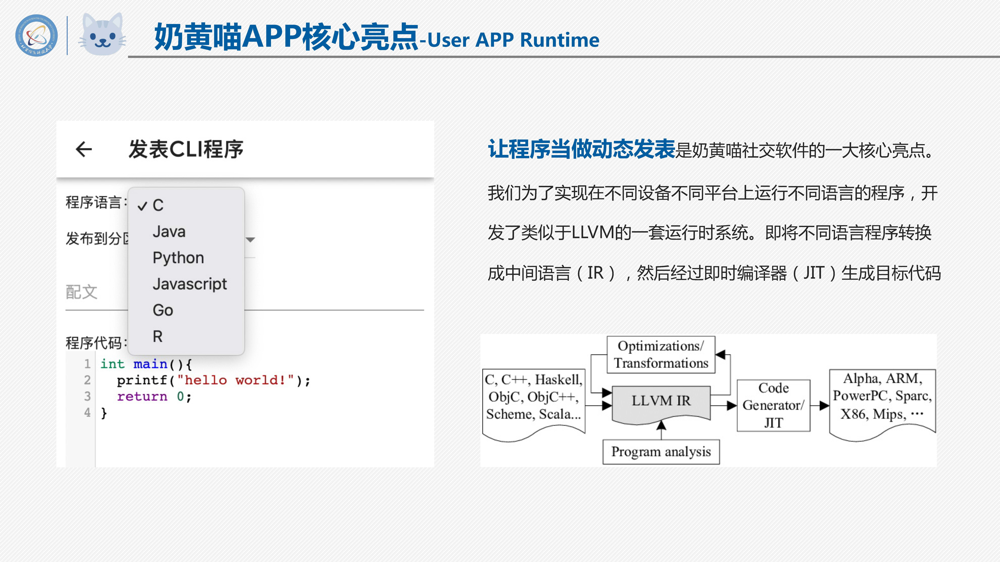

<link rel="stylesheet"
        href="https://fonts.googleapis.com/css2?family=Material+Symbols+Outlined:opsz,wght,FILL,GRAD@48,500,0,0" />

2021 年 9 月，作为大四的最后一次小组开发课程，我们设计了一个有趣的社交软件——奶黄猫。我在小组中担任产品设计、前端/客户端开发的职位。

## 演示视频

> 视频使用 AV1 格式编码，请使用 Chrome 70+ / Firefox 67+ / Edge 79+ 浏览器进行播放。See more on [here.](https://caniuse.com/av1)

<video src="nhm.webm" controls>

## 设计想法

在设计这个该社交软件时，由于我们小组都是来自同一个班学同一个专业的程序员，于是我就想到了一个很有意思的想法——将类似于小程序的应用嵌入到动态区域内，来增强可交互性和趣味性。目前的社交软件往往支持在动态除了文字外添加照片、视频等，向下方所展示的一样。

    

        
        
Xianfei

        
A software engineer.

    

    

        Today I'm excited to tell you that we have just launched our new social app, Cream Cat.
    

    
<video src="nhm.webm" class="media" controls>

    

        666
        favorite
        
        666
        chat_bubble
    

而我们认为动态的区域应该让用户自由发挥，所以我们设计了可编程动态，大大提高了社交软件用户动态的可交互性及可玩性。当你想与你的朋友分享一个小游戏时，你的朋友无需点开链接，即可直接进行游玩。

    

        
        
Xianfei

        
A software engineer.

    

    

        What an interesting game! Try to play it bro!
    

    
<iframe src="2048/"></iframe>

    

        666
        favorite
        
        666
        chat_bubble
    

此外，对于编程初学者，可能只会编写CLI应用程序，我们也设计了CLI运行环境，方便编程初学者分享他们的学习成果。

试想一下，刚上大学的你，学会了 C 语言，写下属于自己人生中的第一个程序时，那迫不及待想让亲朋好友体验的心情。而这个软件恰好能满足他们！

## 核心技术

## 代码

https://github.com/xianfei/nhm-android-client/tree/main/app/src/main/assets/web

## 接口文档

版本：2021-11-02 ver0.9 by xianfei

备注 time 使用的为 Unix 时间戳，new Date().getTime()

### 动态相关部分

1. 获取动态

    HTTP 请求方式：POST

    URL： /moment/getMoments

    POST Form：

    | 参数         | 说明                                      |
    | ------------ | ----------------------------------------- |
    | userID       | 用户唯一标识符                            |
    | type         | 0 为广场 1 为关注                         |
    | lastMomentID | 上次获取最后一条动态的 ID，第一次获取为-1 |
    | length       | 本次获取的动态数                          |

    预期返回类型：Json Object

    {

    ​ "status":0,

    ​ "message":

    ​ [{

    ​ "momentID":`当前动态ID`,

    ​ "userID":`用户ID，字符串`,

    ​ "userName":`用户昵称，字符串`,

    ​ "userAvatar":`用户头像，应为图片URL，字符串`,

    ​ "time":`此动态产生时间戳 整型`,

    ​ "text":`动态文字内容`,

    ​ "appendixType":`0无  1图片  2视频 3GUI程序代码段  4CLI程序代码段`,

    ​ "photos":`仅appendixType为1时读取该属性  为含一个或多个图片URL的数组 `,

    ​ "video":`仅appendixType为2时读取该属性  此项为视频URL  `,

    ​ "appID":`仅appendixType为3/4时读取该属性`,

    ​ "likedNum":`点赞数  整型`,

    ​ "commentNum":`评论数  整型`,

    ​ "isLiked":`当前用户是否点赞了当前动态，Boolean`,

    ​ "isDel":`该动态是否已被删除，Boolean`,

    ​ "tag":`动态标签`

    },{

    ​ //同上

    }]

    }

2. 获取单个动态

    HTTP 请求方式：POST

    URL： /moment/getMomentByID

    POST Form：

    | 参数     | 说明           |
    | -------- | -------------- |
    | userID   | 用户唯一标识符 |
    | momentID | 动态的 ID      |

    预期返回类型：Json Object

    {

    ​ "status":0,

    ​ "message":

    {

    ​ "momentID":`当前动态ID`,

    ​ "userID":`用户ID，字符串`,

    ​ "userName":`用户昵称，字符串`,

    ​ "userAvatar":`用户头像，应为图片URL，字符串`,

    ​ "time":`此动态产生时间戳 整型`,

    ​ "text":`动态文字内容`,

    ​ "appendixType":`0无  1图片  2视频 3GUI程序代码段  4CLI程序代码段`,

    ​ "photos":`仅appendixType为1时读取该属性  为含一个或多个图片URL的数组 `,

    ​ "video":`仅appendixType为2时读取该属性  此项为视频URL  `,

    ​ "appID":`仅appendixType为3/4时读取该属性`,

    ​ "likedNum":`点赞数  整型`,

    ​ "commentNum":`评论数  整型`,

    ​ "isLiked":`当前用户是否点赞了当前动态，Boolean`,

    ​ "isDel":`该动态是否已被删除，Boolean`,

    ​ "tag":`动态标签`

    }

    }

3. 点赞/取消动态（对于已点赞再次点赞为取消）

    HTTP 请求方式：POST

    URL： /moment/likeMoment

    POST Form：

    | 参数     | 说明           |
    | -------- | -------------- |
    | userID   | 用户唯一标识符 |
    | momentID | 点赞的动态     |

    预期返回类型：Json Object

    {

    ​ "status":0,

    ​ "message":{

    ​ "isLiked":`当前用户是否点赞了当前动态，Boolean`,

    ​ "likedNum":`该动态点赞数`

    ​ }

    }

4. 发送评论

    HTTP 请求方式：POST

    URL： /moment/commentMoment

    POST Form：

    | 参数        | 说明           |
    | ----------- | -------------- |
    | userID      | 用户唯一标识符 |
    | momentID    | 评论的动态     |
    | commentText | 评论内容       |

    预期返回类型：Json Object

    {"status":0,"message":""}

5. 获取评论

    HTTP 请求方式：POST

    URL： /moment/getComment

    POST Form：

    | 参数     | 说明           |
    | -------- | -------------- |
    | userID   | 用户唯一标识符 |
    | momentID | 动态 ID        |

    预期返回类型：Json Array

    {

    ​ "status":0,

    ​ "message":[{

    ​ "commentID":`评论ID，字符串`,

    ​ "userID":`用户ID，字符串`,

    ​ "userName":`用户昵称，字符串`,

    ​ "userAvatar":`用户头像，应为图片URL，字符串`,

    ​ "time":`此评论产生时间戳 整型`,

    ​ "text":`内容`,

    ​ "likedNum":`点赞数`,

    },{

    // 同上

    }]

    }

6. 获取点赞用户列表

    HTTP 请求方式：POST

    URL： /moment/getLikedMomentUsers

    POST Form：

    | 参数     | 说明           |
    | -------- | -------------- |
    | userID   | 用户唯一标识符 |
    | momentID | 动态 ID        |

    预期返回类型：Json Array

    {

    ​ "status":0,

    ​ "message":[{

    ​ "userID":`用户ID，字符串`,

    ​ "userName":`用户昵称，字符串`,

    ​ "userAvatar":`用户头像，应为图片URL，字符串`,

    },{

    // 同上

    }]

    }

7. 发表纯文本动态

    HTTP 请求方式：POST

    URL： /moment/createMomentOnlyText

    POST Form：

    | 参数   | 说明           |
    | ------ | -------------- |
    | userID | 用户唯一标识符 |
    | text   | 文本内容       |
    | tag    | 标签           |

    预期返回类型：Json Object

    {"status":0,"message":""}

8. 发表含图片文本动态

    HTTP 请求方式：POST

    URL： /moment/createMomentWithPhotos

    POST Form：

    | 参数   | 说明           |
    | ------ | -------------- |
    | userID | 用户唯一标识符 |
    | text   | 文本内容       |
    | tag    | 标签           |
    | photos | 多张图片文件\* |

    \*参考 https://blog.csdn.net/qq_38310446/article/details/87623991

    预期返回类型：Json Object

    {"status":0,"message":""}

9. 发表含视频文本动态

    HTTP 请求方式：POST

    URL： /moment/createMomentWithVideo

    POST Form：

    | 参数   | 说明           |
    | ------ | -------------- |
    | userID | 用户唯一标识符 |
    | text   | 文本内容       |
    | tag    | 标签           |
    | video  | 视频文件       |

    预期返回类型：Json Object

    {"status":0,"message":""}

<!-- 10. 删除评论 -->

9. 删除评论

    HTTP 请求方式：POST

    HTTP 请求方式：POST

    URL： /moment/delComment

    POST Form：

    | 参数      | 说明           |
    | --------- | -------------- |
    | userID    | 用户唯一标识符 |
    | commentID | 点赞的评论     |

    预期返回类型：Json Object

    {

    ​ "status":0,

    ​ "message":""

    }

10. 删除动态

    HTTP 请求方式：POST

    URL： /moment/delMoment

    POST Form：

    | 参数     | 说明           |
    | -------- | -------------- |
    | userID   | 用户唯一标识符 |
    | momentID | 动态 ID        |

    预期返回类型：Json Object

    {"status":0,"message":""}

11. 获取某用户动态

    HTTP 请求方式：POST

    URL： /moment/getUsersMoments

    POST Form：

    | 参数         | 说明                      |
    | ------------ | ------------------------- |
    | userID       | 用户唯一标识符            |
    | targetUserID | 需要获取对方动态的 ID     |
    | lastMomentID | 上次获取最后一条动态的 ID |
    | length       | 本次获取的动态数          |

    预期返回类型：Json Object

    **返回值同 1 获取动态**

12. 获取某类型动态

    HTTP 请求方式：POST

    URL： /moment/getTagMoments

    POST Form：

    | 参数         | 说明                      |
    | ------------ | ------------------------- |
    | userID       | 用户唯一标识符            |
    | tag          | 希望获取的动态类型        |
    | lastMomentID | 上次获取最后一条动态的 ID |
    | length       | 本次获取的动态数          |

    预期返回类型：Json Object

    **返回值同 1 获取动态**

13. 举报动态

    HTTP 请求方式：POST

    URL： /moment/reportMoment

    POST Form：

    | 参数     | 说明           |
    | -------- | -------------- |
    | userID   | 用户唯一标识符 |
    | momentID | 被举报动态 ID  |
    | message  | 举报理由       |

    预期返回类型：Json Object

    {

    ​ "status":0,

    ​ "message":""

    }

14. 获取 CLI 程序段

    HTTP 请求方式：POST

    URL： /moment/getAppCLI

    POST Form：

    | 参数  | 说明             |
    | ----- | ---------------- |
    | appID | 代码段唯一标识符 |

    {

    ​ "status":0,

    ​ "message":{

    ​ "language":`编程语言`,

    ​ "code":`程序代码`,

    ​ "para":`保留段`,

    ​ }

    }

15. 发表含 CLI 程序段文本动态

    HTTP 请求方式：POST

    URL： /moment/createMomentWithAppCLI

    POST Form：

    | 参数     | 说明           |
    | -------- | -------------- |
    | userID   | 用户唯一标识符 |
    | text     | 文本内容       |
    | tag      | 标签           |
    | language | 编程语言       |
    | code     | 程序代码段     |
    | para     | 保留段         |

    预期返回类型：Json Object

    {

    ​ "status":0,

    ​ "message":""

    }

16. 获取 GUI 程序段

    HTTP 请求方式：POST

    URL： /moment/getAppGUI

    POST Form：

    | 参数  | 说明             |
    | ----- | ---------------- |
    | appID | 代码段唯一标识符 |

    {

    ​ "status":0,

    ​ "message":{

    ​ "language":`编程语言`,

    ​ "code":`程序代码`,

    ​ "html":`HTML代码`,

    ​ "css":`css代码`,

    ​ "para":`保留段`,

    ​ }

    }

17. 发表含 GUI 程序段文本动态

    HTTP 请求方式：POST

    URL： /moment/createMomentWithAppGUI

    POST Form：

    | 参数     | 说明           |
    | -------- | -------------- |
    | userID   | 用户唯一标识符 |
    | text     | 文本内容       |
    | tag      | 标签           |
    | language | 编程语言       |
    | code     | 程序代码段     |
    | html     | 代码           |
    | css      | 代码           |
    | para     | 保留段         |

    预期返回类型：Json Object

    {

    ​ "status":0,

    ​ "message":""

    }

### 用户相关

1. 获取某用户信息

    HTTP 请求方式：POST

    URL： /user/getUsersInfo

    POST Form：

    | 参数         | 说明          |
    | ------------ | ------------- |
    | userID       | 请求的用户 ID |
    | targetUserID | 对方动态 ID   |

    预期返回类型：Json Object 对象数组

    {

    ​ "status":0,

    ​ "message":{

    ​ "userID":`用户ID，字符串`,

    ​ "userName":`用户昵称，字符串`,

    ​ "userAvatar":`用户头像，应为图片URL，字符串`,

    ​ "follower":`粉丝数`,

    ​ "following":`关注数`,

    ​ "isMale":`性别`,

    ​ "description":`个性签名`,

    ​ "tag":`用户喜好标签`,

    ​ "relationship":`0无  1是粉丝  2已关注  3互相关注 `

    ​ }

    }

2. 修改用户信息

    HTTP 请求方式：POST

    URL： /user/changeUsersInfo

    POST Form：

    | 参数        | 说明           |
    | ----------- | -------------- |
    | userID      | 用户唯一标识符 |
    | userName    | 用户昵称       |
    | isMale      | 性别           |
    | description | 个性签名       |
    | tag         | 用户喜好标签   |

    预期返回类型：Json Object 对象数组

    {

    ​ "status":0,

    ​ "message":""

    }

3. 登录

    HTTP 请求方式：POST

    URL： /user/login

    POST Form：

    | 参数     | 说明           |
    | -------- | -------------- |
    | user     | 用户 ID/手机号 |
    | password | 密码           |

    预期返回类型：Json Object 对象数组

    {

    ​ "status":0,

    ​ "message":{"userID":`用户唯一标识符`}

    }

4. 修改头像

    HTTP 请求方式：POST

    URL： /user/changeAvatar

    POST Form：

    | 参数   | 说明    |
    | ------ | ------- |
    | userID | 用户 ID |
    | img    | 头像    |

    预期返回类型：Json Object 对象数组

    {

    ​ "status":0,

    ​ "message":""

    }

5. 注册

    HTTP 请求方式：POST

    URL： /user/register

    POST Form：

    | 参数     | 说明     |
    | -------- | -------- |
    | userID   | 手机号   |
    | password | 密码     |
    | userName | 用户昵称 |
    | isMale   | 性别     |

    预期返回类型：Json Object 对象数组

    {

    ​ "status":0,

    ​ "message":{"userID":`用户唯一标识符`}

    }

6. 修改密码

    HTTP 请求方式：POST

    URL： /user/changePassword

    POST Form：

    | 参数        | 说明    |
    | ----------- | ------- |
    | userID      | 用户 ID |
    | passwordOld | 原密码  |
    | passwordNew | 新密码  |

    预期返回类型：Json Object 对象数组

    {

    ​ "status":0,

    ​ "message":""

    }

7. 获取粉丝列表

    HTTP 请求方式：POST

    URL： /user/getFans

    POST Form：

    | 参数         | 说明          |
    | ------------ | ------------- |
    | userID       | 请求的用户 ID |
    | targetUserID | 对方动态 ID   |

    预期返回类型：Json Object 对象数组

    {

    ​ "status":0,

    ​ "message":[{

    ​ "userID":`用户ID，字符串`,

    ​ "userName":`用户昵称，字符串`,

    ​ "userAvatar":`用户头像，应为图片URL，字符串`,

    ​ "relationship":`0无  1是粉丝  2已关注  3互相关注`

    ​ },{同上}]

    }

8. 获取关注列表

    HTTP 请求方式：POST

    URL： /user/getFollowers

    POST Form：

    | 参数         | 说明          |
    | ------------ | ------------- |
    | userID       | 请求的用户 ID |
    | targetUserID | 对方的 ID     |

    预期返回类型：Json Object 对象数组

    {

    ​ "status":0,

    ​ "message":[{

    ​ "userID":`用户ID，字符串`,

    ​ "userName":`用户昵称，字符串`,

    ​ "userAvatar":`用户头像，应为图片URL，字符串`,

    ​ "relationship":`0无  1是粉丝  2已关注  3互相关注`

    ​ }

    ​ ,{同上}]

    }

9. 举报用户

    HTTP 请求方式：POST

    URL： /user/reportUser

    POST Form：

    | 参数         | 说明           |
    | ------------ | -------------- |
    | userID       | 用户唯一标识符 |
    | targetUserID | 被举报用户     |
    | message      | 举报理由       |

    预期返回类型：Json Object

    {

    ​ "status":0,

    ​ "message":""

    }

10. 关注用户

    HTTP 请求方式：POST

    URL： /user/followUser

    POST Form：

    | 参数         | 说明           |
    | ------------ | -------------- |
    | userID       | 用户唯一标识符 |
    | targetUserID | 被关注用户 id  |

    预期返回类型：Json Object

    {

    ​ "status":0,

    ​ "message":""

    }

11. 搜索用户

    HTTP 请求方式：POST

    URL： /user/searchUser

    POST Form：

    | 参数          | 说明          |
    | ------------- | ------------- |
    | userID        | 请求的用户 ID |
    | queryUserName | 查询的用户名  |

    预期返回类型：Json Object 对象数组

    {

    ​ "status":0,

    ​ "message":[{

    ​ "userID":`用户ID，字符串`,

    ​ "userName":`用户昵称，字符串`,

    ​ "userAvatar":`用户头像，应为图片URL，字符串`,

    ​ "relationship":`0无  1是粉丝  2已关注  3互相关注`

    ​ }

    ​ ,{同上}]

    }

12. 取消关注用户

    HTTP 请求方式：POST

    URL： /user/cancelFollowUser

    POST Form：

    | 参数         | 说明           |
    | ------------ | -------------- |
    | userID       | 用户唯一标识符 |
    | targetUserID | 被关注用户 id  |

    预期返回类型：Json Object

    {

    ​ "status":0,

    ​ "message":""

    }

### 通知

1. 获取通知

    HTTP 请求方式：POST

    URL： /notice/getNotice

    POST Form：

    | 参数   | 说明          |
    | ------ | ------------- |
    | userID | 请求的用户 ID |

    预期返回类型：Json Object 对象数组

    {

    ​ "status":0,

    ​ "message":[{

    ​ "type":`1新粉丝  2评论   3点赞  4系统公告`,

    ​ "userID":`用户ID，字符串，type为4时不检查此属性`,

    ​ "userName":`用户昵称，字符串，type为4时不检查此属性`,

    ​ "userAvatar":`用户头像，应为图片URL，字符串，type为4时不检查此属性`,

    ​ "note":`信息内容`,

    ​ "momentID":`仅type为2或3时使用此值，其余不检测该属性`,

    ​ "time":`当前通知产生时间`

    ​ }

    ​ ,{同上}]

    }

### 聊天

1. 发送消息

    协议：WebSocket 全双工

    URL：/chat

    数据报类型：JSON

    数据报格式：

    {

    ​ "formUserID":`发送消息的用户ID`,

    ​ "toUserID":`接收消息的用户ID`,

    ​ "message":`消息体`

    }
