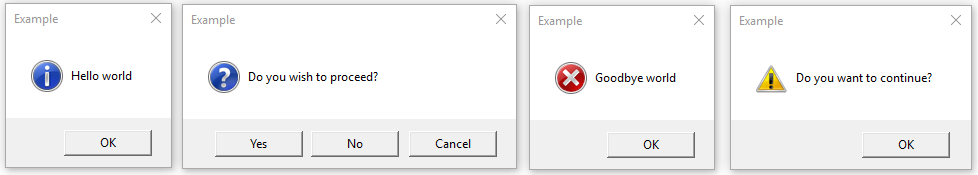

## 前言

好久没写博客了，随便水一期。在Python GUI开发中，希望调用系统预设的报错弹窗而不是手动实现，对于现成的解决方案我们可以使用`tkinter.messagebox`实现。但是在Python Embeddable版本中并没有预置thinker也不太容易安装，那我们要如何使用系统自带的弹窗呢？

## 代码

话不多说，直接上代码：

```python
import ctypes

if ctypes.windll.user32.MessageBoxW(None, '是否继续?', '提示', 0x01 | 0x40) == 1:
    ctypes.windll.user32.MessageBoxW(None, '点击了是', '标题', 0x40 | 0x1)
else:
    ctypes.windll.user32.MessageBoxW(None, '点击了否', '标题', 0x40 | 0x1)
```

## 参数说明

`MessageBoxW`函数的参数说明如下：

```c
int MessageBoxW(
  HWND    hWnd,
  LPCWSTR lpText,
  LPCWSTR lpCaption,
  UINT    uType
);
```

- `hWnd`: 父窗口句柄，一般传入`None`即可
- `lpText`: 弹窗内容
- `lpCaption`: 弹窗标题
- `uType`: 弹窗类型，可以通过`|`运算符组合多个参数，常用参数如下：
    - `0x00`: 确定按钮
    - `0x01`: 取消按钮
    - `0x02`: 重试按钮
    - `0x03`: 是、否、取消按钮
    - `0x04`: 是、否按钮
    - `0x10`: 信息图标
    - `0x20`: 警告图标
    - `0x30`: 询问图标
    - `0x40`: 错误图标

详情参考：https://learn.microsoft.com/en-us/windows/win32/api/winuser/nf-winuser-messageboxw

## 运行效果

这种方法会调用系统原生的弹窗，并且造成阻塞，直到用户点击确定或取消。



## 结语

以上就是如何使用Python调用Windows原生的弹窗，希望对你有所帮助。