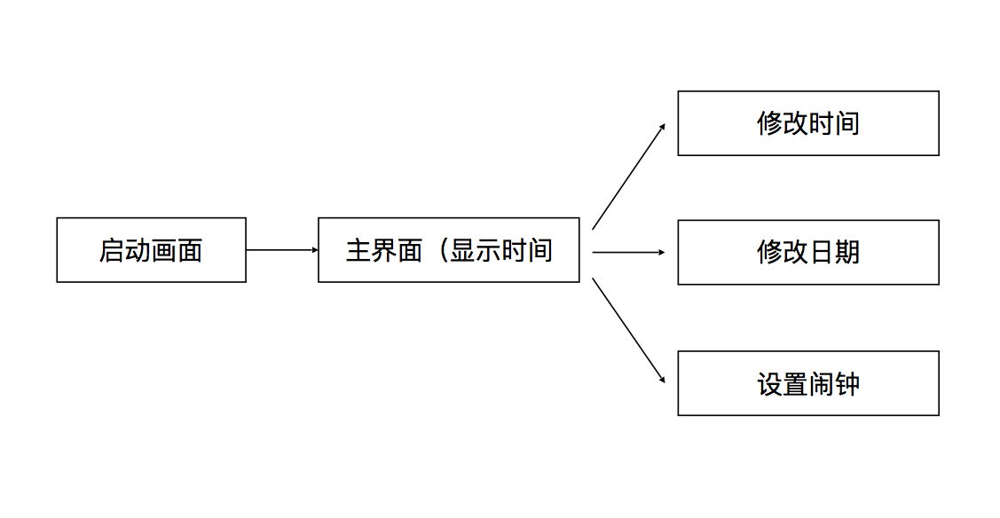
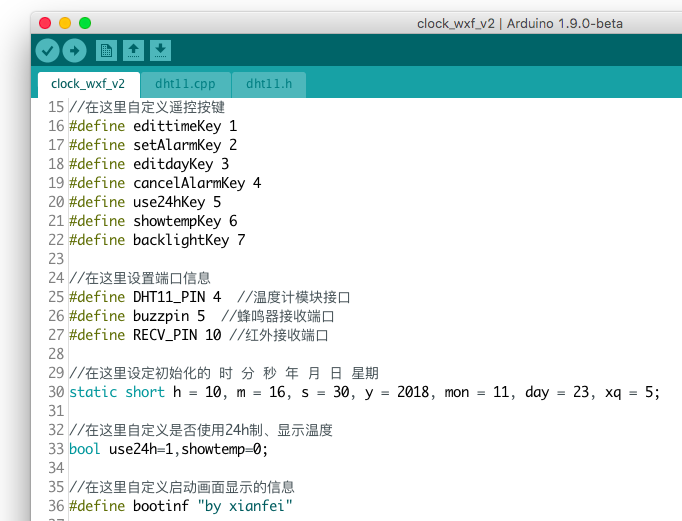
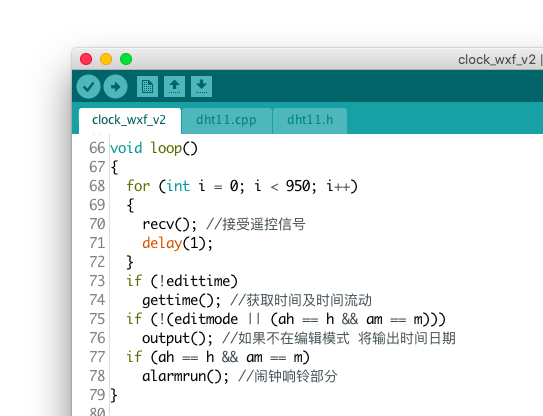

## 1. 个人简介

北京邮电大学软件学院软件工程系王衔飞。

Arduino开发吧，兴趣还是很重要的，Arduino是个很好玩的东西，不仅能学习编程本领，也可以用于模拟电路实践。大家要利用好手中的Arduino，能实现许许多多的有意思的功能哦。

The only limit is your imagination. 要敢想敢做，课上的代码只是用作参考，用Arduino还能实现更多的东西，例如可以用温度计和继电器，让温度过高时自动打开电风扇；将该电子时钟中的闹钟蜂鸣器改成继电器，实现定时开关电器；利用Arduino模拟输入做电压表；利用Arduino的PWM管脚做遥控调光等等……

## 2. 实验简介

### 2.0 实验材料

ArduinoUno开发板及扩展版，屏幕模块，IR接收模块，遥控器，蜂鸣器，（v2新增）温湿度传感器。

### 2.1 程序功能

一个小小的时钟程序，具有显示及修改时间日期星期、设定闹钟功能。在v2版本中加入了温度显示、切换24小时制等功能。

### 2.2 程序设计

电源键：返回主界面  
1键：修改时间  
2键：设定闹钟  
3键：修改日期  
4键：取消闹钟  
v2版本增加：  
5键：切换24小时制  
6键：显示温度  
7键：切换背光开关

### 2.3 程序及代码亮点

1. 美观的UI及更加人性化的提示  
2. 直接使用遥控器进行输入数字，更加方便快捷  
3. 可在代码顶部进行自定义设定  

4. 模块化代码，使用`recv`（接收遥控信号）、`remote`（处理遥控信号）、`gettime`（获取时间日期及时间流动）、`output`（输出主屏幕）、`alarmrun`（闹钟响铃）函数组成，提高代码易读性。  

## 3. 视频介绍

修改时间演示视频  

<video src="11.compressed.mp4" controls loop></video>

修改日期演示视频  

<video src="22.compressed.mp4" controls loop></video>

设定闹钟及闹钟响起演示视频  

<video src="33.compressed.mp4" controls loop></video>

切换24小时制演示视频  

<video src="IMG_6792-2.compressed.mp4" controls loop></video>

切换是否显示温度演示视频  

<video src="IMG_6794-2.compressed.mp4" controls loop></video>

切换背光开关演示视频  

<video src="IMG_6799.compressed.mp4" controls loop></video>

## 4. 附件

[v2 源代码下载：clock_wxf_v2.zip (5.81KB)](clock_wxf_v2.zip)

[v1.1 源代码下载：arduino_clock_by_xianfei.zip (5.35KB)](arduino_clock_by_xianfei.zip)

#### 更新日志：
- **V2：2018.12.25**  
加入温度计、24小时制切换、开关屏幕背光功能，优化代码易读性及使用宏定义更加方便对代码进行个性化调整。

- **V1.1：2018.11.23**  
优化时序逻辑降低接收信号延时，优化算法提高接收信号成功率，优化系统稳定性并降低内存占用提高执行效率。

- **V1.0：2018.10.31**  
完成第一版，具备闹钟、修改时间日期、显示时间日期功能。使用直接输入的方式输入时间日期及设定闹钟。

（该文章从老的博客系统迁移而来，[点击查看原始文章](./index_old.html)）