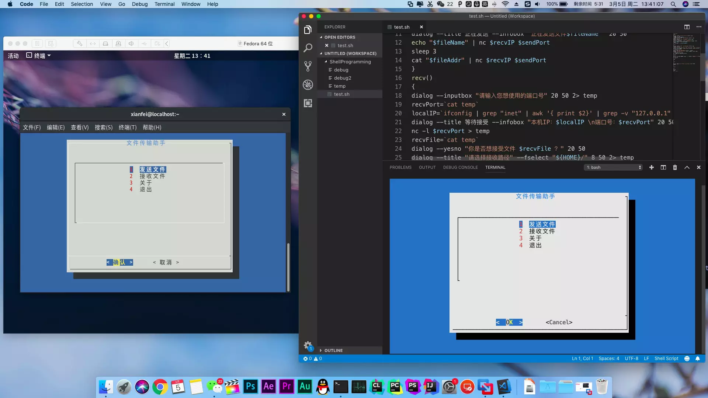
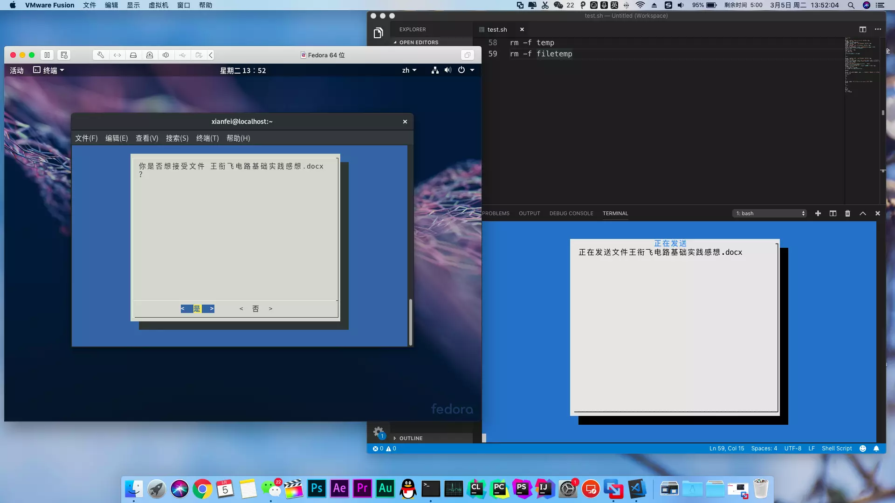

+++
author = "Xianfei"
title = "Shell File Transfer — Local Area Network File Transfer Program for Linux/macOS"
date = "2019-03-05"
description = "Linux development practice course project"
categories = [
    "CLI","Shell","Linux","Coding"
]
image = "1.webp"
slug = "shell-file-trans"
+++

## Feature Introduction

This tool uses the TCP/IP protocol for local area network file transfer, connecting via IP address and a custom port number.

## Running Environment

Tested running environment: macOS Mojave 10.14 & Fedora Linux Workstation 29

Required software packages: dialog (a graphical library, needs to be installed separately), netcat (nc, for reading and writing TCP/UDP, included in these systems), net-tools (ifconfig, for configuring and displaying network interfaces in the Linux kernel, included in these systems)

Dialog installation methods:

### macOS: Install using the brew package manager. Provide superuser permission if necessary.

Enter the following commands in the terminal:

1. Brew installation command: (Skip this step if already installed)

`/usr/bin/ruby -e "$(curl -fsSL https://raw.githubusercontent.com/Homebrew/install/master/install)"`

2. Install using the brew package manager:

`brew install dialog`

### Fedora: Install using the yum package manager.

Enter the following command in the terminal:

`sudo yum install dialog`

## Screenshot of Running

<div class="gallery"></div>
<div class="gallery"></div>
<div class="gallery"></div>

## Source Code

```shell
#!/bin/bash
send()
{
dialog --inputbox "Please drag the file here or enter the absolute path" 20 50 2> temp
if [ $? != 0 ]
then
return 6
fi
fileAddr=`cat temp`
fileName=`echo ${fileAddr##*/}`
dialog --inputbox "Please enter the port number you wish to use" 20 50 2> temp
if [ $? != 0 ]
then
return 6
fi
sendPort=`cat temp`
dialog --inputbox "Please enter the recipient's IP address" 20 50 2> temp
if [ $? != 0 ]
then
return 6
fi
recvIP=`cat temp`
dialog --title Sending --infobox "Sending file $fileName " 20 50
echo $fileName | nc $recvIP $sendPort
if [ $? != 0 ]
then
dialog --colors --msgbox "\Z1 Send error! Please check the port number and IP address!" 0 0
return 6
fi
sleep 1
nc $recvIP $sendPort < $fileAddr
if [ $? != 0 ]
then
dialog --colors --msgbox "\Z1 Send error!" 0 0
return 6
fi
fileSize=`ls -lh $fileAddr | awk '{print $5}'`
dialog --msgbox "Send complete.\nFile name: $fileName \nSize: ${fileSize}" 20 50
}
recv()
{
dialog --inputbox "Please enter the port number you wish to use" 20 50 2> temp
if [ $? != 0 ]
then
return 6
fi
recvPort=`cat temp`
dialog --title "Select a reception path" --fselect "${HOME}/" 8 50 2> temp
if [ $? != 0 ]
then
return 6
fi
recvAddr=`cat temp`
localIP=`ifconfig | grep "inet" | awk '{ print $2}' | grep -v "127.0.0.1" | grep -v ":"`
dialog --title Waiting to Receive --infobox "Local IP: $localIP \nPort number: $recvPort" 20 50
nc -l $recvPort > temp
if [ $? != 0 ]
then
dialog --colors --msgbox "\Z1 Reception error!" 0 0
return 6
fi
recvFile=`cat temp`
dialog --infobox "Receiving file $recvFile ……" 20 50
nc -l $recvPort > filetemp
if [ $? != 0 ]
then
dialog --colors --msgbox "\Z1 Reception error!" 0 0
return 6
fi
mv filetemp ${recvAddr}/${recvFile}
fileSize=`ls -lh ${recvAddr}/${recvFile} | awk '{print $5}'`
dialog --msgbox "Reception complete.\nFile name: $recvFile \nSize: ${fileSize}" 20 50
}
mainUI()
{
dialog --cancel

-label Exit --title Shell File Transfer Assistant --menu " \n " 20 50 8 1 "Send file" 2 "Receive file" 3 "About" 4 "Exit" 2> temp
a1=`cat temp`
case $a1 in
1)
send
if [ $? = 6 ]
then 
mainUI
fi
;;
2)
recv
if [ $? = 6 ]
then 
mainUI
fi
;;
3)
dialog --colors --msgbox "Shell File Transfer Assistant \n\nBeta Version 2019.3.5\n\n\Z6Developers:\nXianfei, Li Sihan, Hu Jiahui, Ding Ling (王衔飞  李思涵  胡嘉慧  丁玲)" 20 50
mainUI
;;
4)
return
;;
esac
}
mainUI
clear
rm -f temp
rm -f filetemp
```