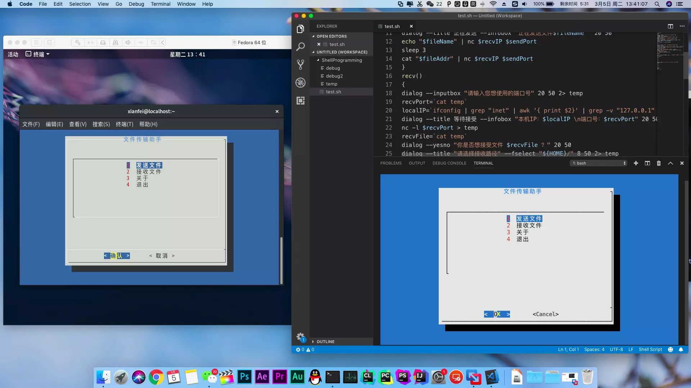
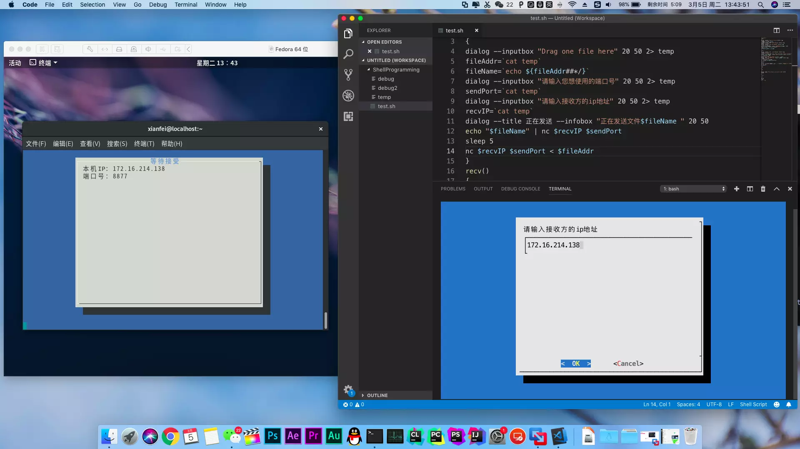
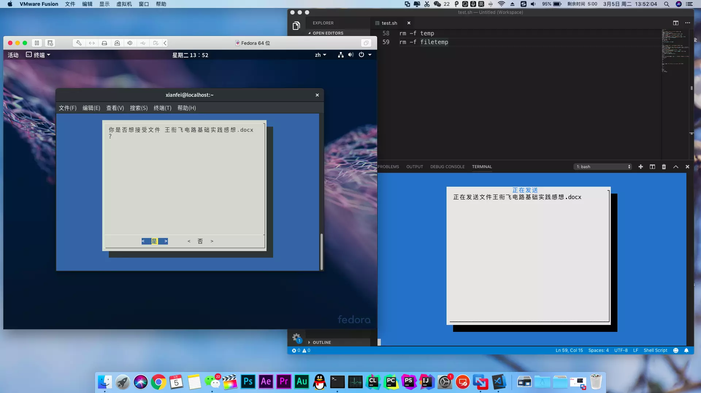

+++
author = "Xianfei"
title = "Shell File Transfer —— 适用于Linux/macOS的局域网文件传输程序"
date = "2019-03-05"
description = "大一Linux开发实践课程作品"
categories = [
    "CLI","Shell","Linux","Coding"
]
image = "1.webp"
slug = "shell-file-trans"
+++

## 功能介绍

利用TCP/IP协议的局域网文件传输工具，通过ip地址及自定义的端口号进行连接。

## 运行环境

通过测试的运行环境：macOS Mojave 10.14 & Fedora Linux Workstation 29

依赖的软件包：dialog（图形库，需自己安装）、netcat(nc，用于对TCP/UDP进行读写，这两个系统自带)、net-tools（ifconfig，用于配置和显示Linux内核中网络接口，这两个系统自带）

Dialog安装方法：

### macOS：使用brew包管理器安装。必要时请提供superuser权限。

在终端中输入以下命令

1. brew安装命令：（如果安装过请跳过这一步）

`/usr/bin/ruby -e "$(curl -fsSL https://raw.githubusercontent.com/Homebrew/install/master/install)"`

2. 使用brew包管理器安装命令：

`brew install dialog`

### fedora: 使用yum包管理器安装。

在终端中输入以下命令

`sudo yum install dialog`

## 运行截图

<div class="gallery"></div>
<div class="gallery"></div>
<div class="gallery"></div>

## 源代码

```shell
#!/bin/bash
send()
{
dialog --inputbox "请将文件拖到这里，或者输入绝对路径" 20 50 2> temp
if [ $? != 0 ]
then
return 6
fi
fileAddr=`cat temp`
fileName=`echo ${fileAddr##*/}`
dialog --inputbox "请输入您想使用的端口号" 20 50 2> temp
if [ $? != 0 ]
then
return 6
fi
sendPort=`cat temp`
dialog --inputbox "请输入接收方的ip地址" 20 50 2> temp
if [ $? != 0 ]
then
return 6
fi
recvIP=`cat temp`
dialog --title 正在发送 --infobox "正在发送文件$fileName " 20 50
echo $fileName | nc $recvIP $sendPort
if [ $? != 0 ]
then
dialog --colors --msgbox "\Z1 发送错误！请检查端口号及IP地址！" 0 0
return 6
fi
sleep 1
nc $recvIP $sendPort < $fileAddr
if [ $? != 0 ]
then
dialog --colors --msgbox "\Z1 发送错误！" 0 0
return 6
fi
fileSize=`ls -lh $fileAddr | awk '{print $5}'`
dialog --msgbox "发送完成。\n文件名：$fileName \n大小：${fileSize}" 20 50
}
recv()
{
dialog --inputbox "请输入您想使用的端口号" 20 50 2> temp
if [ $? != 0 ]
then
return 6
fi
recvPort=`cat temp`
dialog --title "请选择接收路径" --fselect "${HOME}/" 8 50 2> temp
if [ $? != 0 ]
then
return 6
fi
recvAddr=`cat temp`
localIP=`ifconfig | grep "inet" | awk '{ print $2}' | grep -v "127.0.0.1" | grep -v ":"`
dialog --title 等待接受 --infobox "本机IP：$localIP \n端口号：$recvPort" 20 50
nc -l $recvPort > temp
if [ $? != 0 ]
then
dialog --colors --msgbox "\Z1 接收错误！" 0 0
return 6
fi
recvFile=`cat temp`
dialog --infobox "正在接收文件 $recvFile ……" 20 50
nc -l $recvPort > filetemp
if [ $? != 0 ]
then
dialog --colors --msgbox "\Z1 接收错误！" 0 0
return 6
fi
mv filetemp ${recvAddr}/${recvFile}
fileSize=`ls -lh ${recvAddr}/${recvFile} | awk '{print $5}'`
dialog --msgbox "接收完成。\n文件名：$recvFile \n大小：${fileSize}" 20 50
}
mainUI()
{
dialog --cancel-label 退出 --title Shell文件传输助手 --menu " \n " 20 50 8 1 "发送文件" 2 "接收文件" 3 "关于" 4 "退出" 2> temp
a1=`cat temp`
case $a1 in
1)
send
if [ $? = 6 ]
then 
mainUI
fi
;;
2)
recv
if [ $? = 6 ]
then 
mainUI
fi
;;
3)
dialog --colors --msgbox "Shell文件传输助手 \n\nBeta Version 2019.3.5\n\n\Z6开发人员：\n王衔飞  李思涵  胡嘉慧  丁玲" 20 50
mainUI
;;
4)
return
;;
esac
}
mainUI
clear
rm -f temp
rm -f filetemp
```