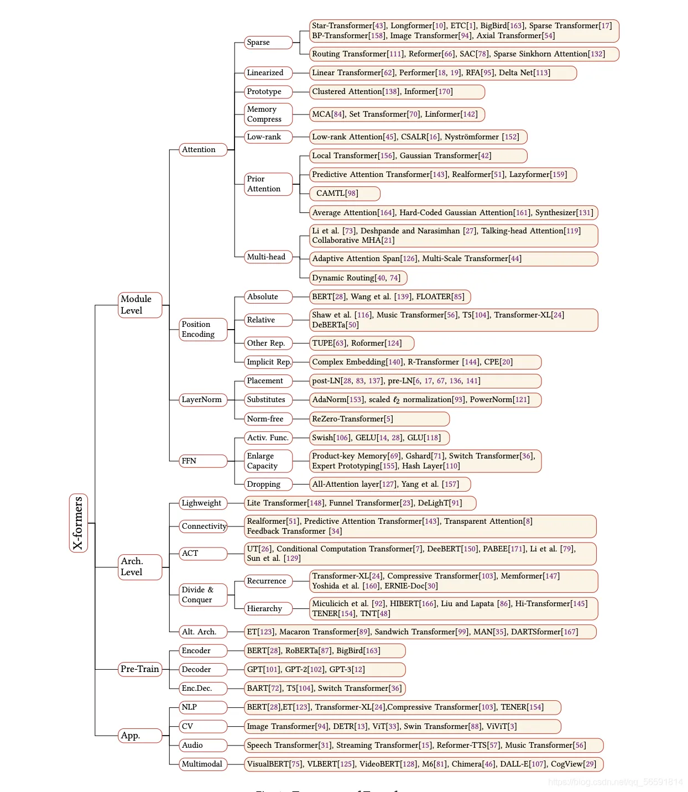
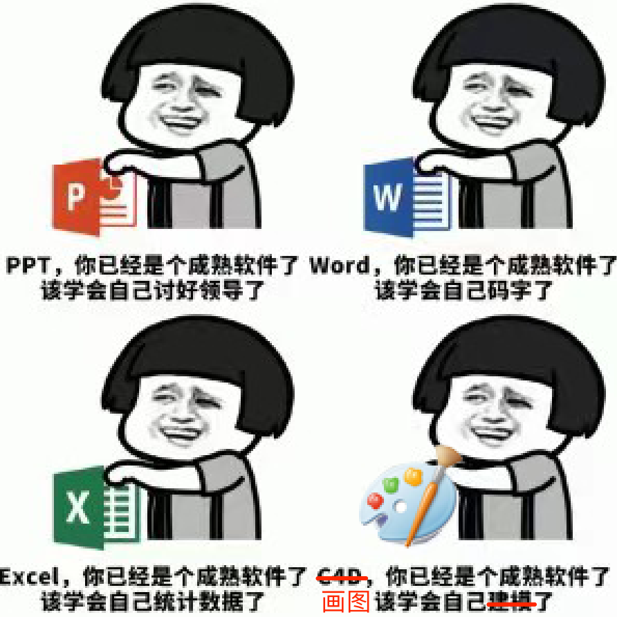
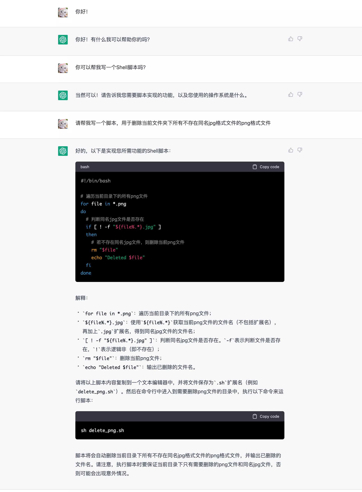
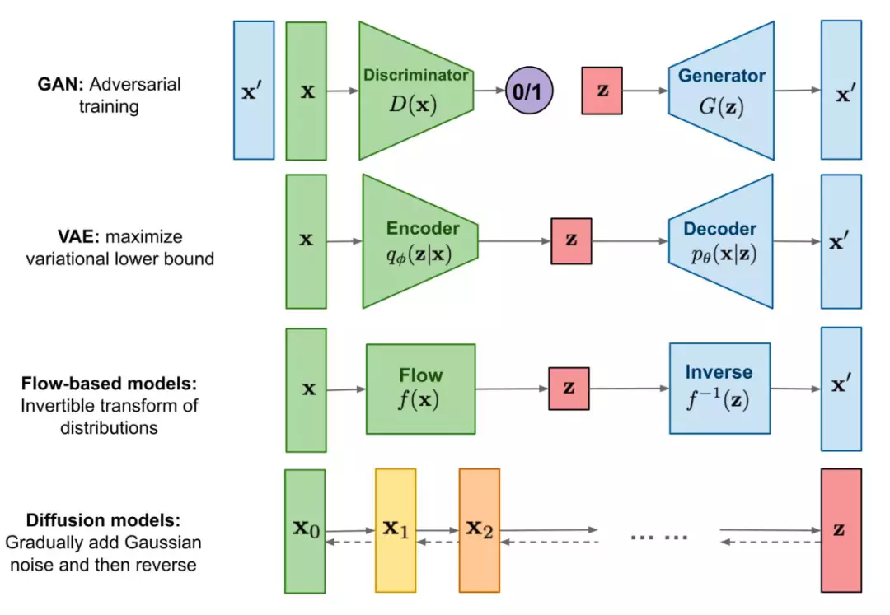
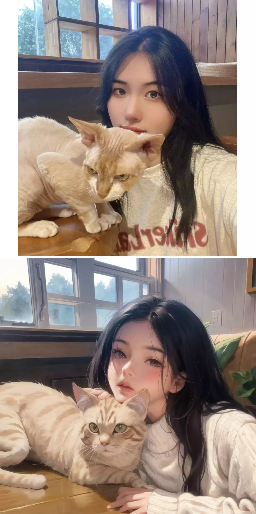
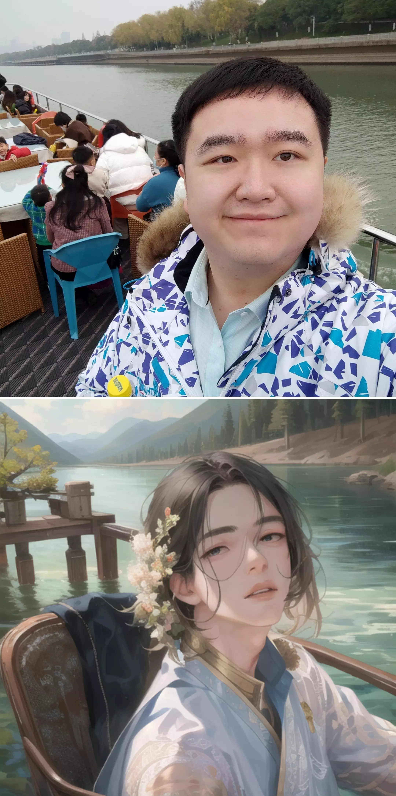
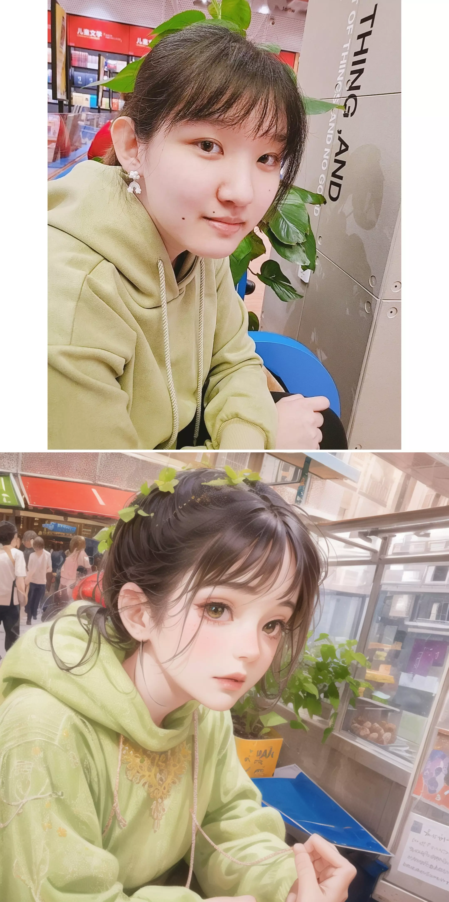
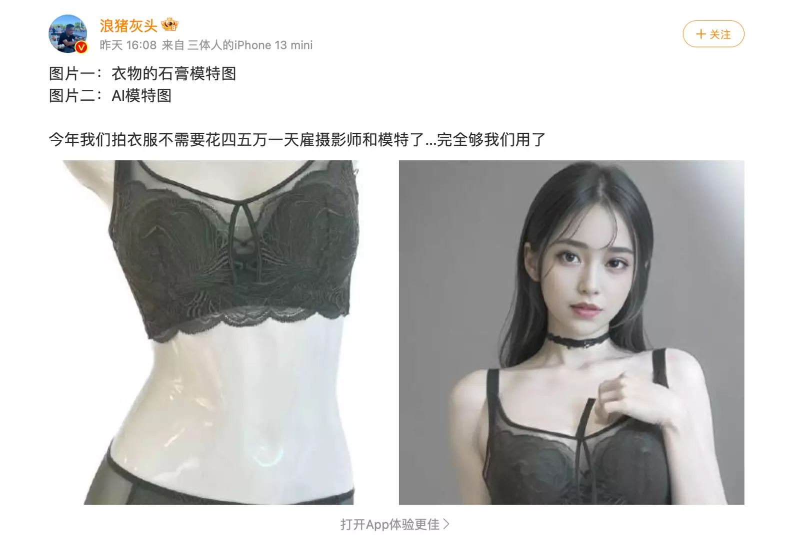
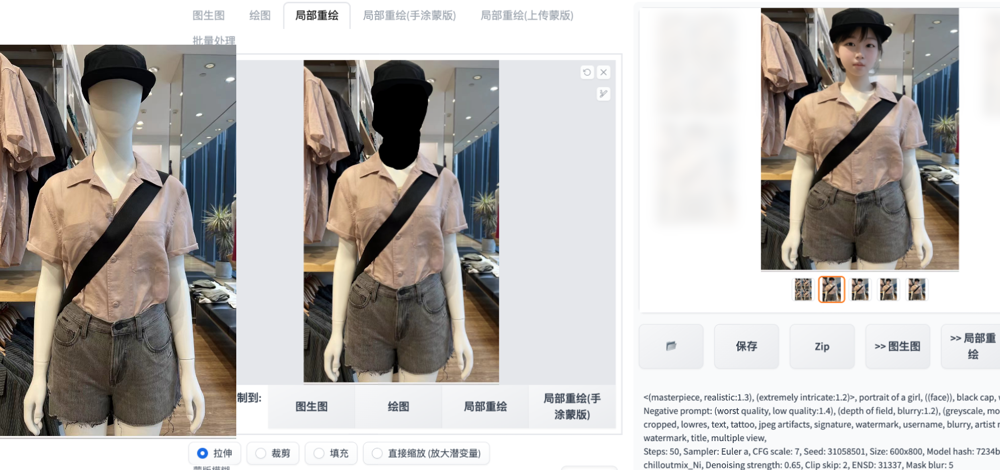

注：AIGC（AI Generated Content，人工智能创作内容）

> 天才就是1%的灵感加上99%的汗水，但那1%的灵感是最重要的，甚至比那99%的汗水都要重要。 
 ——爱迪生

而AI技术的出现，在我看来，就是当我们有了那1%的灵感时，能让我们不需要或更少的付出汗水就能实现我们的想法。所以说，善于利用AI，还是得我们有想法，让后让AI技术帮我们实现。

如果是在几年前，当你和你的小伙伴讨论AI会取代什么样的行业时，或是AI取代谁的工作时，我们会认为创造性工作（画画、作曲、作家等）会是难以被替代的。而现在事实证明，AI最有可能取代的反而是创造性工作。

三大技术革命（农业，工业，IT）之后，AI或许（也可以去掉这两个字）将是第四个。

## 前言

这一周，是神奇的一周。

周一： Stanford 开源基于 LLaMA 的 Alpaca 7B

周二：OpenAI 发布 GPT-4; Anthropic 发布 Claude; Google 公布 PaLM API; Google 将生成式 AI 加入 Workspaces;
清华智谱AI开源ChatGLM-6B; AdeptAI 融资 3.5 亿美元

周三：Pytorch 2.0 发布; MidJouney5 发布

周四：百度公布文心一言; Microsoft 公布 365 Copilot

周五：我着手开始写这篇文章

其中让我最兴奋的主要是两个方向和两个方面，两个方向分别是 大语言对话模型 和 基于扩散模型的图片生成，比如说Google的PaLM和GPT（Generative Pre-trained Transformer*）系列都是用于生成文本的大语言类Transformer模型，而MidJouney5和Stable Diffusion都是基于扩散模型的图片生成技术。

* *Transformer 是Google Brain 2017的提出的一篇工作，它针对RNN的弱点进行重新设计，解决了RNN效率问题和传递中的缺陷等，在很多问题上都超过了RNN的表现，发布之后被用于Google Translate中。在我看来，Transformer的提出意义不亚于ImageNet，属于是里程碑式的贡献。2017年，《Attention Is All You Need》论文首次提出了Transformer模型结构并在机器翻译任务上取得了The State of the Art(SOTA, 最好)的效果。2018年，《BERT: Pre-training of Deep Bidirectional Transformers for Language Understanding》使用Transformer模型结构进行大规模语言模型（language model）预训练（Pre-train），再在多个NLP下游（downstream）任务中进行微调（Finetune）,一举刷新了各大NLP任务的榜单最高分，轰动一时。2019年-2021年，研究人员将Transformer这种模型结构和预训练+微调这种训练方式相结合，提出了一系列Transformer模型结构、训练方式的改进（比如transformer-xl，XLnet，Roberta等等）。如下图所示，各类Transformer的改进不断涌现。(进一步了解可[移步这里](https://blog.csdn.net/Raina_qing/article/details/106374584))

两个方面一个是技术迭代，就像上一句话讲的那些，一个是应用创新，比如基于GPT-4用于Office的Copilot（其实之前Github推出过一个用于写代码的Copilot，那个也很强大，这个词的中文解释是副驾驶的意思，他就像飞机的副驾驶一样帮你完成那些你已经决定好要做的事情）。让我想到了很久以前的一个表情包：

这是几年前看见的一些表情包，当时大家都觉得这基本上是不可能实现的，但随着Microsoft Copilot的发布，居然被实现了！具体的功能演示可以看一下这段视频：



Wow! Amazing! [哇]

### 让ChatGPT写代码

我使用相机拍照的时候都会选择同时存储RAW与JPEG文件，通常在选照片以及给别人发照片的情况下使用JPEG文件，在修图的时候使用RAW文件。选图的时候我只会删除JPG文件，于是想编写一个脚本，能帮我自动删除对应的RAW文件，于是我去找了ChatGPT：

他写出来的脚本居然可以真的直接使用，运行起来完全没有问题也能达到我想要的功能（把png改为arw），而且也对代码以及使用方法做出了详细的阐述！太神奇了！[惊讶]

### 用Stable Diffusion画头像

目前深度学习领域比较主流的生成模型有GAN(对抗生成网络), VAE(变分自编码器), flow-based models(基于流的生成网络), diffusion models(扩散模型)几种。对于其更进一步的解读可以[移步这篇文章。](https://zhuanlan.zhihu.com/p/558937247)

突发奇想，用它来画头像会不会很棒！之前看小红书呀b站呀许多画画的小伙伴接单画头像，于是我在朋友圈也展开了这个业务，与美术博主不同的是，我画头像是免费的，毕竟是使用AI绘图 [破涕为笑]。

   

使用的是[dalcefoPainting_v4](https://civitai.com/models/5396/dalcefopainting)模型（原作者似乎删库跑路了）。

## AIGC对产业的影响

AIGC对产业的各个行业的影响，远远超出我们的想象。如果让ChatGPT去答这个问题，都显得太过保守了。我们甚至从未想到过，AI甚至能取代模特。

> 人工智能生成的文字和图片已经开始改变我们的工作与生活，并且将会在未来继续发挥越来越重要的作用。以下是一些例子：
   - 自动化工作流程：人工智能可以帮助我们自动化许多繁琐的工作流程，如数据录入、文件整理、文件分类等。这可以大大提高工作效率，让人类从重复性劳动中解放出来，专注于更有价值的工作。
   - 智能客服：人工智能可以为客服提供支持，例如通过聊天机器人回答常见问题，自动分类和解决问题，提高客户满意度，减少人工客服的工作负担。
   - 智能创作：人工智能可以生成各种形式的创意，如音乐、绘画、写作等。这可以使创意产生更多可能性，激发创作者的灵感，并提高创作的效率。
   - 自动化决策：人工智能可以通过对大量数据的分析和学习，自动化决策过程，例如贷款审批、股票交易等。这可以提高决策的准确性和效率，减少错误和风险。
   - 智能医疗：人工智能可以通过对医疗数据的分析和学习，提供更准确的诊断和治疗方案。这可以改善医疗质量，减少医疗资源的浪费，提高医疗效率。
  总之，人工智能生成的文字和图片将会在很多方面改变我们的工作与生活，提高效率、准确性和创造力，让我们更加聪明和高效。
 
 ——ChatGPT

## 我们会因此失业吗

> 尽管人工智能和自动化技术的普及可能会导致一些工作的减少或消失，但在另一方面，这些技术也将为新的就业机会和工作模式创造空间。实际上，人工智能技术的发展已经带来了一些新的工作领域，例如机器学习工程师、数据科学家、AI产品经理、智能客服工程师等等。
  此外，人工智能技术可以帮助提高工作效率和精度，使得企业可以通过减少人力成本来降低产品或服务的价格。这可以促进市场的发展，带来更多的经济机会和就业机会。
  当然，在人工智能和自动化技术的普及过程中，我们也需要采取一些措施来确保劳动力的可持续性和稳定性，例如提供教育和培训来帮助人们适应新的工作模式，以及实行社会保障政策来保障受影响的人们的基本权益。
  综上所述，人工智能和自动化技术的发展会改变一些就业机会，但同时也会创造新的就业机会，同时也需要采取一些措施来确保劳动力的可持续性和稳定性。 
 ——ChatGPT

当然，部分人对AI的抵触情绪的些竟有可能会影响到自己的工作和收入，最近频繁在微博和小红薯能看到一些人对AI的抨击 (特别是一些模特、coser、画家、摄影、拍写真、搞颜色，这些是最快被替代的)，但时代的车轮开始转动的时候，会毫不留情的碾压没能及时上车的人，随着时间的推移，人类会在越来越多的领域上输给AI。大多数人根本连上车的机会都没有。我们可以同情，却无可奈何。

好在，我是从事AI技术研发的[旺柴]。

## 安全与局限性

"A double-edged sword cuts both ways."

### 难以辨别真伪

俗话说的好，“有图有真相”，但是随着P图的出现，可能很多图片也不可信了。而AI绘图的出现，让P图门槛进一步降低。

> 虽然图像和视频可以为我们提供某些信息，但它们并不总是完全可信的。有时候图像和视频可以被编辑和篡改，以达到欺骗的目的。此外，有时候图像和视频也可能只提供了事件的片段，缺乏背景和上下文信息，从而导致我们对事实的真相做出错误的推断。
  因此，尽管有图像或视频作为证据可以增加确定事实真实性的可信度，但我们仍然需要谨慎地评估这些证据，并考虑是否需要其他信息来完整地了解事实的真相。 
 ——ChatGPT

最近，“广州地铁三号线裸照事件”冲上热搜，具体的内容各位可以在各种搜索引擎进行搜索，但是基于AI的绘图技术无疑是为了这种犯罪拉低了门槛。

下图的左边是在卖衣服的服装商场常见的假人模型，通过Stable Diffusion的局部重绘功能加上描述词，我们可以将假人的脸换的看起来像真人一样。

当然，这个技术被合适的运用可以得到很强的生产力和很棒创意表达，但是被不合理运用，比如涂抹掉衣服并加上类似于(nude, nsfw)这样的tag，产生的图片将不堪设想。不过，技术无罪。

> (问：为什么说“技术无罪”？)  “技术无罪”是一种说法，意味着技术本身并没有好坏之分，它们只是工具和手段。技术的好坏是由使用它们的人所决定的。  这种说法源于欧洲法学中的“罪刑不祖”原则，即罪行的存在必须要有相应的法律规定，而仅仅是使用某种工具并不能成为罪行。  举个例子，刀具可以用来切菜、切肉等日常生活中的用途，也可以被用来犯罪，如杀人、伤人等。但是，我们不会因为它被用来犯罪而谴责刀具本身，而是谴责使用它的人。  同样地，计算机技术、网络技术等也可以被用来创造和分享知识、促进社会进步和发展，但也可以被用于非法行为，如网络攻击、网络诈骗等。因此，技术本身并不是好坏的标准，而是取决于使用它的人的道德和行为准则。  技术的正当性和合法性，需要符合法律、道德、人类价值观等各方面的要求。技术的发展也需要伴随着社会、法律、伦理等方面的规范和监管。只有在这样的框架下，技术才能真正为人类的福祉和发展服务，而不是成为人类的灾难。 
 ——ChatGPT

### AI的“幻觉”

## 未来的展望

### 多模态

### 数字永生

