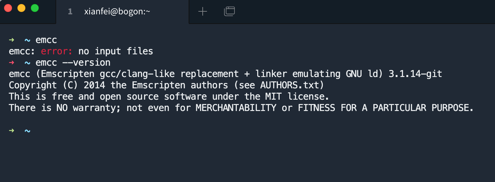
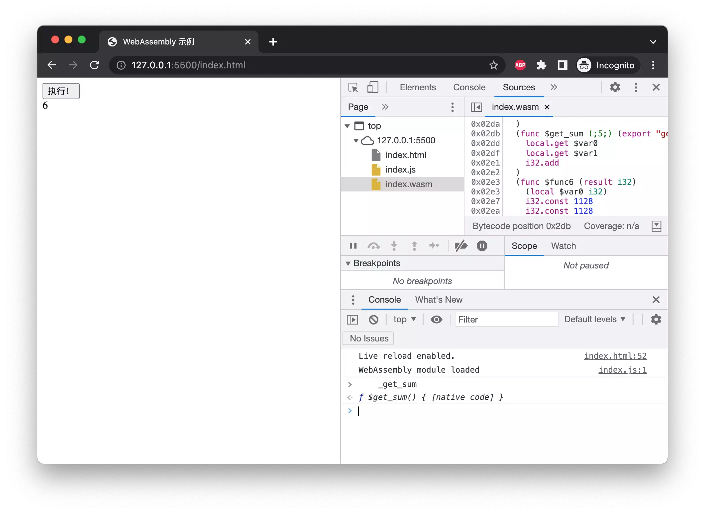
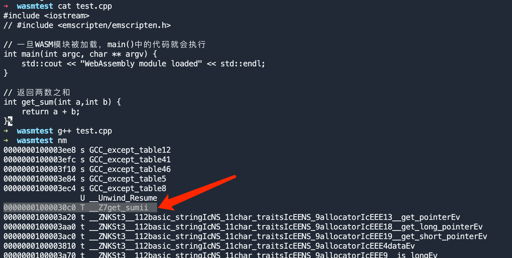
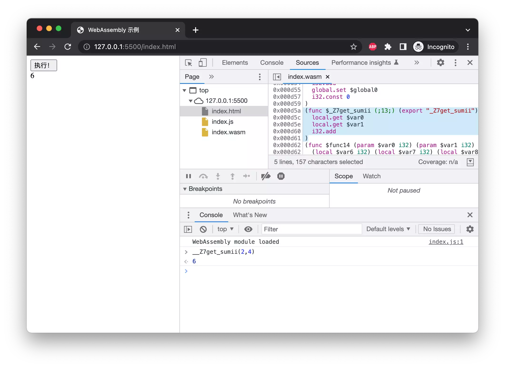

## 什么是 WebAssembly？


WebAssembly (abbreviated Wasm) is a binary instruction format for a stack-based virtual machine. Wasm is designed as a portable compilation target for programming languages, enabling deployment on the web for client and server applications.


WebAssembly 是一种新的编码方式，可以在现代的网络浏览器中运行 － 它是一种低级的类汇编语言，具有紧凑的二进制格式，可以接近原生的性能运行，并为诸如 C / C ++等语言提供一个编译目标，以便它们可以在 Web 上运行。它也被设计为可以与 JavaScript 共存，允许两者一起工作。

对于网络平台而言，WebAssembly 具有巨大的意义——它提供了一条途径，以使得以各种语言编写的代码都可以以接近原生的速度在 Web 中运行。在这种情况下，以前无法以此方式运行的客户端软件都将可以运行在 Web 中。

WebAssembly 被设计为可以和 JavaScript 一起协同工作——通过使用 WebAssembly 的 JavaScript API，你可以把 WebAssembly 模块加载到一个 JavaScript 应用中并且在两者之间共享功能。这允许你在同一个应用中利用 WebAssembly 的性能和威力以及 JavaScript 的表达力和灵活性，即使你可能并不知道如何编写 WebAssembly 代码。

以上三段内容来自 MDN： https://developer.mozilla.org/zh-CN/docs/WebAssembly

## 安装编译器

首先我们需要安装一个 WebAssembly 编译器**emscripten**。对于 macOS 可使用 brew 进行安装

```bash
brew install emscripten
```

### 测试 emscripten 是否安装成功

此处我们可以运行`emcc`和`emcc --version`来测试是否安装成功。



## 在 Web 中运行 C 语言代码

C++由于对函数重载、面向对象、名字空间（namespace）等的支持，使得其符号名（mangled symbols）不如 C 语言直观，本文先使用 C 语言进行演示。

### 编写 C 代码

下面我们编写一个非常简单的 C 语言例子，它将会返回两数之和，在你所使用的工作目录下，创建一个 test.c 文件。

```c
#include <stdio.h>
#include <emscripten/emscripten.h>

// 一旦WASM模块被加载，main()中的代码就会执行
int main(int argc, char ** argv) {
    printf("WebAssembly module loaded\n");
}

// 返回两数之和
int EMSCRIPTEN_KEEPALIVE get_sum(int a,int b) {
    return a + b;
}
```

### 将 C 编译为 WebAssembly

现在我们已经有了 C 代码，接下来需要将它编译成 wasm，不仅如此，我们还需要生成相应的 JavaScript 胶接代码以便能够真正运行起来。

```bash
emcc test.c -s WASM=1 -O2 -o index.js
```

各个参数含义如下：

-   emcc——代表 Emscripten 编译器；
-   test.c——包含 C 代码的文件；
-   -s WASM=1——指定使用 WebAssembly；
-   -O2——代码优化级别；
-   -o index.js——指定生成包含 wasm 模块所需的全部胶接代码的 JS 文件；

编译完成后，会生成 index.js 与 index.wasm 文件。

### 编写 HTML 代码

在浏览器中处理 WebAssembly 有一个非常强大的 API 可以使用，在此我们不会进行深入探讨因为这已经超出了入门的范畴，我们只需要 Module 接口及其 ccall 方法这部分即可。该方法允许我们通过函数名从 C 代码中调用一个函数，然后就向一般的 JS 函数一样使用就行了。

```javascript
var result = Module.ccall(
    "funcName", // 函数名
    "number", // 返回类型
    ["number"], // 参数类型
    [42]
); // 参数
```

调用此方法之后，result 就将拥有对应 C 函数的所有功能，除函数名以外的所有参数都是可选的。

我们也可以使用缩写版（使用符号名）：

```javascript
var result = _funcName(args...);
```

接着我们需要编写一个 HTML 文件，此处命名为 index.html，包含一个按钮和一个 div 块用来显示结果。

然后我们添加一个 script 标签用来编写在 JavaScript 中调用 wasm 模块的代码。由于胶接代码的存在（index.js），这项任务变得非常简单，它已经为我们处理好了所有的接线任务。

```html
<!DOCTYPE html>
<html>
  <head>
    <meta charset="utf-8" />
    <meta http-equiv="X-UA-Compatible" content="IE=edge" />
    <title>WebAssembly 示例</title>
    <meta name="viewport" content="width=device-width, initial-scale=1" />
  </head>
  <body>
    <button id="run">执行！</button>
    <div id="result"></div>
    <script src="index.js"></script>

    <script>
      // 当按钮被点击时，其值将会被改变
      var runButton = document.querySelector("#run");

      runButton.addEventListener("click", function () {
        // 调用C代码中的get_sum函数
        var result = _get_sum(2, 4);
        document.querySelector("#result").innerText = result;
      });
    </script>
  </body>
</html>
```

然后访问该网页，此处使用VSCode的Live Server插件进行访问（其他HTTP文件服务器也可以），**不能通过直接打开html文件的方式运行**（由于CORS本地文件限制）



## 那么，C++呢？

首先，先将上面的代码转换为C++代码，并保存为test.cpp文件。

```c++
#include <iostream>
#include <emscripten/emscripten.h>
 
// 一旦WASM模块被加载，main()中的代码就会执行
int main(int argc, char ** argv) {
    std::cout << "WebAssembly module loaded" << std::endl;
}
 
// 返回两数之和
int EMSCRIPTEN_KEEPALIVE get_sum(int a,int b) {
    return a + b;
}
```

然后使用相同的方式进行编译。
```bash
emcc test.cpp -s WASM=1 -O2 -o index.js
```

C++有着复杂的[Symbol Mangling](http://web.mit.edu/tibbetts/Public/inside-c/www/mangling.html)规则，我们不妨先从标准C++文件进行分析，使用g++编译后使用nm命令分析符号，如下图。



我们看到，我们所编写的函数符号名为__Z7get_sumii，于是可以使用该符号名调用此函数。

```html
<!DOCTYPE html>
<html>
  <head>
    <meta charset="utf-8" />
    <meta http-equiv="X-UA-Compatible" content="IE=edge" />
    <title>WebAssembly 示例</title>
    <meta name="viewport" content="width=device-width, initial-scale=1" />
  </head>
  <body>
    <button id="run">执行！</button>
    <div id="result"></div>
    <script src="index.js"></script>

    <script>
      // 当按钮被点击时，其值将会被改变
      var runButton = document.querySelector("#run");

      runButton.addEventListener("click", function () {
        // 调用C++代码中的get_sum函数
        var result = __Z7get_sumii(2, 4);
        document.querySelector("#result").innerText = result;
      });
    </script>
  </body>
</html>
```

我们通过DevTools查看WebAssembly反汇编代码，也可以证实这一点


