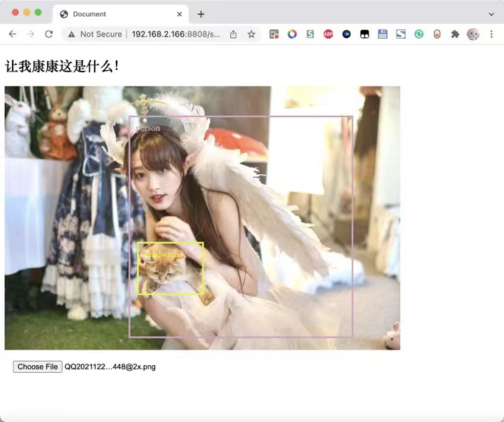

## Introduction

After completing my postgraduate exams last year, I decided to learn how to use Python to invoke machine learning libraries, having previously only known some basic Flask operations.

This is a web-based image object recognition project built on the xyolo library, ~~(just for fun)~~. The frontend was developed using pure native techniques (I hadn’t learned Vue back then), and the backend API part is implemented using Flask. The code is extremely simple.

## Preview

Here are a few images to give you an idea of what the final output looks like. The different colored boxes in the images are drawn by frontend divs, and the recognition result tags are also rendered using HTML. Finally, a table is drawn to display the recognition results and accuracy.

      

## Implementation

### Backend Code

```python
import numpy
from xyolo import YOLO, DefaultYolo3Config
from xyolo import init_yolo_v3
from flask import Flask, jsonify, request
from flask_cors import CORS
from PIL import Image

app = Flask(__name__)
CORS(app, resources=r'/*')

config = DefaultYolo3Config()
init_yolo_v3(config)
yolo = YOLO(config)

@app.route('/postimg', methods=['POST'])
def hello_world():
    img = Image.open(request.files['file'].stream)
    result = yolo.detect_image(img)
    print(result)
    return jsonify({'result':numpy.array(result).tolist()})


if __name__ == '__main__':
    app.run(host='0.0.0.0', port=8808, debug=True)

```

### Frontend Code

Took a shortcut here, it's all in HTML

```html
<!DOCTYPE html>
<html lang="en">

<head>
    <meta charset="UTF-8">
    <meta http-equiv="X-UA-Compatible" content="IE=edge">
    <meta name="viewport" content="width=device-width, initial-scale=1.0">
    <title>Let's See What's Here</title>
    <script type="text/javascript" src="https://cdn.jsdelivr.net/npm/jquery@3.2.1/dist/jquery.min.js"></script>
    <style>
        input {
            margin: 15px;
        }

        .myimg {
            max-height: 100vh;
            max-width: 100%;
            margin: auto;
        }

        .target-info {
            color: #f00;
            padding: 10px;
            border: solid 3px #f00;
        }

        table,
        th,
        td {
            border: 1px solid black;
        }
    </style>
</head>

<body>
    <h2>Let's See What's In Here!</h2>
    <p>Supports dragging and dropping images below this line of text</p>
    <div id="dropBox" style="min-height: 100px; min-height: 100px;">
        <div id="target" style="position:absolute"></div>
        
    </div>
    <input id="fileInput" type="file" onchange="processFiles(this.files)">
    
    <p id="stat">Ready</p>
    <table id="restab">
        <tr><th>Object</th><th>Confidence</th></tr>
    </table>
    <p>by xianfei 2021.12</p>
    <script>
    var dropBox;

    window.onload = function () {
        dropBox = document.getElementById("dropBox");
        dropBox.ondragenter = ignoreDrag;
        dropBox.ondragover = ignoreDrag;
        dropBox.ondrop = drop;
    }

    function ignoreDrag(e) {
        // We're handling the drag-and-drop, so make sure no other elements take this event
        e.stopPropagation();
        e.preventDefault();
    }

    function drop(e) {
        // Stop propagation and prevent default behavior
        e.stopPropagation();
        e.preventDefault();

        // Get the files that were dragged in
        var data = e.dataTransfer;
        var files = data.files;
        // Pass them to the real file processing function
        processFiles(files);
    }

    function ran() {
        return Math.floor(Math.random() * 256);
    }

    function processFiles(files) {
        $('#stat').html('Uploading and processing...')
        var file = files[0];
        const formData = new FormData();
        formData.append('file', file)
        fetch("/postimg", {
            body: formData,
            method: "post"
        }).then(res => {
            res.json().then(json => {
                $('#stat').html('Detected ' + json.result.length + ' objects.')
                var e = $('#myimg')
                var heightRate = e.height() / e[0].naturalHeight
                var widthRate = e.width() / e[0].naturalWidth
                if (json.result.length == 0) $('#target').append('<div style="position:absolute;width:100px;">Detection Failed</div>')
                for (var i of json.result) {
                    var color = 'rgb(' + ran() + ',' + ran() + ',' + ran() + ')';
                    $('#restab').append('<tr style="color:' + color + ';"><td>'+i[0]+'</td><td>'+i[2]+'</td></tr>')
                    $('#target').append('<div style="position:absolute;margin-left:' + i[3] * widthRate + 'px;margin-top:' + i[4] * heightRate + 'px;width: ' + (i[5] - i[3]) * widthRate + 'px;height: ' + (i[6] - i[4]) * heightRate + 'px;border-color: ' + color + ';color:' + color + ';" class="target-info">' + i[0] + '</div>')
                }
                console.log(json)
            })
        }).catch(ex => {
            consoleLog("Submission failed:" + ex.toString());
        });
        var output = document.getElementById("fileOutput");
        // Create a FileReader
        var reader = new FileReader();
        // Set up what to do when the data is ready
        reader.onload = function (e) {
            // Use the image URL to draw the background of the dropBox
            $('#myimg')[0].src = e.target.result;
            $('#target').html('')
            $('#restab').html('<tr><th>Object</th><th>Confidence</th></tr>')
        };
        // Read the image
        reader.readAsDataURL(file);
    }

    function showFileInput() {
        var fileInput = document.getElementById("fileInput");
        fileInput.click();
    }
    </script>
</body>

</html>
```
