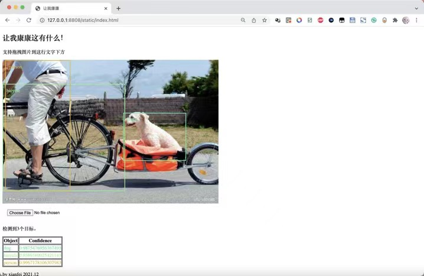
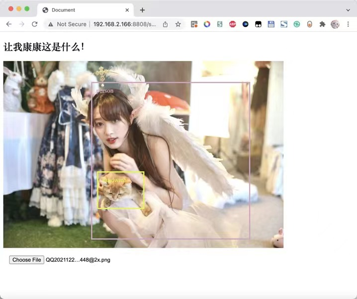

## 前言

去年考完研，打算学一学Python要如何调用机器学习的库，之前只会一些Flask的基本操作。

这是一个基于xyolo库搭建的Web图片目标识别项目，~~（属于没事儿写着玩地那种）~~，前端使用了纯原生开发（去年写这个东西的时候还不会Vue），后端API部分使用的flask，代码极为简单。

## 预览

这里有几张图片，方便大家看一下这个东西最后是个什么效果，图中不同颜色的框框是由前端div绘制，并且识别结果tag也是由html绘制的。在最后还绘制了一个用于显示识别结果和准确率的表格。

      

## 实现

### 后端代码

```python
import numpy
from xyolo import YOLO, DefaultYolo3Config
from xyolo import init_yolo_v3
from flask import Flask, jsonify, request
from flask_cors import CORS
from PIL import Image

app = Flask(__name__)
CORS(app, resources=r'/*')

config = DefaultYolo3Config()
init_yolo_v3(config)
yolo = YOLO(config)

@app.route('/postimg', methods=['POST'])
def hello_world():
    img = Image.open(request.files['file'].stream)
    result = yolo.detect_image(img)
    print(result)
    return jsonify({'result':numpy.array(result).tolist()})


if __name__ == '__main__':
    app.run(host='0.0.0.0', port=8808, debug=True)

```

### 前端代码

此处偷懒了，都写到html里面了

```html
<!DOCTYPE html>
<html lang="en">

<head>
    <meta charset="UTF-8">
    <meta http-equiv="X-UA-Compatible" content="IE=edge">
    <meta name="viewport" content="width=device-width, initial-scale=1.0">
    <title>让我康康</title>
    <script type="text/javascript" src="https://cdn.jsdelivr.net/npm/jquery@3.2.1/dist/jquery.min.js"></script>
    <style>
        input {
            margin: 15px;
        }

        .myimg {
            max-height: 100vh;
            max-width: 100%;
            margin: auto;
        }

        .target-info {
            color: #f00;
            padding: 10px;
            border: solid 3px #f00;

        }

        table,
        th,
        td {
            border: 1px solid black;
        }
    </style>
</head>

<body>
    <h2>让我康康这有什么！</h2>
    <p>支持拖拽图片到这行文字下方</p>
    <div id="dropBox" style="min-height: 100px; min-height: 100px;">
        <div id="target" style="position:absolute"></div>
        
    </div>
    <input id="fileInput" type="file" onchange="processFiles(this.files)">
    
    <p id="stat">就绪</p>
    <table id="restab">
        <tr><th>Object</th><th>Confidence</th></tr>
    </table>
    <p>by xianfei 2021.12</p>
        <script>
        var dropBox;

        window.onload = function () {
            dropBox = document.getElementById("dropBox");
            dropBox.ondragenter = ignoreDrag;
            dropBox.ondragover = ignoreDrag;
            dropBox.ondrop = drop;
        }

        function ignoreDrag(e) {
            //因为我们在处理拖放，所以应该确保没有其他元素会取得这个事件
            e.stopPropagation();
            e.preventDefault();
        }

        function drop(e) {
            //取消事件传播及默认行为
            e.stopPropagation();
            e.preventDefault();

            //取得拖进来的文件
            var data = e.dataTransfer;
            var files = data.files;
            //将其传给真正的处理文件的函数
            processFiles(files);
        }

        function ran() {
            return Math.floor(Math.random() * 256);
        }


        function processFiles(files) {
            $('#stat').html('正在上传及处理中……')
            var file = files[0];
            const formData = new FormData();
            formData.append('file', file)
            fetch("/postimg", {
                body: formData,
                method: "post"
            }).then(res => {
                res.json().then(json => {
                    $('#stat').html('检测到'+json.result.length+'个目标。')
                    var e = $('#myimg')
                    var heightRate = e.height() / e[0].naturalHeight
                    var widthRate = e.width() / e[0].naturalWidth
                    if (json.result.length == 0) $('#target').append('<div style="position:absolute;width:100px;">检测失败</div>')
                    for (var i of json.result) {
                        var color = 'rgb(' + ran() + ',' + ran() + ',' + ran() + ')';
                        $('#restab').append('<tr style="color:' + color + ';"><td>'+i[0]+'</td><td>'+i[2]+'</td></tr>')
                        $('#target').append('<div style="position:absolute;margin-left:' + i[3] * widthRate + 'px;margin-top:' + i[4] * heightRate + 'px;width: ' + (i[5] - i[3]) * widthRate + 'px;height: ' + (i[6] - i[4]) * heightRate + 'px;border-color: ' + color + ';color:' + color + ';" class="target-info">' + i[0] + '</div>')
                    }
                    console.log(json)
                })
            }).catch(ex => {
                consoleLog("提交失败:" + ex.toString());
            });
            var output = document.getElementById("fileOutput");
            //创建FileReader
            var reader = new FileReader();
            //告诉它在准备好数据之后做什么
            reader.onload = function (e) {
                //使用图像URL来绘制dropBox的背景
                $('#myimg')[0].src = e.target.result;
                $('#target').html('')
                $('#restab').html('<tr><th>Object</th><th>Confidence</th></tr>')
            };
            //读取图片
            reader.readAsDataURL(file);
        }

        function showFileInput() {
            var fileInput = document.getElementById("fileInput");
            fileInput.click();
        }
    </script>
</body>

</html>
```